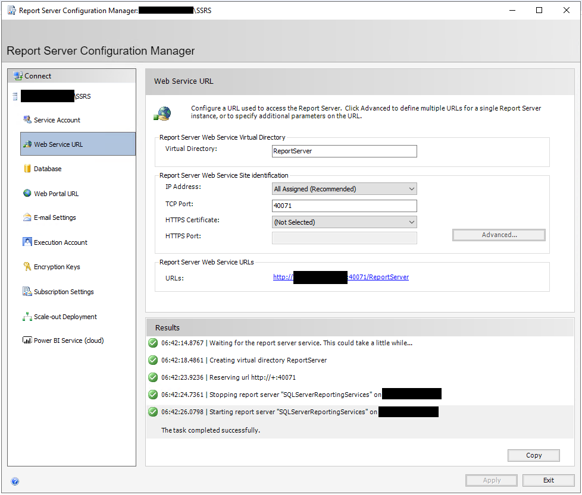
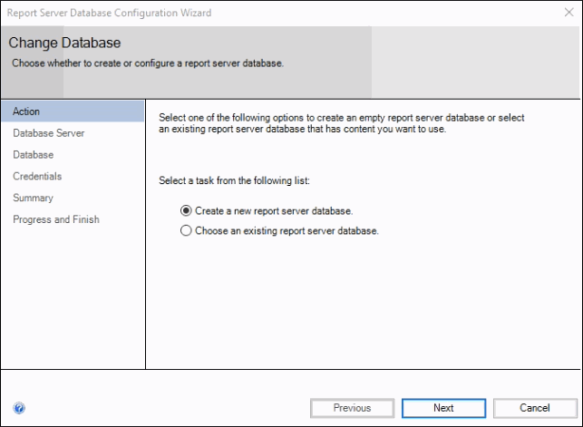
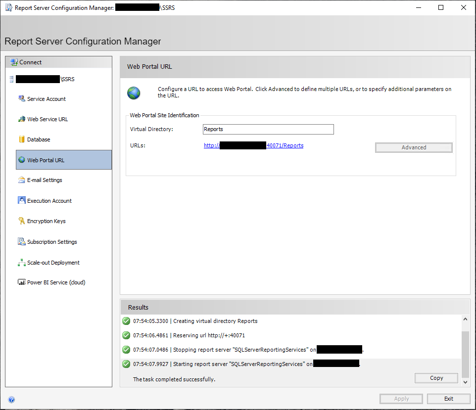
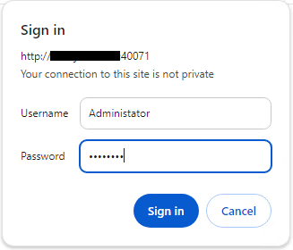
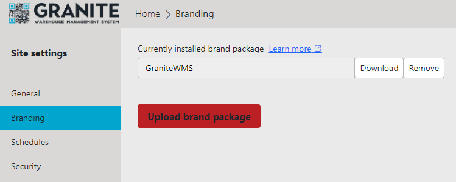
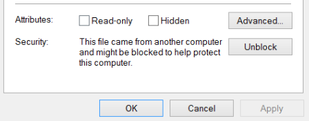
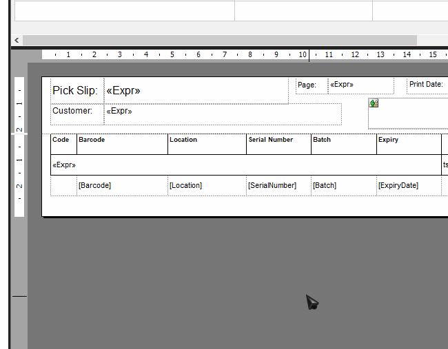
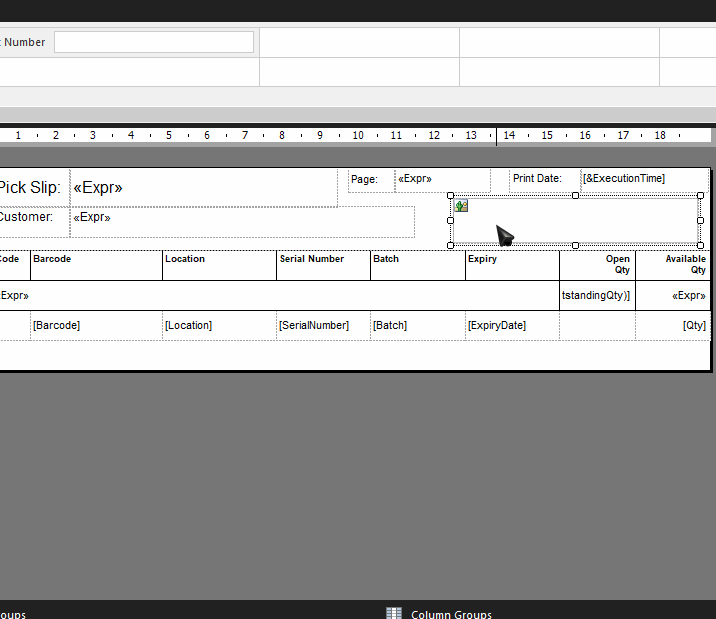

## Prerequisites

- SQL Server needs to be installed and accessible from server where you are installing SSRS

## Install

!!! note
    If your customer is using the server as a Domain Controller, SSRS will NOT install.  To get around this, try the following: 
    
    - With customer’s permission, remove DC rule, install SSRS, and reapply DC rule.
    - Customer to provide and alternative server / PC to run SSRS (must be within same network and be accessible from user’s PCs, i.e. can browse to the SSRS report url).

To install:

- Run SQLServerReportingServices(2019) from the dropbox folder "/Software Installs/Granite/Granite Reports/SQL Server Reporting Services"

OR 

- Download the installer from [SSRS 2019](https://www.microsoft.com/en-us/download/details.aspx?id=100122)

Follow the install prompts, selecting **Developer** as the edition to install. 

Once the install completes, select the option to **"Configure report server"**. 

## Configuration

<h4>Web Service URL</h4>

Once Report Server Configuration Manager has launched, in the left panel, select **"Web Service URL"**. 

Edit only the TCP Port. In this example 40071 was used but you can use any unreserved port. Select apply and you should see the following:



<h4>Database</h4>

Next select the **"Database"** in the left panel.

Here select **"Change Database"** and in the new window do the following:

1. Create a new report server database **"Next"**

2. Connect to SQL Server Instance with SQL Server Account Authentication Type **"Next"**

3. Specify Database Name (the default was used for this install) **"Next"**

4. Change Authentication Type to SQL Server Credentials and specify Sql Username and Password **"Next"**

5. On Summary **"Next"**

6. **"Finish"**



<h4>Web Portal URL</h4>

Next select the **"Web Portal URL"** in the left panel.

Select **"Apply"** and you should see the following:



Click the link to go to the Web Portal

If your are prompted to sign in, the login details are the windows credentials (domain\username or Administrator depending on what server login details have been provided) like below:



## Granite Branding

To apply the Granite Branding go to site setting > branding and upload the zipped file located in dropbox at **"\Software Installs\Granite\Granite Reports\SQL Server Reporting Services\Granite Branding"**



## Adding Barcodes

Barcodes are rendered as images within SSRS, so to be able to produce a barcode on a report, the value to be printed must be passed through an image generator and displayed on the report as an image.

To set this up on the SSRS running server, the following needs to be in setup and configured:

<h4>BarcodeLib.ddl</h4>

Copy the **"BarcodeLib.dll"** from dropbox **"\Software Installs\Granite\Granite Reports\SQL Server Reporting Services\Barcodes on SSRS reports"** to the following locations:

- For Standalone version of SSRS: **"C:\Program Files\Microsoft SQL Server Reporting Services\SSRS\ReportServer\bin"**
- For full SQL version installation: **"C:\Program Files\Microsoft SQL Server\MSRS10_50.MSSQLSERVER\Reporting Services\ReportServer\bin\"**
-⦁	For development / report builder:
**"C:\Program Files (x86)\Microsoft Report Builder"**

!!! note
    Ensure that **"BarcodeLib.dll"** is not blocked. Go to the properties of the file and select Unblock if necessary.



<h4>Microsoft Report Builder</h4>

In report properties:

1. Add References to “BarcodeLib.dll” and “System.Drawing.dll” from the following:
    - BarcodeLib.dll (use server folder from above, i.e. standalone / full server)
    - System.Drawing.dll (C:\Windows\Microsoft.NET\Framework\v2.0.50727\System.Drawing.dll)

2. Insert the code: 
    - For Code 3of9 barcode:
    ```vbnet
        Public Function Convert(Text As String) As Byte()
            Dim b As System.Drawing.Bitmap
            bar.Alignment = BarcodeLib.AlignmentPositions.LEFT
            bar.IncludeLabel = False
            bar.RotateFlipType = Drawing.RotateFlipType.RotateNoneFlipNone
            b = bar.Encode(BarcodeLib.TYPE.CODE39Extended, Text, 200, 15)
            Dim bitmapData As Byte() = Nothing
            Using ms As New System.IO.MemoryStream()
                b.Save(ms, System.Drawing.Imaging.ImageFormat.Bmp)
                bitmapData = ms.ToArray()
            End Using
            Return bitmapData
        End Function
    ```

    - For Code128 barcode:
    ``` vbnet
        Public Function Convert128(Text As String) As Byte()
            Dim b As System.Drawing.Bitmap
            bar.Alignment = BarcodeLib.AlignmentPositions.LEFT
            bar.IncludeLabel = False
            bar.RotateFlipType = Drawing.RotateFlipType.RotateNoneFlipNone
            b = bar.Encode(BarcodeLib.TYPE.CODE128, Text, 400, 50)
            Dim bitmapData As Byte() = Nothing
            Using ms As New System.IO.MemoryStream()
                b.Save(ms, System.Drawing.Imaging.ImageFormat.Bmp)
                bitmapData = ms.ToArray()
            End Using
            Return bitmapData
        End Function
    ```
 
    

In image properties:

- Use an Image with the following settings:
    - For Code3of9 Barcode:<br />
        Image source: Database<br />
        Expression: =Code.Convert("*" & Fields!DocumentNumber.Value & "*")<br />
        MIME Type: image/bmp<br />
        Size: Fit Proportional
    - For Code128 Barcode:<br />
        Image source: Database<br />
        Expression: =Code.Convert(Fields!DocumentNumber.Value)<br />
        MIME Type: image/bmp<br />
        Size: Fit Proportional



