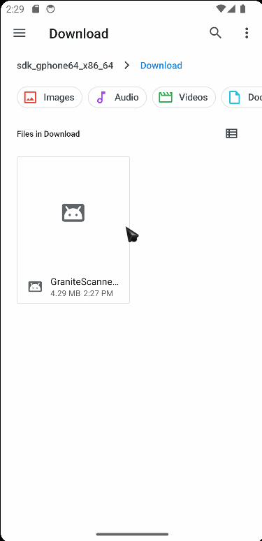
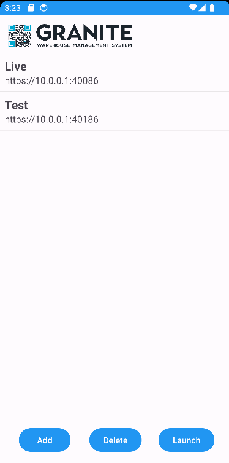
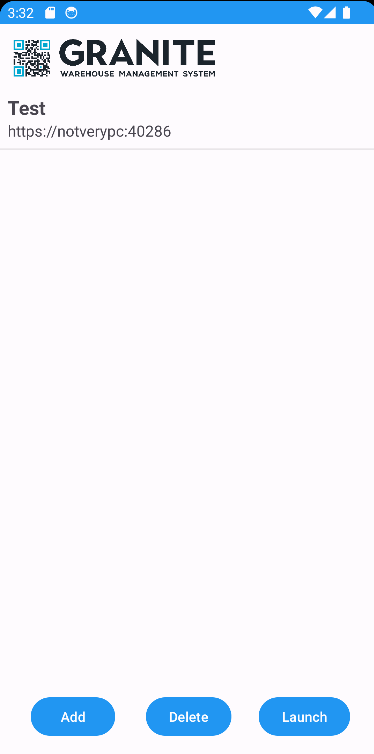
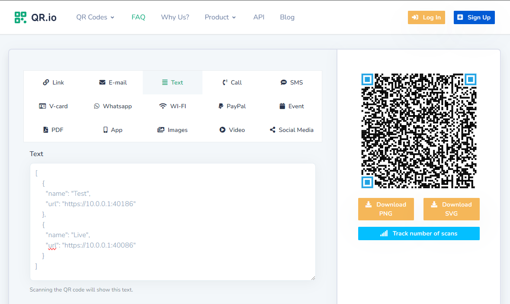

# Granite Scanner Application


The Granite Scanner Application (**Android**) acts as a browser replacement for the ProcessApp allowing the scanner functionality to be configured with restricted access.

## Setup 

To install you will need the apk from the dropbox folder **"Software Installs > Granite Android App > Granite.apk"**

You can either use the QR code from in the same folder to download the APK directly from dropbox onto the scanner or you could send the file via bluetooth to each of the scanners. 

Once the APK is on the device, simply select it to begin the install process. If this is the first APK install you may need to update the permissions to allow to install from a folder as below (it may look different depending on the version of android). 

!!! note 
        Some scanners may prevent you from installing the app if the apk is in the downloads folder. 
        
        Move to DCIM or similar to resolve the issue. 



## Using the App

### Add a Website

There are two options for adding websites:

- Manual
- Scan QR

<h4>Manual</h4>

Select Add > Manual. You will be prompted to enter a Website Name and a URL. 

The name must be unique. If you have a website called **"Live"** and create a new website with the same name the old website will be overwritten. 
The url needs to include **"https://"** or **"http://"**.


<h4>Scan QR</h4>

Select Add > Manual. You will be prompted to scan a QR code. ([create a Config QR code](#config-qr))

In the example below I post from the clipboard, but on a scanner, scanning the Config QR will populate the input field.


### Delete a Website

To delete a website select the website in the list and then press Delete. You will be prompted to confirm that you would like to delete the selected site. 



### Launch a Website

To launch a website select the website and press launch. 

If only website is set up, when launching the app, it will browse directly to the website skipping the home screen. Pressing back take you back to the home screen. 

!!! note 
        Only granite websites can be browsed to.
        
        An error will display if you try launch any other website. 



## Config QR

To create a QR code that can be used to add websites to the scanner you will need to create a QR code that contains json text with your website details.

Below is an example of the json code. You can add as many websites as needed. Remember to change the names and urls.

```json
[{"name":"Test","url":"https://10.0.0.1:40186"},{"name":"Live","url":"https://10.0.0.1:40086"}]
```

To create the Qr code you can use [QR.io](https://qr.io/) and then grab the QR code using the windows snipping tool. 

