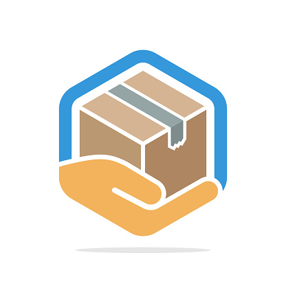

# Process Template Service


The primary responsibility of the Custodian API is to manage **Process Templates**, which encapsulate Granite Processes along with Process Steps, web templates, and pre-scripts. Each template consists of both **metadata** and **artifact** files. Metadata serves to document the process and provide additional information, while artifacts encompass all the data, scripts, views, lookups, and static data necessary for deploying the process. Ultimately, each deployment is self-contained, facilitating seamless sharing and deployment processes through the WebDesktop.

---
## Configuration

### Application Settings

The settings below are configured in the `appsettings.json`.

#### ConnectionStrings
Configuring multiple connection strings allow you to deploy to any instance of Granite.
The name of the connection string will be used in the Webdesktop to identify the connection.
Example CONNECTION and TEST.

``` json
"ConnectionStrings": {
    "CONNECTION": "Data Source=.;Initial Catalog=GraniteLive;Persist Security Info=True;User ID=;TrustServerCertificate=True;",
    "TEST": "Data Source=.;Initial Catalog=GraniteTest;Persist Security Info=True;User ID=;TrustServerCertificate=True;"
  }
```

#### AllowedOrigins

The 'allowed origins' is a list of addresses for applications requiring access to the API. 
By default, the only address that requires configuration is the Granite **WebDesktop** address.

```json

"AllowedOrigins": [ "https://192.168.1.10:8081" ]
```

!!! note
    You cannot use wildcards like `*` in the `AllowedOrigins` setting for Custodian.

### SystemSettings

```sql
INSERT INTO SystemSettings ([Application], [Key], [Value], [Description], [isEncrypted], [isActive], AuditDate, AuditUser)
VALUES 
('Granite.Custodian', 'Repo_id', '676912773', '', 0, 1, GETDATE(), 'AUTOMATION'),
('Granite.Custodian', 'Token', '******', '', 0, 1, GETDATE(), 'AUTOMATION'),
('Granite.Custodian', 'Stores', 'Approved,Draft', '', 0, 1, GETDATE(), 'AUTOMATION')
```

- **`Take Note`** Ensure that the Token is Encrypted. After 90 days reset the token. We will issue a new token prior to expiry.
- New stores could be introduced and added to this setting. The stores available will be communicated to the team; you cannot add names that do not exist.


## Troubleshoot

The most common issues will arise with the connection to the cloud store, ensuring that the token is correct and not expired.
Run `\config` operation to verify connections, authentication and setup.


## Process Template Best Practices 



The aim of a template is to encapsulate a single business use-case in a self-deployable unit. It should be easy to understand, clear in its intention, and simple to deploy. Below are some guidelines on how you would achieve this. These guidelines do not state that you should avoid certain things, but rather aim to provide context and explain some of the trade-offs of your design decisions.


### Simplicity

`Always aim for simplicity over any other motivation.`

Simplicity in templates refers to how easily colleagues can deploy, modify, comprehend, and upkeep processes. 
Your process behavior should consistently yield predefined outcomes.

### Low Ceremony

`Ready to use`

Processes often rely on predefined, hardcoded, or static data. Ensure these are minimized, and thorough documentation is provided to highlight any required setup data, such as types, categories, locations, etc.

### Abstraction and Decoupling

`Less moving parts`

Keep to a single stored procedure per prescript and try to avoid further decoupling.

Decoupling and Abstraction often used for re-use can increase complexity, ensure the re-use value is justified.


### Explicit over Generic

`Be Explicit`

While Generic (multipurpose) processes have their value, simplicity is often compromised in their favor. 
However, it's preferable to develop Explicit (single-use) processes for the sake of simplicity.


-----
