IIS is the web server that is used for hosting all of Granite's APIs and applications.
Once you've followed the steps below to install and configure IIS, you'll be ready to set up any of the Granite applications and APIs.

## Install

1. From the control panel, select Programs and then click on Turn Windows Features on or off:

    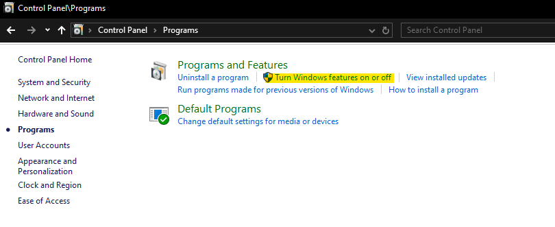


2. Go through the dialog that pops up to select the features shown below

    === "Windows Desktop"
        On desktop versions of Windows, select the following features under `Internet Information Services` and click OK:

        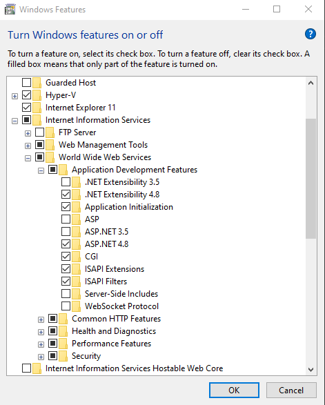

    === "Windows Server"
        On windows server editions, the Server Manager page pops up instead. Click next until you get to the Server Roles page:

        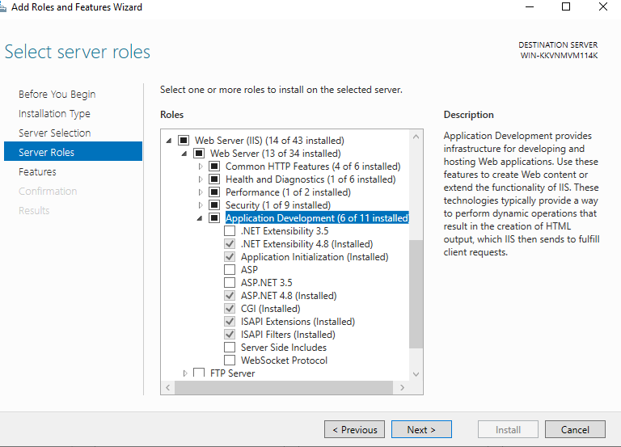

        Select these features under Web Server, then go to the next page and click install.

3. Install the [IIS URL Rewrite Module](https://download.microsoft.com/download/1/2/8/128E2E22-C1B9-44A4-BE2A-5859ED1D4592/rewrite_amd64_en-US.msi)

4. Install the latest ASP.NET Core Runtime 6 and 8 hosting bundles

    - [ASP.NET Core 8](https://dotnet.microsoft.com/en-us/download/dotnet/8.0)
    - [ASP.NET Core 6](https://dotnet.microsoft.com/en-us/download/dotnet/6.0)

    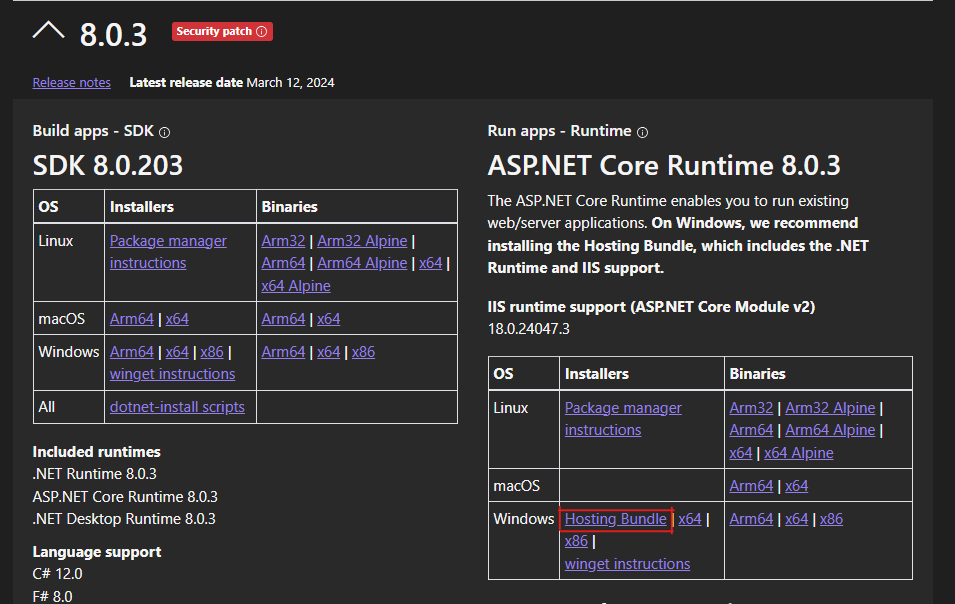


## Creating Certificates

Certificates are needed to host secured sites in IIS over https. 
Most Granite applications and apis require this, so we will need to create a certificate for them to use.
They can all use the same certificate, so you do not need to create multiple.

Be sure to follow the correct section below based on the operating system of the machine you are installing on - older versions of Windows require some extra steps.

### Windows 10 / Server 2016 and up
On the server, open `PowerShell ISE` as Administrator and paste the following into a new script window

```powershell
$FriendlyName = 'GraniteWMS'  # Give your certificate a name
$ServerName = 'appsrv01.domain.local'  # Server name. This can also be just appsrv01
$IPAddress = '192.168.0.168'  # Server IP address
$ExportPath = "C:\GraniteInstalls\$FriendlyName.cer"  # Path to save certificate to

# Create a new self-signed certificate with DNS and IP SAN
New-SelfSignedCertificate -Subject $IPAddress -CertStoreLocation "cert:\LocalMachine\My" -FriendlyName $FriendlyName  -TextExtension @("2.5.29.17={text}dns=$ServerName &ipaddress=$IPAddress") 

#Get Cert Thumbprint
$Cert = Get-ChildItem -Path Cert:LocalMachine\MY | Where-Object {$_.FriendlyName -Match $FriendlyName} | Select-Object Thumbprint
$Thumbprint = $Cert.Thumbprint

#Copy Cert to file
Export-Certificate -Cert (Get-Item Cert:\LocalMachine\My\$Thumbprint) -FilePath $ExportPath
```

Set your variables on the first four lines and execute the script. Ensure that the `$FriendlyName` is a unique name for the certificate - there must not be any other certificates in the store with the same name. It should look like this if all has worked:

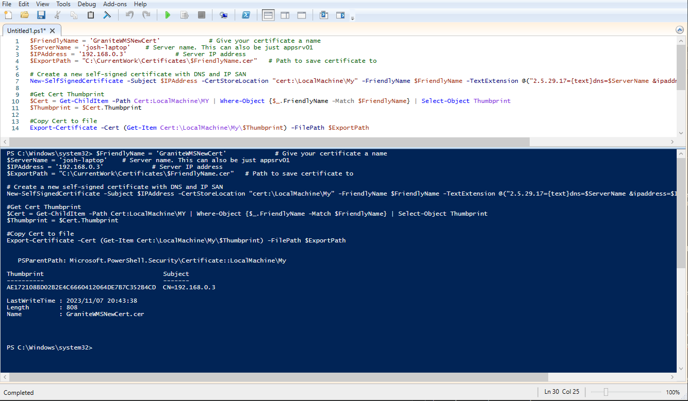

You should now be able to select the certificate in IIS's Edit Bindings screen:

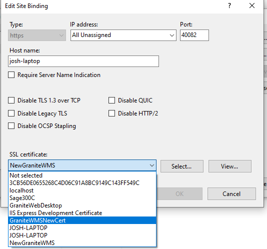

If you don't see the certificate you've just created in the dropdown, find it in the folder it exported to and double click it and select install. Be sure to install to the Local Machine store, and on the next page click browse and select the Personal store.

If your certificate is still not available in IIS, please reach out to the development team for assistance.

### Windows 8.1 / Server 2012 R2 and below
On older versions of Windows you need to create the certificate on your own machine and then import it on the server.

On **YOUR MACHINE**, open `PowerShell ISE` as Administrator and paste the following into a new script window.

```powershell
$FriendlyName = 'GraniteWMS'  # Give your certificate a name
$ServerName = 'appsrv01.domain.local'  # Server name. This can also be just appsrv01
$IPAddress = '192.168.0.168'  # Server IP address
$ExportPath = "C:\GraniteInstalls\$FriendlyName.cer"  # Path to save certificate to

# Create a new self-signed certificate with DNS and IP SAN
New-SelfSignedCertificate -Subject $IPAddress -CertStoreLocation "cert:\LocalMachine\My" -FriendlyName $FriendlyName  -TextExtension @("2.5.29.17={text}dns=$ServerName &ipaddress=$IPAddress") 

#Get Cert Thumbprint
$Cert = Get-ChildItem -Path Cert:LocalMachine\MY | Where-Object {$_.FriendlyName -Match $FriendlyName} | Select-Object Thumbprint
$Thumbprint = $Cert.Thumbprint

#Copy Cert to file
Export-Certificate -Cert (Get-Item Cert:\LocalMachine\My\$Thumbprint) -FilePath $ExportPath
```

Set your variables on the first four lines and execute the script. Ensure that the `$FriendlyName` is a unique name for the certificate - there must not be any other certificates in the store with the same name. It should look like this if all has worked:


Now search the start menu for `Manage computer certificates` and open it. Under Personal certificates you should see the certificate you have just created:

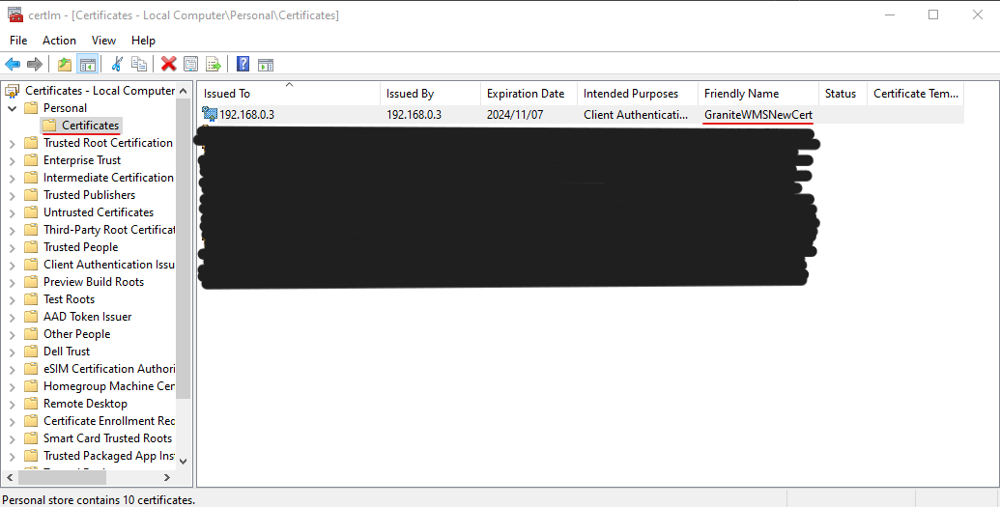

Right click it, and under All Tasks, select Export. Click Next and ensure you select `Yes, export the private key`:

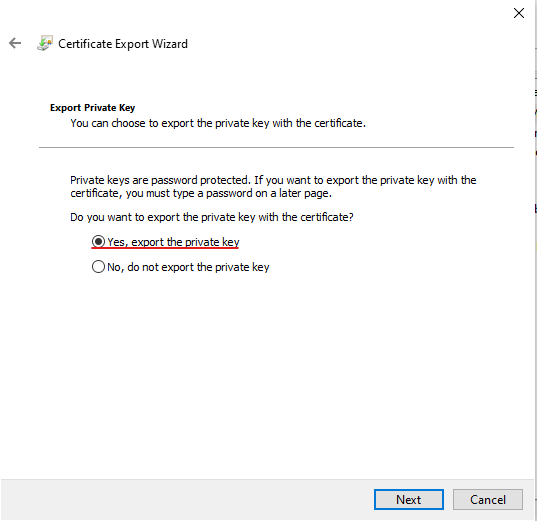

On the next screen ensure you select the following:

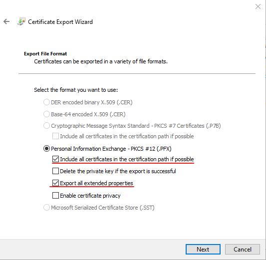

On the next page, enter and confirm a password:

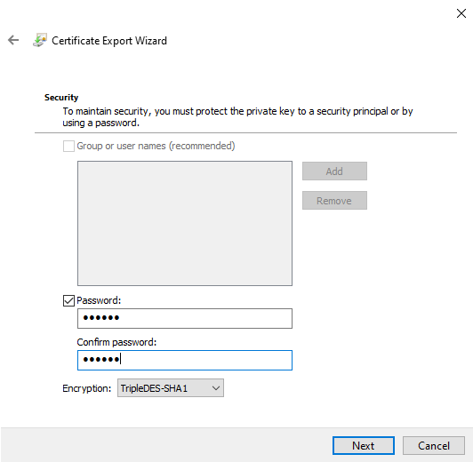

Lastly you will be prompted for a path to save the certificate to. Browse to where you want to save it and give it a name, then finish going through the export wizard.

You should now have a `.pfx` file in the directory you selected with the name you entered.

Copy the `.pfx` file to the server and double click it to install.

Ensure you select `Local Machine`:

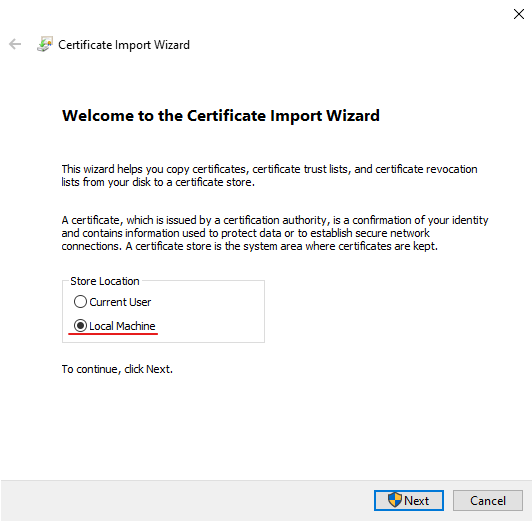

Click next until you get to a page prompting you for the password you set when exporting the certificate. Enter the password and be sure to select the Include all extended properties checkbox:

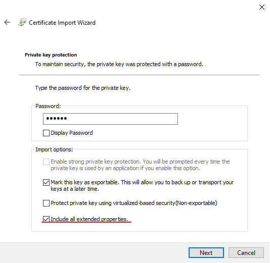

On the next page ensure you select the Personal certificate store, then finish going through the wizard.

Your certificate should now be selectable from the IIS bindings edit screen:


### Troubleshooting 

<h4>Export-Certificate : The system cannot find the path specified</h4>

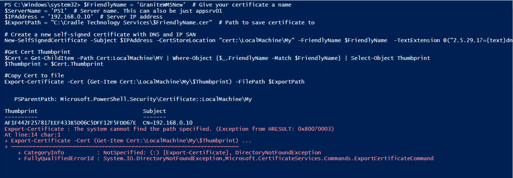

If you get this error it means that the path that the folder that you have specified in the `$ExportPath` variable does not exist. Make sure to create the folder you want to place the certificate in before you run the PowerShell script.

Once you've created the folder to export to, you can comment out the part of the PowerShell script that creates the certificate to just run the export part.

<h4>Get-Item : Cannot find path 'Cert:\LocalMachine\My\...'</h4>

Looking at the below screenshot you'll see that there are multiple thumbprints after `Cert:\LocalMachine\My\`

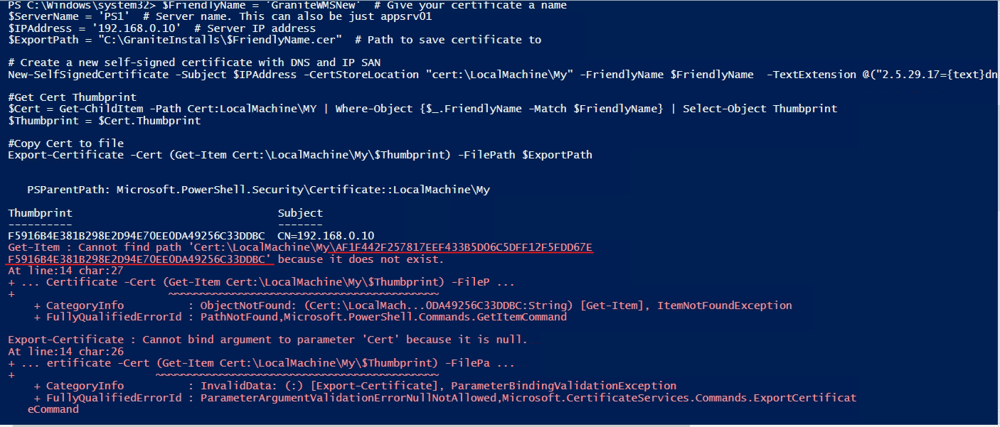

This happens when you have multiple certificates installed to the store with the same FriendlyName. The script needs a unique Friendly name to find the correct certificate.

You can end up with multiple certificates named the same when the script has successfully created and installed the certificate but failed to export it, and you run the entire script again. 

You can remove unused certificates from the `Manage computer certificates` explorer by right clicking them and deleting. Try to ensure when you create a new certificate that you are giving it a unique name to prevent this from happening.

## Adding a site to IIS

Before you add your site to IIS, ensure that you have configured the relevant `appsettings.json` or `web.config` file as per the application's installation guide

To add a site to IIS, open the IIS Manager and right click the Sites folder to select `Add Website`:
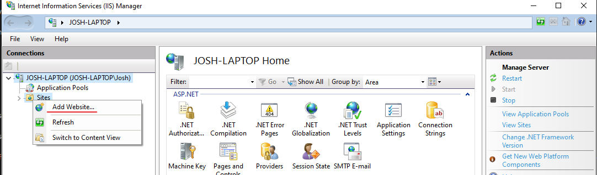

In the dialogue enter relevant settings for your application. 

- Site name is the name that will be used in IIS for this website.
- Physical path is where the application folder actually is
- Binding settings determine the url that your application will be accessible at. 
You should use either the host name or the IP address of the machine that you are installing on. 
This ProcessApp will be accessible at `https://josh-laptop:40086`

    !!! note
        Because we need the ProcessApp to use https, we have to select a SSL certificate that we have previously created.
        If we are adding a http site, there is no option to select an SSL certificate

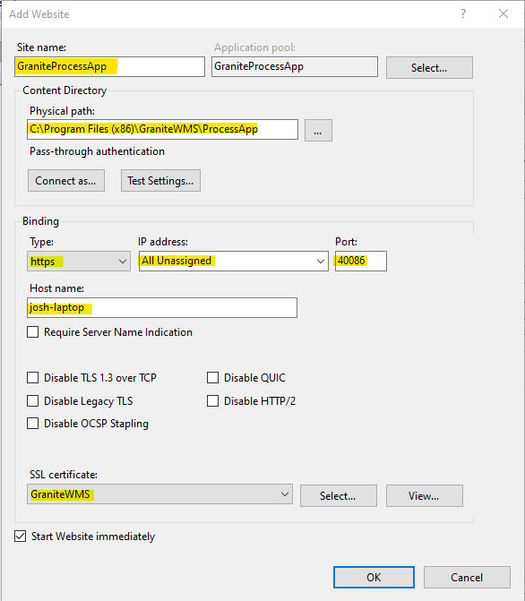

Once you click OK, you will see your site is available in IIS:

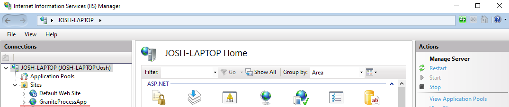
