# Acumatica Overview

The purpose of the this to provide of an overview of the parts of Acumatica's system that Granite interacts with in the upwards and downwards integration. 

## Investigating Acumatica

Acumatica has a useful feature that gives more detail on the details of the various fields in the system. 
To use it, hover over the name of a field until the ? icon appears, select the icon and a description will appear on the right. 

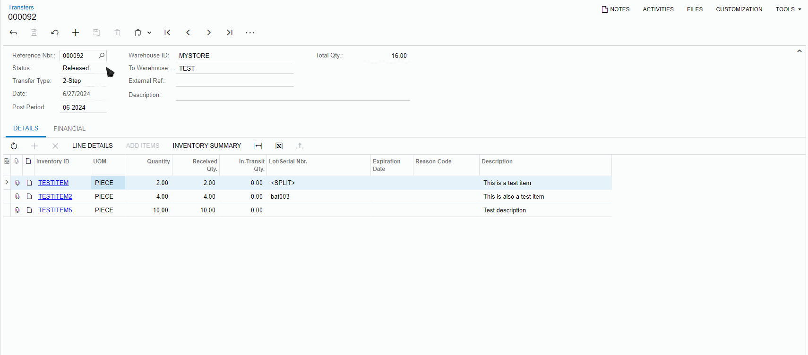

## StockItems

The StockItems are Acumatica's MasterItems. They can be found under Inventory > Stock Items.

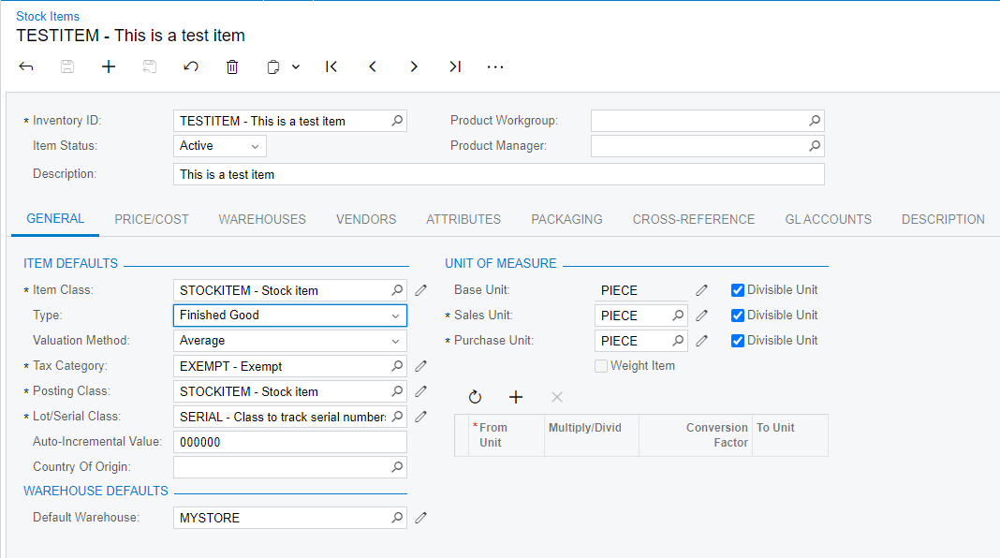

The most notable field is the Lot/Serial Class. In Acumatica, Lot and Serial number share the same property call LotSerialNbr. This class determines if either lot, serial, or neither is tracked. 

Expiry date can only be tracked in the standard way if either lot or serial is tracked and cannot be tracked separately. 

## Warehouses

Warehouses in Acumatica represent a physical location where stock can be kept (a warehouse, a section of a warehouse, a store).

The only relevant field for Granite is the WarehouseID which is the ERPLocation

These are found under Inventory > Warehouses.

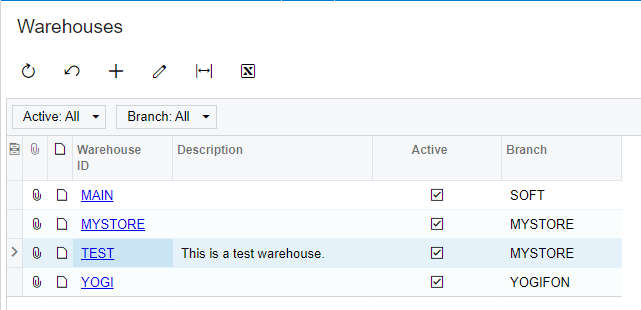

## Documents

Documents follow a similar structure to Granite's documents with one main difference being Allocations. 
The hierarchy is as follows: Document (Header) > Details > Allocations. Not all documents have Allocations. 

The header contains the info of the documents status, vendor/customer, and number.

The Details contain the Inventory ID (MasterItem Code), Qty, and processed qty. 

The Allocations are seen under Line details and contain the serial numbers or lot numbers, Quantity, and expiry date if applicable. 

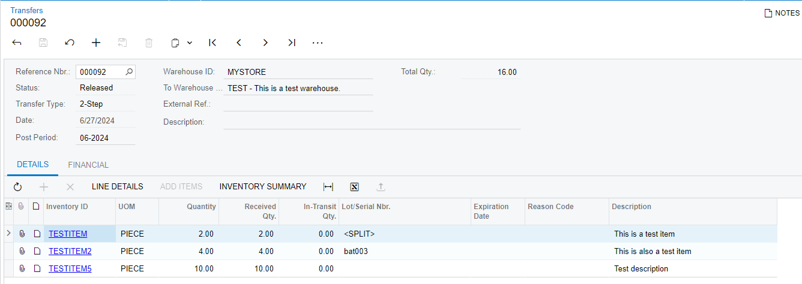
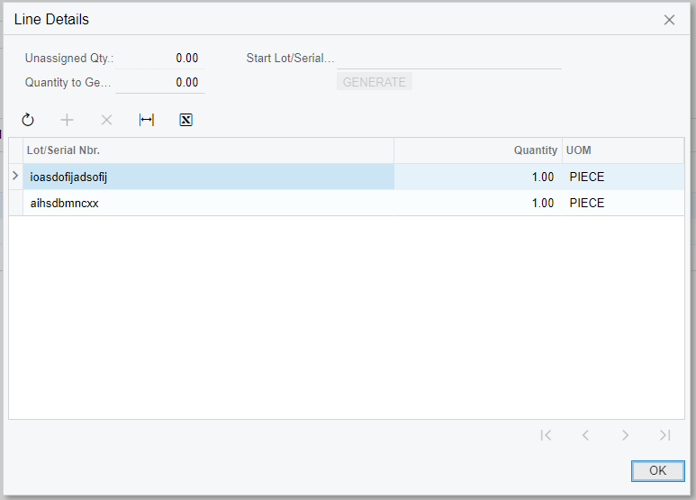

### Document Types:

The following documents are used in the integration process:

- Purchase Orders
- Purchase Receipts
- Transfers
- Receipts
- Sales Orders
- Shipments

#### Purchase Orders

Purchase orders are inbound documents and are brought into Granite as Receiving documents. 
They do not have allocations (line details) as these are on the purchase receipt.

These documents are not updated with directly with received quantities, rather, Purchase Receipts are created that specify the received quantities. 

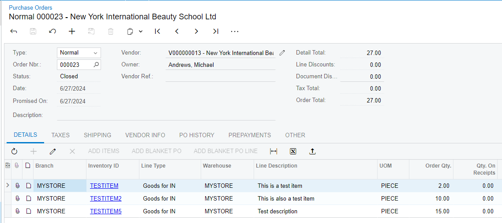

#### Purchase Receipts

Purchase receipts are associated with a Purchase order and represent what was actually received against the Purchase Order. 
You can have multiple Purchase Receipts per Purchase order. 

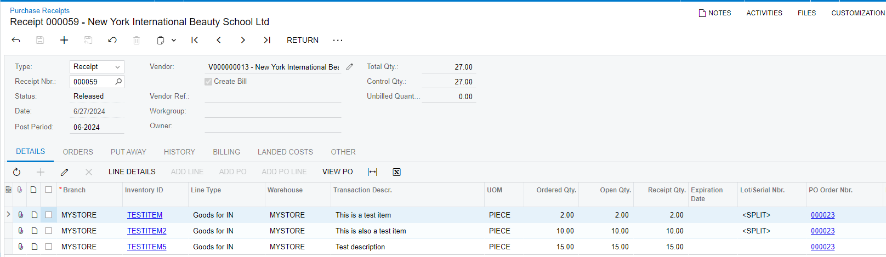

#### Transfers

Transfers are movements of goods between warehouses. 

There are 2 types of Transfers: 1-step and 2-step

- 1-Step Transfers are the equivalent of Transfers in Granite. A difference to note is the the quantity on the document is the quantity that will be transferred when the document is marked as Released, there is no Action Qty. 

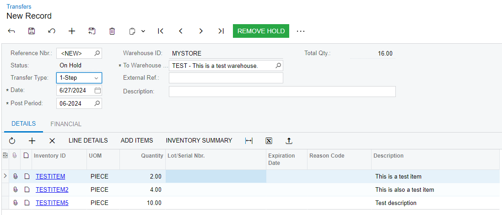

- 2-Step Transfers are the equivalent of Intransit documents in Granite. Similar to the 1-Step, there is no Action Qty, the quantity on the document is the quantity that will be removed from the warehouse and marked as intransit when the document is marked as Released. 

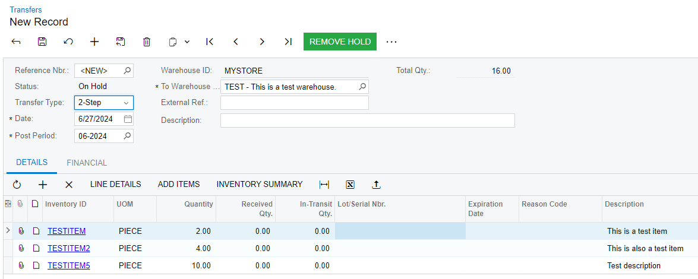

#### Receipts

Receipts are transactions that bring stock into Acumatica. For the purpose of our we will only be using Receipts that are associated with a Transfer and have a TransferNbr in the header. These receipts are brought into Granite as Receipt documents.

As with transfers, they do not have an Action Qty and the quantity will be the quantity that is received at the warehouse when the document is marked as Released. 

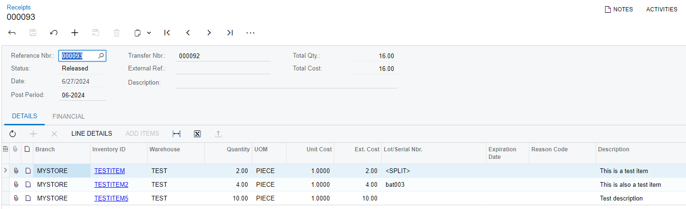

#### Sales Orders

These are outbound documents and are brought into Granite as Order documents. 
Like Purchase orders, they do not have allocations (Line details), these are on the Shipment. 

These documents are not updated directly with picked quantities. Instead, shipments are created against it that specify the quantities picked. 

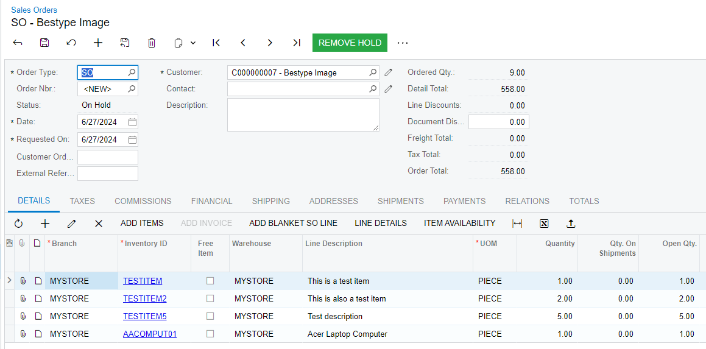

#### Shipments

Shipments are associated with a Sales order and represent the quantities picked. 
There can only one open Shipment against per Sales order. Once a Shipment is Released, a new shipment can be created if back orders are allowed on the Sales Order. 

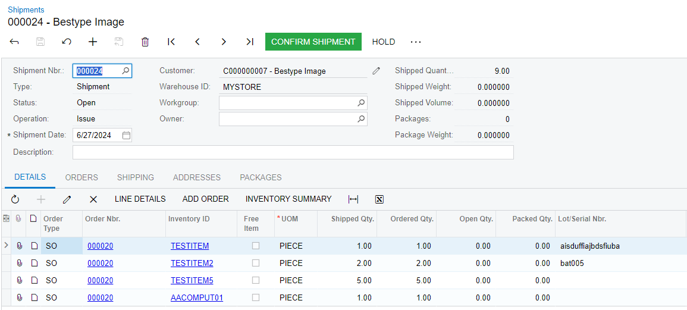