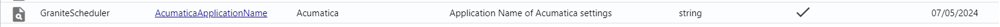
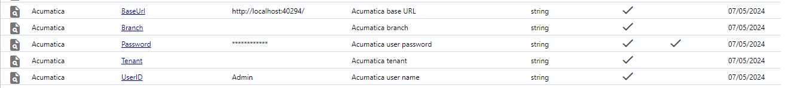
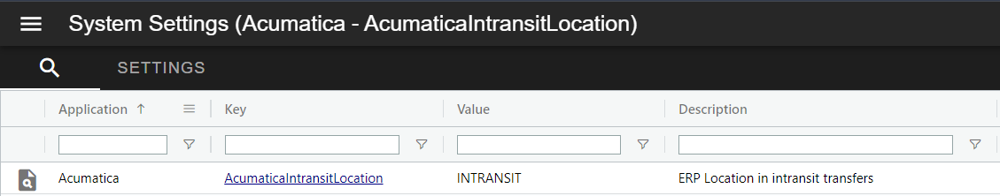
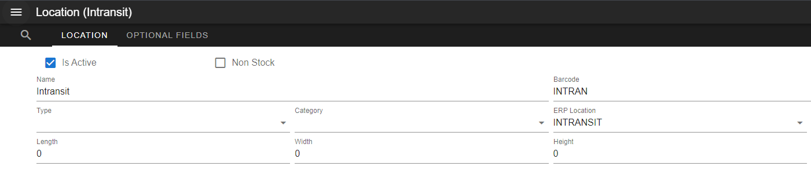
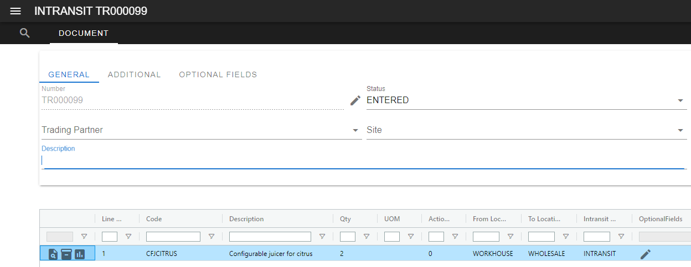

# Integration Jobs

Integration jobs are a special type of [Scheduler](../../scheduler/manual.md) job called [injected jobs](../../scheduler/manual.md#injected-jobs-integration-jobs). 
See below for information for specifics on how document and master data jobs work

## Supported document types 

 -   ORDER

    ---

    Acumatica type: Sales Order

 -   RECEIVING

    ---

    Acumatica type: Purchase Order

 -   TRANSFER

    ---

    Acumatica type: Transfer (1-Step)

 -   INTRANSIT

    ---

    Acumatica type: Transfer (2-Step)

 -   RECEIPT

    ---

    Acumatica type: Receipt (with TransferNbr)

## How it works
### Document Jobs
All data is currently fetched through Acumatica's ODataV4 endpoint. The ODataV4 endpoint allows us to construct queries on the underlying DAC (Data Access classes). ODataV4 does not uses Generic Inquiries and as such no custom views are needed in Acumatica.

GraniteScheduler runs injected jobs that check the IntegrationDocumentQueue for the lastUpdated time for the relevant document type(if no lastUpdated time is found it will use current time - 24hours). With this last updated time, it will then do a OData request for all relevant documents that have a last updated time greater than the lastUpdated time from the IntegrationDocumentQueue. If there are any documents that fit those criteria they are inserted into the IntegrationDocumentQueue. The job then runs this queue.

When a record with Status 'ENTERED' is found, the job uses a OData request to fetch the information related to that document from the Acumatica and apply the changes to the Granite document. 

All valid changes to data in the Granite tables are logged to the Audit table, showing the previous value and the new value.

If a change is made in the ERP system that would put Granite into an invalid state, no changes are applied. Instead, the ERPSyncFailed field is set to true and the ERPSyncFailedReason field shows the reason for the failure. The IntegrationLog table will contain further details on the failure if applicable.

#### Document Statuses

For Sales Orders the statuses are mapped in the following way:

| Acumatica Status | Granite Status | 
|------------------|----------------|
| Back Order, Open | ENTERED |
| Expired, Canceled, Rejected | CANCELLED | 
| On Hold, Credit Hold, Risk Hold, Pending Approval, Pending Processing | ONHOLD |
| Completed, Invoiced, Shipping | COMPLETE |

For Purchase Orders the statuses are mapped in the following way:

| Acumatica Status | Granite Status | 
|------------------|----------------|
| Open | ENTERED |
| Canceled, Rejected | CANCELLED |
| On hold, Pending Approval, Pending Email, Pending Printing | ONHOLD |
| Completed, Closed | COMPLETED|

For Transfers and Receipts the statuses are mapped in the following way:

| Acumatica Status | Granite Status | 
|------------------|----------------|
| Balanced | ENTERED |
| On hold | ONHOLD |
| Released | COMPLETED|

### Master data jobs
MasterItems and TradingPartners have their own Jobs. These Jobs fetch all StockItems, Vendors, and Customers from  Acumatica and compares them to the MasterItems and TradingPartners in Granite. Any inserts / updates are done as required. 

The document jobs also sync changes to the MasterItems that are on the document. This means that on sites that do not make many changes to their MasterItems it is better to limit running this job to once a day or even less frequently. 

Document Jobs do not automatically sync trading partners as they are not required to create to the document in Granite and as such are only synced when the TradingPartner Job runs. 

## Install 

### Set up database triggers, views, and data

Run the `AcumaticaIntegrationJobs_Create.sql` script to insert the required SystemSettings and ScheduledJob table entries needed. 
You can then just activate the Scheduled Jobs that are needed. 

The system setting AcumaticaApplicationName is defaulted to 'Acumatica'. If you change this then you should also change it in the Integration service config file so that the scheduled Jobs amd Integration service can share settings. If you wish to use different SystemSettings for each then you need to specify a different value. 

#### SystemSettings

##### Base URL

The base url can be found in IIS if hosted locally or provided by the customer if hosted in the cloud.

!!! note 
      You need to set the password from inside the Webdesktop if you are going to encrypt the password. 

##### AcumaticaIntansitLocation

Acumatica does not specify a intransit location on its 2-step transfers so it needs to be specified in this system setting. This is the ERP location for the location used in Intransit documents. 

### Add the Injected job files to GraniteScheduler
To add the injected job files to the GraniteScheduler, simply copy the dlls and xml files into the root folder of GraniteScheduler. 

## Configure

### Schedule configuration
See the GraniteScheduler manual for the details on how to [configure injected jobs](../../scheduler/manual.md#injected-jobs-integration-jobs).
Most of the work will have already been done for you by the `AcumaticaIntegrationJobs_Create.sql` script, you can simply activate the jobs you want to run.

### Email on Error

!!! note 
    Emailing functionality is now handled by the [Custodian API](../../custodian-api/manual.md), set up has changed from previous versions.

Ensure that you have configured the CustodianApiUrl for the Scheduler in the `SystemSettings` table:

| Application | Key | Value |
|---|---|---|
| GraniteScheduler | CustodianApiUrl | https://localhost:5001/ |

Ensure you have the `IntegrationError` email template in your database. This is the email template that is used for all error notifications in these injected jobs. 

Then for each job that needs to send failure notifications, add a job input for `MailOnError` and `MailOnErrorToAddresses`:

| JobName | Name | Value |
| --- | --- | --- |
| < JobName goes here > | MailOnError | true |
| < JobName goes here > | MailOnErrorToAddresses | name@client.co.za;name2@client.co.za |