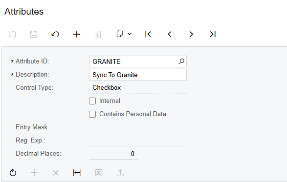
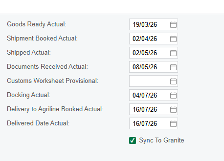
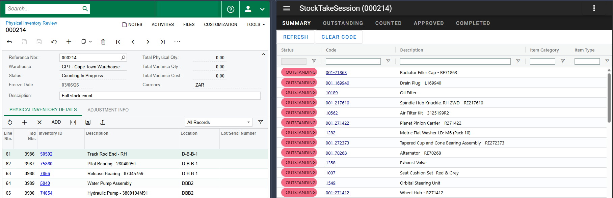
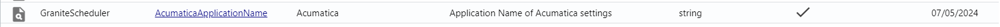
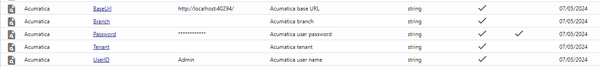
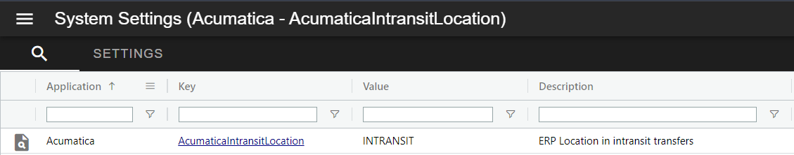
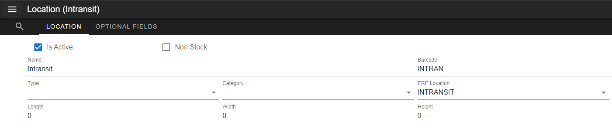
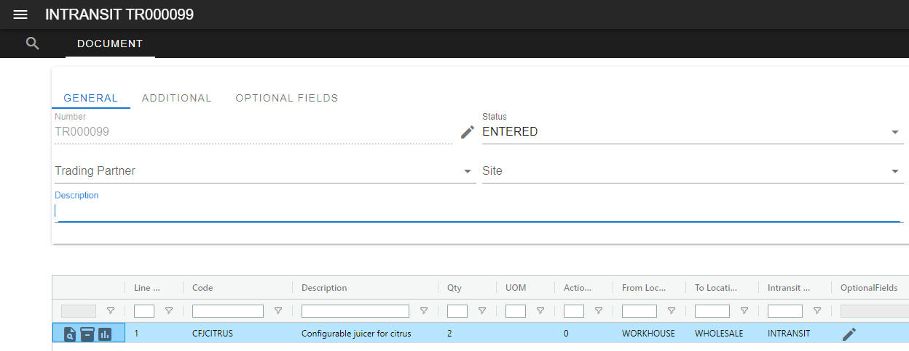

# Integration Jobs

Integration jobs are a special type of [Scheduler](../../scheduler/manual.md) job called [injected jobs](../../scheduler/manual.md#injected-jobs-integration-jobs). 
See below for information for specifics on how document and master data jobs work

## Supported document types 
<div class="grid cards" markdown>

 -   ORDER

    ---

    Acumatica type: Sales Order

 -   RECEIVING

    ---

    Acumatica type: Purchase Order / Purchase Receipt 

 -   TRANSFER

    ---

    Acumatica type: Transfer (1-Step)

 -   INTRANSIT

    ---

    Acumatica type: Transfer (2-Step)

 -   RECEIPT

    ---

    Acumatica type: Receipt (with TransferNbr)
    
 -   RTS

    ---

    Acumatica type: Return to Supplier (Purchase Receipt with `ReceiptType = RN`, mapped to Granite `ORDER`)

</div>

## How it works
### Document Jobs
All data is currently fetched through Acumatica's ODataV4 endpoint. The ODataV4 endpoint allows us to construct queries on the underlying DAC (Data Access classes). ODataV4 does not uses Generic Inquiries and as such no custom views are needed in Acumatica.

GraniteScheduler runs injected jobs that check the IntegrationDocumentQueue for the lastUpdated time for the relevant document type(if no lastUpdated time is found it will use current time - 24hours). With this last updated time, it will then do a OData request for all relevant documents that have a last updated time greater than the lastUpdated time from the IntegrationDocumentQueue. If there are any documents that fit those criteria they are inserted into the IntegrationDocumentQueue. The job then runs this queue.

When a record with Status 'ENTERED' is found, the job uses a OData request to fetch the information related to that document from the Acumatica and apply the changes to the Granite document. 

All valid changes to data in the Granite tables are logged to the Audit table, showing the previous value and the new value.

If a change is made in the ERP system that would put Granite into an invalid state, no changes are applied. Instead, the ERPSyncFailed field is set to true and the ERPSyncFailedReason field shows the reason for the failure. The IntegrationLog table will contain further details on the failure if applicable.

#### Document Statuses

<h5>Sales Order</h5>

For Sales Orders the statuses are mapped in the following way:

| Acumatica Status | Granite Status | 
|------------------|----------------|
| Back Order, Open | ENTERED |
| Expired, Canceled, Rejected | CANCELLED | 
| On Hold, Credit Hold, Risk Hold, Pending Approval, Pending Processing | ONHOLD |
| Completed, Invoiced, Shipping | COMPLETE |

Sales Order allocation behavior:

- Sales order lines are fetched with `SOLineSplitCollection`.
- A line is only pickable when all splits on that line have `IsAllocated = true`; if not, Granite line `Qty` is set to `0`.
- If `ShipComplete = C` and not all sales order lines are fully allocated, Granite status is forced to `ONHOLD`.

<h5>Purchase Order</h5>

For Purchase Orders the statuses are mapped in the following way:

| Acumatica Status | Granite Status | 
|------------------|----------------|
| Open | ENTERED |
| Canceled, Rejected | CANCELLED |
| On hold, Pending Approval, Pending Email, Pending Printing | ONHOLD |
| Completed, Closed | COMPLETED|

For Purchase Receipts (`ReceiptType = RT` and `AttributeGRANITE = 1`) the statuses are mapped in the following way:

| Acumatica Status | Granite Status |
|------------------|----------------|
| Hold = true | ONHOLD |
| Hold = false and Released = false | ENTERED |
| Released = true | COMPLETE |

For Return to Supplier (RTS) the statuses are mapped in the following way:

| Acumatica Status | Granite Status |
|------------------|----------------|
| Hold = true | ONHOLD |
| Hold = false and Released = false | ENTERED |
| Released = true | COMPLETE |

For Transfers and Receipts the statuses are mapped in the following way:

| Acumatica Status | Granite Status | 
|------------------|----------------|
| Balanced | ENTERED |
| On hold | ONHOLD |
| Released | COMPLETED|

#### Purchase Receipt job
`PurchaseOrderReceiptJob` integrates Acumatica Purchase Receipts into Granite as a Purchase order with the lines linked back to the original Purchase Order line via the `LinkedDetail_id`.
This allows the grouping of Purchase orders to be received using a single Receipt number if multiple purchase orders are going to be delivered in a single shipment. See the [Acumatica overview](./acumatica-overview.md#purchase-receipts) for more details

The user defined attribute GRANITE must be added to the header of the document in order for it to be flagged to integrate into Granite. 

 

### Master data jobs
MasterItems and TradingPartners have their own Jobs. These Jobs fetch all StockItems, Vendors, and Customers from  Acumatica and compares them to the MasterItems and TradingPartners in Granite. Any inserts / updates are done as required. 

The document jobs also sync changes to the MasterItems that are on the document. This means that on sites that do not make many changes to their MasterItems it is better to limit running this job to once a day or even less frequently. 

Document Jobs do not automatically sync trading partners as they are not required to create to the document in Granite and as such are only synced when the TradingPartner Job runs. 

### InSite Status job
`InSiteStatusJob` synchronizes Acumatica site/item stock status data into Granite into the custom table [`Integration_INSiteStatus`](#insitestatus-database-objects). This is table can then be used for inventory variance. 

### Stock Take Session job
`StockTakeSessionJob` seeds Granite `StockTakeSession` and `StockTakeLines` rows from new Acumatica **Physical Inventory Reviews** (PIRs).
This job currently only support full warehouse stock take, meaning all items in the specific ERPLocation in Granite must be counted. 
It does this by selecting every in-stock `TrackingEntity` (`InStock = 1`) whose `Location.ERPLocation` matches the session's `ERPLocation`, with each line defaulted to `Status = 'OUTSTANDING'`.



!!! note
    Unlike the document jobs, the Stock Take Session job does not use `IntegrationDocumentQueue`. The lookback is a fixed 24 hours from `DateTime.Now` on every run.

## Setup 

### Add the Acumatica providers to the Granite Scheduler

Copy the dlls and xml files from `GraniteScheduler\Providers\Acumatica` into the root folder of GraniteScheduler. 

### Set up database triggers, views, and data

To create the Scheduled Jobs run the following script:

```sql
INSERT INTO [GraniteDatabase].dbo.ScheduledJobs (isActive, JobName, JobDescription, [Type], InjectJob, Interval, IntervalFormat, AuditDate, AuditUser)
SELECT 0, 'Acumatica MasterItem Job', 'Syncs MasterItems from Acumatica', 'INJECTED', 'Granite.Integration.Acumatica.Job.MasterItem', '24', 'HOURS', GETDATE(), 'AUTOMATION'
WHERE NOT EXISTS (SELECT 1 FROM [GraniteDatabase].dbo.ScheduledJobs WHERE JobName = 'Acumatica MasterItem Job');

INSERT INTO [GraniteDatabase].dbo.ScheduledJobs (isActive, JobName, JobDescription, [Type], InjectJob, Interval, IntervalFormat, AuditDate, AuditUser)
SELECT 0, 'Acumatica Purchase Order Job', 'Syncs PurchaseOrders from Acumatica', 'INJECTED', 'Granite.Integration.Acumatica.Job.PurchaseOrder', '5', 'MINUTES', GETDATE(), 'AUTOMATION'
WHERE NOT EXISTS (SELECT 1 FROM [GraniteDatabase].dbo.ScheduledJobs WHERE JobName = 'Acumatica Purchase Order Job');

INSERT INTO [GraniteDatabase].dbo.ScheduledJobs (isActive, JobName, JobDescription, [Type], InjectJob, Interval, IntervalFormat, AuditDate, AuditUser)
SELECT 0, 'Acumatica Purchase Receipt Job', 'Syncs PurchaseReceipts from Acumatica', 'INJECTED', 'Granite.Integration.Acumatica.Job.PurchaseOrderReceipt', '5', 'MINUTES', GETDATE(), 'AUTOMATION'
WHERE NOT EXISTS (SELECT 1 FROM [GraniteDatabase].dbo.ScheduledJobs WHERE JobName = 'Acumatica Purchase Receipt Job');

INSERT INTO [GraniteDatabase].dbo.ScheduledJobs (isActive, JobName, JobDescription, [Type], InjectJob, Interval, IntervalFormat, AuditDate, AuditUser)
SELECT 0, 'Acumatica Receipt Job', 'Syncs Receipts from Acumatica', 'INJECTED', 'Granite.Integration.Acumatica.Job.Receipt', '5', 'MINUTES', GETDATE(), 'AUTOMATION'
WHERE NOT EXISTS (SELECT 1 FROM [GraniteDatabase].dbo.ScheduledJobs WHERE JobName = 'Acumatica Receipt Job');

INSERT INTO [GraniteDatabase].dbo.ScheduledJobs (isActive, JobName, JobDescription, [Type], InjectJob, Interval, IntervalFormat, AuditDate, AuditUser)
SELECT 0, 'Acumatica Return To Supplier Job', 'Syncs Return-to-Supplier documents from Acumatica', 'INJECTED', 'Granite.Integration.Acumatica.Job.ReturnsToSupplier', '5', 'MINUTES', GETDATE(), 'AUTOMATION'
WHERE NOT EXISTS (SELECT 1 FROM [GraniteDatabase].dbo.ScheduledJobs WHERE JobName = 'Acumatica Return To Supplier Job');

INSERT INTO [GraniteDatabase].dbo.ScheduledJobs (isActive, JobName, JobDescription, [Type], InjectJob, Interval, IntervalFormat, AuditDate, AuditUser)
SELECT 0, 'Acumatica Sales Order Job', 'Syncs SalesOrders from Acumatica', 'INJECTED', 'Granite.Integration.Acumatica.Job.SalesOrder', '5', 'MINUTES', GETDATE(), 'AUTOMATION'
WHERE NOT EXISTS (SELECT 1 FROM [GraniteDatabase].dbo.ScheduledJobs WHERE JobName = 'Acumatica Sales Order Job');

INSERT INTO [GraniteDatabase].dbo.ScheduledJobs (isActive, JobName, JobDescription, [Type], InjectJob, Interval, IntervalFormat, AuditDate, AuditUser)
SELECT 0, 'Acumatica Transfer Job', 'Syncs Transfers from Acumatica', 'INJECTED', 'Granite.Integration.Acumatica.Job.Transfer', '5', 'MINUTES', GETDATE(), 'AUTOMATION'
WHERE NOT EXISTS (SELECT 1 FROM [GraniteDatabase].dbo.ScheduledJobs WHERE JobName = 'Acumatica Transfer Job');

INSERT INTO [GraniteDatabase].dbo.ScheduledJobs (isActive, JobName, JobDescription, [Type], InjectJob, Interval, IntervalFormat, AuditDate, AuditUser)
SELECT 0, 'Acumatica Trading Partner Job', 'Syncs TradingPartners from Acumatica', 'INJECTED', 'Granite.Integration.Acumatica.Job.TradingPartner', '4', 'HOURS', GETDATE(), 'AUTOMATION'
WHERE NOT EXISTS (SELECT 1 FROM [GraniteDatabase].dbo.ScheduledJobs WHERE JobName = 'Acumatica Trading Partner Job');

INSERT INTO [GraniteDatabase].dbo.ScheduledJobs (isActive, JobName, JobDescription, [Type], InjectJob, Interval, IntervalFormat, AuditDate, AuditUser)
SELECT 0, 'Acumatica InSite Status Job', 'Syncs InSite Stock on Hand from Acumatica', 'INJECTED', 'Granite.Integration.Acumatica.Job.InSiteStatus', '12', 'HOURS', GETDATE(), 'AUTOMATION'
WHERE NOT EXISTS (SELECT 1 FROM [GraniteDatabase].dbo.ScheduledJobs WHERE JobName = 'Acumatica InSite Status Job');

INSERT INTO [GraniteDatabase].dbo.ScheduledJobs (isActive, JobName, JobDescription, [Type], InjectJob, Interval, IntervalFormat, AuditDate, AuditUser)
SELECT 0, 'Acumatica StockTake Session Job', 'Syncs Physical Inventory Reviews from Acumatica into Granite StockTake sessions', 'INJECTED', 'Granite.Integration.Acumatica.Job.StockTake', '5', 'MINUTES', GETDATE(), 'AUTOMATION'
WHERE NOT EXISTS (SELECT 1 FROM [GraniteDatabase].dbo.ScheduledJobs WHERE JobName = 'Acumatica StockTake Session Job');

-- Insert Acumatica System Settings
INSERT INTO [GraniteDatabase].dbo.SystemSettings ([Application], [Key], [Value], [Description], [ValueDataType], [isActive], [isEncrypted], [EncryptionKey], [AuditDate], [AuditUser], [Version])
SELECT 'Acumatica', 'BaseUrl', '', 'Acumatica base URL', 'String', 1, 0, NULL, GETDATE(), 'AUTOMATION', 1
WHERE NOT EXISTS (SELECT 1 FROM [GraniteDatabase].dbo.SystemSettings WHERE [Application] = 'Acumatica' AND [Key] = 'BaseUrl');

INSERT INTO [GraniteDatabase].dbo.SystemSettings ([Application], [Key], [Value], [Description], [ValueDataType], [isActive], [isEncrypted], [EncryptionKey], [AuditDate], [AuditUser], [Version])
SELECT 'Acumatica', 'UserID', '', 'Acumatica user name', 'String', 1, 0, NULL, GETDATE(), 'AUTOMATION', 1
WHERE NOT EXISTS (SELECT 1 FROM [GraniteDatabase].dbo.SystemSettings WHERE [Application] = 'Acumatica' AND [Key] = 'UserID');

INSERT INTO [GraniteDatabase].dbo.SystemSettings ([Application], [Key], [Value], [Description], [ValueDataType], [isActive], [isEncrypted], [EncryptionKey], [AuditDate], [AuditUser], [Version])
SELECT 'Acumatica', 'Password', '', 'Acumatica user password', 'String', 1, 1, NULL, GETDATE(), 'AUTOMATION', 1
WHERE NOT EXISTS (SELECT 1 FROM [GraniteDatabase].dbo.SystemSettings WHERE [Application] = 'Acumatica' AND [Key] = 'Password');

INSERT INTO [GraniteDatabase].dbo.SystemSettings ([Application], [Key], [Value], [Description], [ValueDataType], [isActive], [isEncrypted], [EncryptionKey], [AuditDate], [AuditUser], [Version])
SELECT 'Acumatica', 'Tenant', '', 'Acumatica tenant', 'String', 1, 0, NULL, GETDATE(), 'AUTOMATION', 1
WHERE NOT EXISTS (SELECT 1 FROM [GraniteDatabase].dbo.SystemSettings WHERE [Application] = 'Acumatica' AND [Key] = 'Tenant');

INSERT INTO [GraniteDatabase].dbo.SystemSettings ([Application], [Key], [Value], [Description], [ValueDataType], [isActive], [isEncrypted], [EncryptionKey], [AuditDate], [AuditUser], [Version])
SELECT 'Acumatica', 'Branch', '', 'Acumatica branch', 'String', 1, 0, NULL, GETDATE(), 'AUTOMATION', 1
WHERE NOT EXISTS (SELECT 1 FROM [GraniteDatabase].dbo.SystemSettings WHERE [Application] = 'Acumatica' AND [Key] = 'Branch');

INSERT INTO [GraniteDatabase].dbo.SystemSettings ([Application], [Key], [Value], [Description], [ValueDataType], [isActive], [isEncrypted], [EncryptionKey], [AuditDate], [AuditUser], [Version])
SELECT 'Acumatica', 'AcumaticaIntransitLocation', '', 'ERP Location in intransit transfers', 'String', 1, 0, NULL, GETDATE(), 'AUTOMATION', 1
WHERE NOT EXISTS (SELECT 1 FROM [GraniteDatabase].dbo.SystemSettings WHERE [Application] = 'Acumatica' AND [Key] = 'AcumaticaIntransitLocation');

INSERT INTO [GraniteDatabase].dbo.SystemSettings ([Application], [Key], [Value], [Description], [ValueDataType], [isActive], [isEncrypted], [EncryptionKey], [AuditDate], [AuditUser], [Version])
SELECT 'Acumatica', 'AcumaticaSalesOrderPrefix', '', 'Acumatica sales order prefix', 'String', 1, 0, NULL, GETDATE(), 'AUTOMATION', 1
WHERE NOT EXISTS (SELECT 1 FROM [GraniteDatabase].dbo.SystemSettings WHERE [Application] = 'Acumatica' AND [Key] = 'AcumaticaSalesOrderPrefix');

INSERT INTO [GraniteDatabase].dbo.SystemSettings ([Application], [Key], [Value], [Description], [ValueDataType], [isActive], [isEncrypted], [EncryptionKey], [AuditDate], [AuditUser], [Version])
SELECT 'Acumatica', 'AcumaticaPurchaseOrderPrefix', '', 'Acumatica purchase order prefix', 'String', 1, 0, NULL, GETDATE(), 'AUTOMATION', 1
WHERE NOT EXISTS (SELECT 1 FROM [GraniteDatabase].dbo.SystemSettings WHERE [Application] = 'Acumatica' AND [Key] = 'AcumaticaPurchaseOrderPrefix');

INSERT INTO [GraniteDatabase].dbo.SystemSettings ([Application], [Key], [Value], [Description], [ValueDataType], [isActive], [isEncrypted], [EncryptionKey], [AuditDate], [AuditUser], [Version])
SELECT 'Acumatica', 'AcumaticaPurchaseOrderReceiptPrefix', '', 'Acumatica purchase order receipt prefix', 'String', 1, 0, NULL, GETDATE(), 'AUTOMATION', 1
WHERE NOT EXISTS (SELECT 1 FROM [GraniteDatabase].dbo.SystemSettings WHERE [Application] = 'Acumatica' AND [Key] = 'AcumaticaPurchaseOrderReceiptPrefix');

INSERT INTO [GraniteDatabase].dbo.SystemSettings ([Application], [Key], [Value], [Description], [ValueDataType], [isActive], [isEncrypted], [EncryptionKey], [AuditDate], [AuditUser], [Version])
SELECT 'Acumatica', 'AcumaticaTransferOrderPrefix', '', 'Acumatica transfer order prefix', 'String', 1, 0, NULL, GETDATE(), 'AUTOMATION', 1
WHERE NOT EXISTS (SELECT 1 FROM [GraniteDatabase].dbo.SystemSettings WHERE [Application] = 'Acumatica' AND [Key] = 'AcumaticaTransferOrderPrefix');

INSERT INTO [GraniteDatabase].dbo.SystemSettings ([Application], [Key], [Value], [Description], [ValueDataType], [isActive], [isEncrypted], [EncryptionKey], [AuditDate], [AuditUser], [Version])
SELECT 'Acumatica', 'AcumaticaTransferReceiptPrefix', '', 'Acumatica transfer receipt prefix', 'String', 1, 0, NULL, GETDATE(), 'AUTOMATION', 1
WHERE NOT EXISTS (SELECT 1 FROM [GraniteDatabase].dbo.SystemSettings WHERE [Application] = 'Acumatica' AND [Key] = 'AcumaticaTransferReceiptPrefix');
INSERT INTO [GraniteDatabase].dbo.SystemSettings ([Application], [Key], [Value], [Description], [ValueDataType], [isActive], [isEncrypted], [EncryptionKey], [AuditDate], [AuditUser], [Version])
SELECT 'Acumatica', 'AcumaticaReturnToSupplierPrefix', '', 'Acumatica return to supplier prefix', 'String', 1, 0, NULL, GETDATE(), 'AUTOMATION', 1
WHERE NOT EXISTS (SELECT 1 FROM [GraniteDatabase].dbo.SystemSettings WHERE [Application] = 'Acumatica' AND [Key] = 'AcumaticaReturnToSupplierPrefix');

```

#### InSiteStatus database objects
The `InSiteStatusJob` requires the table `Integration_INSiteStatus` and the view `ERP_StockOnHand`.

Create the table:

```sql
CREATE TABLE dbo.Integration_INSiteStatus
(
    -- Inventory Item Information
    InventoryCD NVARCHAR(50) NOT NULL,
    SiteCD NVARCHAR(50) NOT NULL,
    
    -- Quantity Fields
    QtyOnHand DECIMAL(18,4) NOT NULL,
    QtyAvail DECIMAL(18,4) NOT NULL,
    QtyInTransit DECIMAL(18,4) NOT NULL,
    QtyPOOrders DECIMAL(18,4) NOT NULL,
    
    -- Additional Fields
    NoteID NVARCHAR(100) NULL,
    LastModifiedDateTime DATETIME2(7) NOT NULL,
    [Updated] [bit] NULL,
);
GO;
```

Create (or update) the view:

```sql
CREATE OR ALTER VIEW [dbo].[ERP_StockOnHand]
AS
SELECT RTRIM(SiteCD) AS LOCATION,
       RTRIM(InventoryCD) AS ITEMNO,
       QtyOnHand AS QTYONHAND,
       QtyPOOrders AS QTYONORDER,
       0 AS QTYSALORDR,
       0 AS AVRCOST
FROM Integration_INSiteStatus
GO
```

#### SystemSettings

<h5>Base URL</h5>

The base url can be found in IIS if hosted locally or provided by the customer if hosted in the cloud.




<h5>UserID</h5>

The Acumatica user name that will be used for authentication with the OData endpoint.

<h5>Password</h5>

The Acumatica user password that will be used for authentication with the OData endpoint.

!!! note 
      You need to set the password from inside the Webdesktop if you are going to encrypt the password. 

<h5>Tenant</h5>

The Acumatica tenant identifier (if applicable for multi-tenant deployments).

<h5>Branch</h5>

The Acumatica branch code to use for document and master data synchronization.

<h5>AcumaticaSalesOrderPrefix</h5>

The prefix used to identify Acumatica sales orders during synchronization. This helps distinguish orders from different source systems.

<h5>AcumaticaPurchaseOrderPrefix</h5>

The prefix used to identify Acumatica purchase orders during synchronization.

<h5>AcumaticaPurchaseOrderReceiptPrefix</h5>

The prefix used to identify Acumatica purchase receipts during synchronization.

<h5>AcumaticaTransferOrderPrefix</h5>

The prefix used to identify Acumatica transfer orders (1-Step transfers) during synchronization.

<h5>AcumaticaTransferReceiptPrefix</h5>

The prefix used to identify Acumatica transfer receipts during synchronization.

<h5>AcumaticaReturnToSupplierPrefix</h5>

The prefix used to identify Acumatica Return-to-Supplier documents during synchronization.

<h5>AcumaticaIntansitLocation</h5>

Acumatica does not specify a intransit location on its 2-step transfers so it needs to be specified in this system setting. This is the ERP location for the location used in Intransit documents. 





## Configure

<h5>Schedule configuration</h5>
See the GraniteScheduler manual for the details on how to [configure injected jobs](../../scheduler/manual.md#injected-jobs-integration-jobs).
Most of the work will have already been done for you by the `AcumaticaIntegrationJobs_Create.sql` script, you can simply activate the jobs you want to run.

<h5>Email on Error</h5>

!!! note 
    Emailing functionality is now handled by the [Custodian API](../../custodian-api/index.md), set up has changed from previous versions.

Ensure that you have configured the CustodianApiUrl for the Scheduler in the `SystemSettings` table:

| Application | Key | Value |
|---|---|---|
| GraniteScheduler | CustodianApiUrl | https://localhost:5001/ |

Ensure you have the `IntegrationError` email template in your database. This is the email template that is used for all error notifications in these injected jobs. 

Then for each job that needs to send failure notifications, add a job input for `MailOnError` and `MailOnErrorToAddresses`:

| JobName | Name | Value |
| --- | --- | --- |
| < JobName goes here > | MailOnError | true |
| < JobName goes here > | MailOnErrorToAddresses | name@client.co.za;name2@client.co.za |