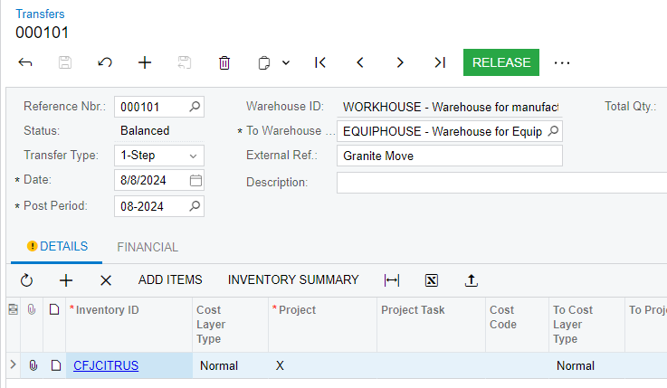
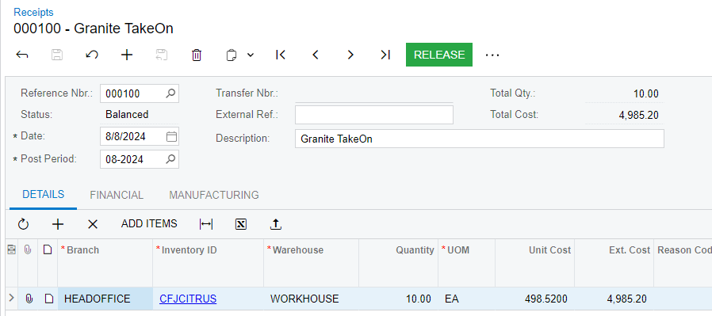
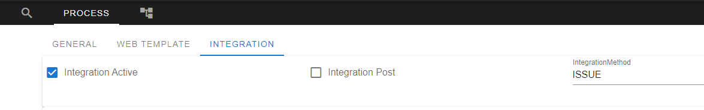

# SDK Provider

The Acumatica SDK provider is responsible for mapping Granite Transactions to the relevant format for posting to Acumatica. It makes use of the Acumatica REST API.

## How it connects

The upwards integration achieved using Acumatica's rest API. For more details on the Acumatica object's used in integration please consult the [Acumatica Overview](acumatica-overview.md). 

## Settings

!!! note
    To pick up any changes to the SystemSettings table, the IntegrationService will need to be restarted. 

The settings for Acumatica are configured in the SystemSettings table. The IntegrationService will pick up the settings using the Application name specified in it's `.config` file:
If this setting is missing from the config file or left empty, the IntegrationService will default to using `Acumatica` as the SystemSettingsApplicationName.
You can browse the IntegrationService's `/config` page to have the IntegrationService create the default settings in the SystemSettings table for you. 

### Config File Settings

```xml
    <add key="SystemSettingsApplicationName" value="Acumatica" />
    <add key="EndPoint" value="http://:40091/" />
```
#### SystemSettingsApplicationName
The Application name of the entries in the SystemSettings table that you want to use for this integration service. If this setting is the same as Application name for the ScheduledJobs they can use the same SystemSettings.

This setting allows you to have multiple integration services running with different settings.
### SystemSetting

- `BaseUrl` - Acumatica base URL. Default: empty.
- `UserID` - Acumatica user name. Default: empty.
- `Password` - Acumatica user password (encrypted). Default: empty.
- `Tenant` - Acumatica tenant. Default: empty.
- `Branch` - Acumatica branch. Default: empty.
- `DefaultLocation` - Acumatica default inventory location. Default: empty.
- `AcumaticaSalesOrderPrefix` - Acumatica sales order prefix. Default: empty.
- `AcumaticaPurchaseOrderPrefix` - Acumatica purchase order prefix. Default: empty.
- `AcumaticaTransferOrderPrefix` - Acumatica transfer order prefix. Default: empty.
- `AcumaticaTransferReceiptPrefix` - Acumatica transfer receipt prefix. Default: empty.
- `AcumaticaReturnToSupplierPrefix` - Acumatica return to supplier prefix. Default: empty.
- `ProductionOrderType` - Acumatica production order type. Default: empty.
- `AcumaticaWorkOrderPrefix` - Acumatica work order prefix. Default: empty.

### Acumatica Settings

#### Lot/Serial Tracking
For Granite to be able to post Serial Numbers or Batch back to Acumatica the feature in System Management > Enable/Disable Features > Lot and Serial Tracking needs to be turned on. 

After that a Lot/Serial class must be created and assigned to all Item Classes that require Lot/Serial tracking. 

If this is not done, acumatica will discard any Lot\Serial information sent as part of the request. 

#### Control Quantity

Acumatica has a feature that requires the user to validate the document quantity before changing the document status. 
This needs to be disabled in order from Granite to post documents into the system. 

The setting needs to be disabled in the following places (if Granite is integrating these documents):

- Sales Order Preferences > Validate Shipment Total on Confirmation
- Inventory Preferences > Validate Document Totals on Entry


## Integration Methods

By default if the method names below is the same as a Granite Transaction type, it will autowire the integration. 
If you require a different integration action you can specify the name below in the Process IntegrationMethod property. 
`CONSUME`/manufacturing behavior is not yet implemented for documented SDK-provider usage.

### ADJUSTMENT
- Granite Transaction: **ADJUSTMENT**
- Acumatica: **INVENTORY ADJUSTMENT**
- Supports:
    - Lot
    - Serial
- Integration Post
    - False - Creates a new Inventory Adjustment with status Balanced
    - True - Creates a new Inventory Adjustment and performs the Release action to change the Status to Released
- Returns:
    Reference Number 

| Granite    | Acumatica Entity | Required | Behavior |
|------------|------------------|----------|-----------|
| Code                        | InventoryID           |Y||
| Qty                         | Qty  |Y||
| FromLocation                | WarehouseID  |Y||
| UOM                         | UOM |Y||
| Batch                       | LotSerialNbr  |N||
| Serial                      | LotSerialNbr  |N||
| ExpirationDate              | ExpiryDate|N||

### SCRAP
- Granite Transaction: **SCRAP**
- Acumatica: **INVENTORY ADJUSTMENT**
- Supports:
    - Lot
    - Serial
- Integration Post
    - False - Creates a new Inventory Adjustment with status Balanced
    - True - Creates a new Inventory Adjustment and performs the Release action to change the Status to Released
- Returns:
    Reference Number 

| Granite    | Acumatica Entity | Required | Behavior |
|------------|------------------|----------|-----------|
| Code                        | InventoryID           |Y||
| Qty                         | Qty  |Y||
| FromLocation                | WarehouseID  |Y||
| UOM                         | UOM |Y||
| Batch                       | LotSerialNbr  |N||
| Serial                      | LotSerialNbr  |N||
| ExpirationDate              | ExpiryDate|N||

### MOVE/REPLENISH

MOVE and REPLENISH create the same transaction in Acumatica. They both share a transaction type in Acumatica with Transfers.
To prevent them being brought into Granite as transfers the external reference is populated (currently `Granite move` / `Granite replenish`) as you can see below.



- Granite Transaction: **MOVE/REPLENISH**
- Acumatica: **TransferOrder**
- Supports:
    - Serial
    - Lot
- Return
    - Transfer Number

- Integration Post
    - False - Creates a 1-Step Transfer in Acumatica with status Balanced. 
    - True - Changes the status of the transfer from Balanced to Released
- Returns:
    TransferNumber

| Granite    | Acumatica Entity | Required | Behavior |
|------------|------------------|----------|-----------|
| Code                        | InventoryID           |Y||
| Qty                         | Qty  |Y||
| FromLocation                | WarehouseID  |Y||
| ToLocation                  | ToWarehouseID  |Y||
| UOM                         | UOM |Y||
| Batch                       | LotSerialNbr  |N||
| Serial                      | LotSerialNbr  |N||
| ExpirationDate              | ExpiryDate|N||

### TAKEON

TAKEON uses the same transaction type in Acumatica as Transfer receipts. To prevent TAKEON receipts from being pulled into Granite as Transfer receipts the Description is populated with "Granite TakeOn". The scheduled job will then exclude these from being integrated.



- Granite Transaction: **TAKEON**
- Acumatica: **Inventory Receipt**
- Supports:
    - Serial
    - Lot
- Integration Post
    - False - Creates a Inventory Receipt in Acumatica with status Balanced
    - True - Changes the status of the Inventory Receipt to from Balanced to Released
- Return
    - Inventory Receipt Number

| Granite    | Acumatica Entity | Required | Behavior |
|------------|------------------|----------|-----------|
| Code                        | InventoryID           |Y||
| Qty                         | Qty  |Y||
| ToLocation                  | WarehouseID  |Y||
| UOM                         | UOM |Y||
| Batch                       | LotSerialNbr  |N||
| Serial                      | LotSerialNbr  |N||
| ExpirationDate              | ExpiryDate|N||

### RECLASSIFY

This process first performs as Adjustment decreasing the stock and then a receipt of the new stock.

- Granite Transaction: **RECLASSIFY**
- Acumatica: **Adjustment => Receipt**
- Supports:
    - Serial
    - Lot
- Integration Post
    - False - Creates an Adjustment and Inventory Receipt in Acumatica with status Balanced
    - True - Creates an Adjustment and Inventory Receipt and performs the Release action to change the Status to Released
- Returns:
    Receipt Number

| Granite    | Acumatica Entity | Required | Behavior |
|------------|------------------|----------|-----------|
| FromCode                    | InventoryID|          |Y||
| ToCode                    | InventoryID           |Y||
| Qty                         | Qty  |Y||
| FromLocation                | WarehouseID  |Y||
| ToLocation                  | WarehouseID  |Y||
| UOM                         | UOM |Y||
| Batch                       | LotSerialNbr  |N||
| Serial                      | LotSerialNbr  |N||
| ExpirationDate              | ExpiryDate|N||

### ISSUE 

This process issues inventory from stock. After this point it is no longer tracked in Acumatica. This can be seen as a pick but not against a document. 
It is not mapped to any specific Granite transaction type. If you have a requirement you will need to specify it as the integration method on the relevant process as you can see below. 



- Granite Transaction: **NONE**
- Acumatica: **ISSUE**
- Supports:
    - Lot
    - Serial

- Integration Post
    - False - Creates a new Issue, invokes Release From Hold, and does not invoke final Release.
    - True - Creates a new Issue, invokes Release From Hold, and then invokes Release to change status to Released.

-Returns 
    Issue Number

| Granite    | Acumatica Entity | Required | Behavior |
|------------|------------------|----------|-----------|
| Code                       | InventoryID           |Y||
| Qty                        | ShippedQty  |Y||
| FromLocation               | WarehouseID |Y||
| Lot                        | LotSerialNbr|N||
| Serial                     | LotSerialNbr|N||
| ExpirationDate             | ExpiryDate|N||

### PICK

- Granite Transaction: **PICK**
- Acumatica: **CREATE SHIPMENT**
- Supports:
    - Lot
    - Serial

- Integration Post
    - False - Creates a new Shipment with status Open
    - True - Creates a new shipment and performs the Confirm Shipment action

- Returns:
    Shipment Number

| Granite    | Acumatica Entity | Required | Behavior |
|------------|------------------|----------|-----------|
| Document                   | OrderNumber |Y||
| LineNumber                 |             |Y||
| Qty                        | ShippedQty  |Y||
| DocumentTradingPartnerCode | CustomerID  |Y||
| FromLocation               | WarehouseID |Y||
| Lot                        | LotSerialNbr|N||
| Serial                     | LotSerialNbr|N||
| ExpirationDate              | ExpiryDate|N||

### RECEIVE

- Granite Transaction: **RECEIVE**
- Acumatica: **CREATE PURCHASE RECEIPT**
- Supports:
    - Lot
    - Serial

- Integration Post
    - False - Creates a new Purchase Order Receipt with `On Hold` status (`Hold = true`)
    - True - Creates a new Purchase Order Receipt and performs the Release action to change the Status to Released. 
- Returns:
    Purchase Order Receipt Number

| Granite    | Acumatica Entity | Required | Behavior |
|------------|------------------|----------|-----------|
| Document                   | POOrderNumber |Y||
| LineNumber                 |               |Y||
| Qty                        | ReceiptQty    |Y||
| DocumentTradingPartnerCode | VendorID      |Y||
| TLocation                  | WarehouseID   |Y||
| Batch                      | LotSerialNbr  |N||
| Serial                     | LotSerialNbr  |N||
| ExpirationDate              | ExpiryDate|N||

### TRANSFER

!!! note
    The TRANSFER integration method supports Granite document types `TRANSFER`, `INTRANSIT`, and `RECEIPT` with different validation flows.

- Granite Transaction: **TRANSFER**
- Acumatica: **TransferOrder / InventoryReceipt**
- Supports:
    - Serial
    - Lot
- Document handling:
    - `TRANSFER` - Validates each Transfer Order allocation against Granite `ActionQty` (line + split + lot/serial where applicable), updates `ExternalRef` to `Quantities validated in Granite`, and optionally releases.
    - `INTRANSIT` - Uses the same validation/update path as `TRANSFER`, and when `Integration Post = True` also attempts transfer receipt creation.
    - `RECEIPT` - Validates ERP receipt detail/allocation quantities against Granite grouped transactions (`ActionQty`), appends `. Quantities validated in Granite` to receipt `Description`, and optionally releases.

- Integration Post
    - False - Runs validation and updates the ERP document without invoking release.
    - True - Runs validation and invokes release (`ReleaseTransferOrder` / `ReleaseInventoryReceipt`); for `INTRANSIT`, transfer receipt creation is also attempted.
- Returns:
    - `TRANSFER`/`INTRANSIT`: Transfer reference number.
    - `RECEIPT`: `AcumaticaTransferReceiptPrefix` + receipt reference number.

| Granite    | Acumatica Entity | Required | Behavior |
|------------|------------------|----------|-----------|
| Document                   | TransferOrder/InventoryReceipt |Y||
| LineNumber                 |               |Y||
| Qty / ActionQty            |               |Y| Validates Granite `ActionQty` against ERP allocation/detail quantities |
| Batch                      | LotSerialNbr  |N||
| Serial                     | LotSerialNbr  |N||
| ExpirationDate             | ExpiryDate|N||

### RETURNTOSUPPLIER

- Granite Transaction: **PICK**
- Acumatica: **PO RECEIPT RETURN**
- Supports:
    - Serial
    - Lot
- Validation behavior:
    - Validates each purchase receipt allocation against Granite `ActionQty` using `LineNumber-SplitLineNumber`.
    - For lot/serial tracked allocations, validates quantity per lot/serial number; otherwise validates total allocation quantity for the split line.
    - If allocations are missing or quantities do not match, integration fails with validation errors.
    - On successful validation, sets `VendorRef` to `Quantity validated in Granite`.
- Integration Post
    - False - Runs validation and updates the PO Receipt Return without releasing.
    - True - Runs validation, updates the document, and invokes release.
- Returns:
    `AcumaticaReturnToSupplierPrefix` + purchase receipt return number.

| Granite    | Acumatica Entity | Required | Behavior |
|------------|------------------|----------|-----------|
| Document                   | PurchaseReceipt |Y||
| LineNumber                 |               |Y| Use `LineNumber-SplitLineNumber` format for allocation validation |
| Qty / ActionQty            |               |Y| Validates Granite `ActionQty` against ERP allocation quantities |
| Batch                      | LotSerialNbr  |N||
| Serial                     | LotSerialNbr  |N||
| ExpirationDate             | ExpiryDate|N||
