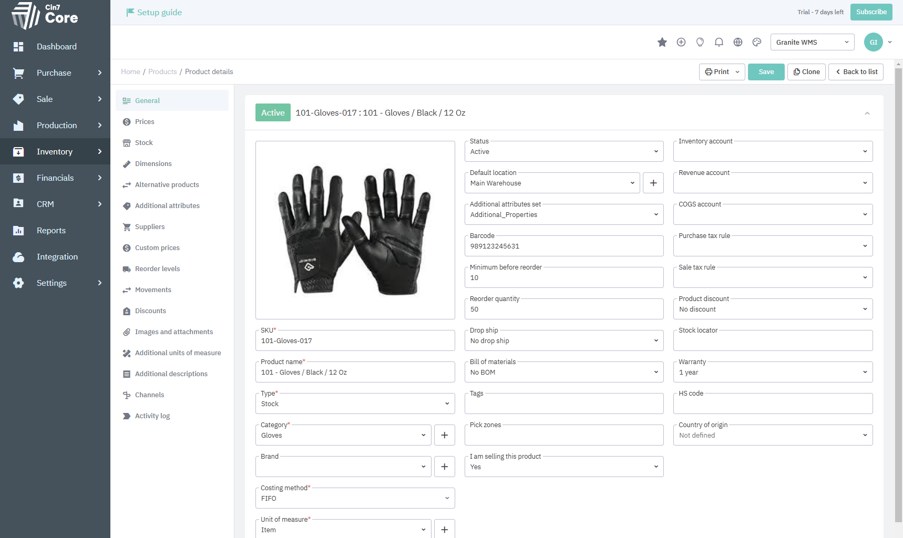
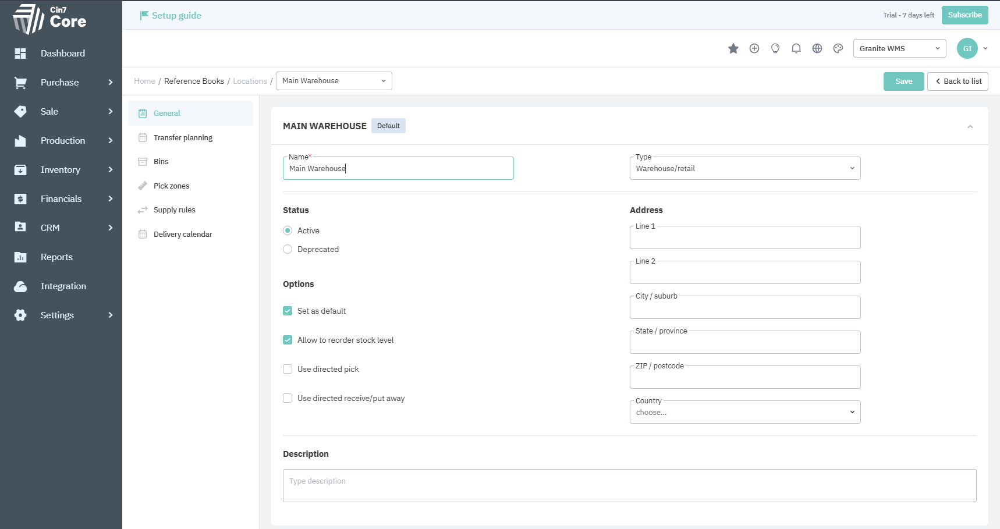
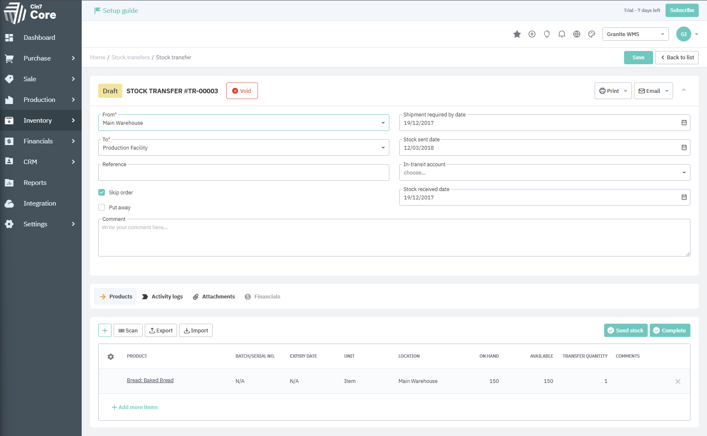
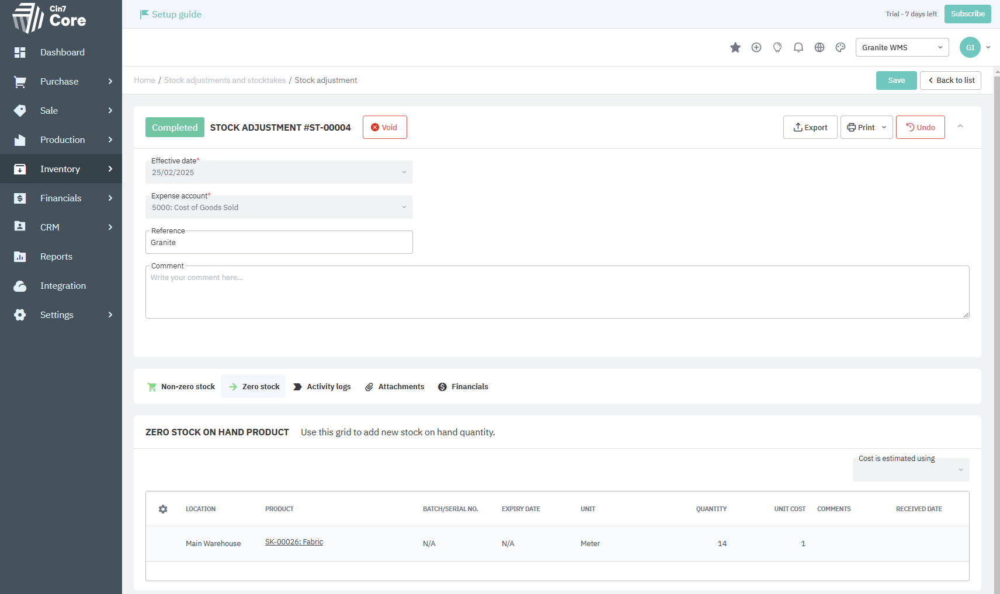
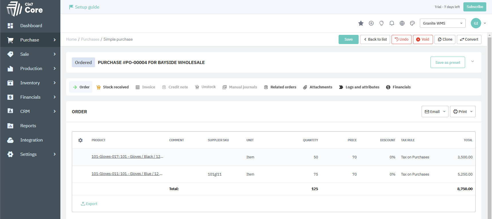
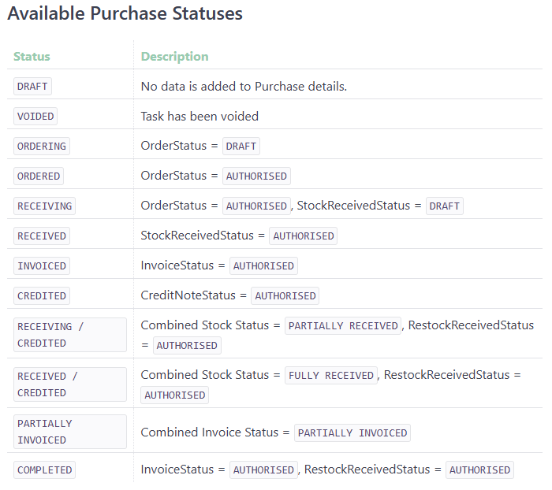
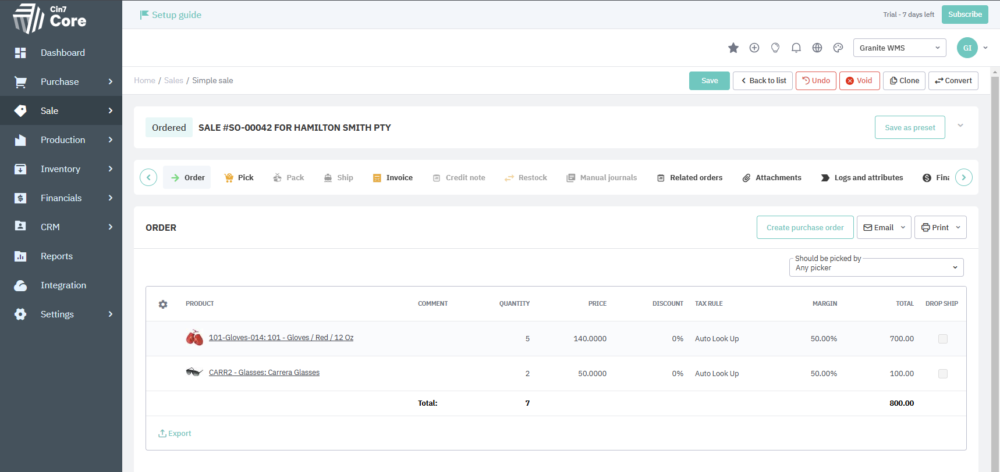
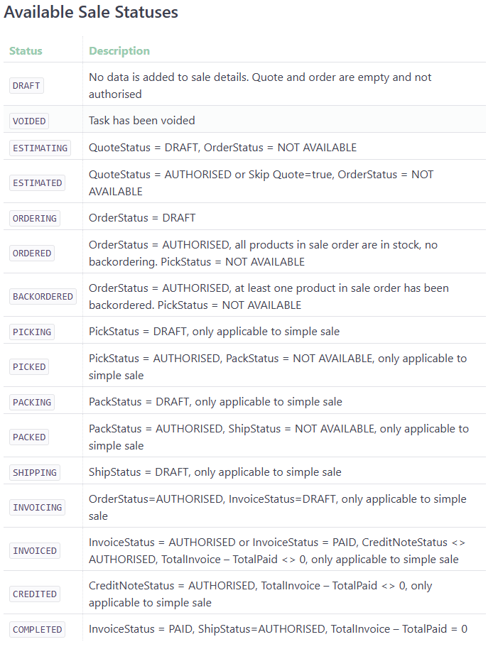

!!! note
    This documentation is a work in progress and is intended to show the development progress of the integration with CIN7. As such, it may be subject to change as progress is made. 

The purpose of this document is to provide an overview of CIN7 in terms of integrating with Granite. For details on how integration will take place and which Granite transactions are supported please see the [SDK Provider](sdk-provider.md) and the [integration jobs](integration-jobs.md).

## CIN7 Business Objects:

### Product

A product in CIN7 is what will be integrated into a Granite as a MasterItem. It has all normal fields like: SKU, Name, Barcode, ect...

### Location

A Location in CIN7 will be used in Granite as an ERP Location. They can be hard to find, but are under Setting>Reference Books>Locations.
It is important to have this set up in Granite as all CIN7 transactions require the location.

### StockTransfer

The first transaction type is StockTransfer. This is a movement of stock from one CIN7 location to another. This will occur only when stock moves from one ERPLocation to another as CIN7 locations are used as ERPLocations in Granite. The example below only has one item, but it supports multiple items on a single transfer. 

### StockTake/Adjustment

The next transaction type is StockTake/Adjustment. CIN7 used the same transaction type for both. As you can see at the bottom of the image below, it has tabs for Zero Stock and Non-zero Stock. These simply show if it is creating stock where there was now stock before in that location or if it is adjusting an existing stock level. An interesting thing to note about this transaction, is that you specify the total stock at the location, rather than the amount that you are adjusting by and it will work out how much the stock is changing by. 

### Purchase

Next up is Purchase. This CIN7 transaction is brought into Granite as Receiving document. Each Purchase will have a Supplier (Inbound Trading Partner in Granite) and a location specified where the stock is going to be received. Below you can see a example of a purchase and all the available statuses. 

### Sale

A CIN7 Sale is integrated into Granite as an Order document. It has a Customer(Outbound trading Partner) and a Location where the stock will be picked from. It is processed in three stages. Pick, Pack, and Ship. It must be processed in this order and each previous step needs to be completed before the next step. Below you can see an example and all of the available status. 

### Production Orders

Work in progress...
