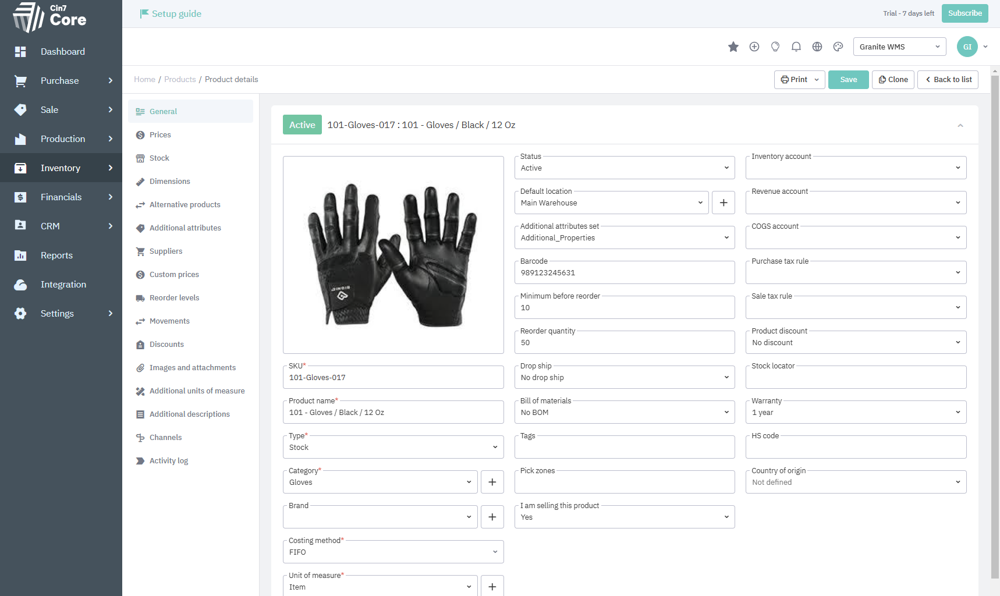
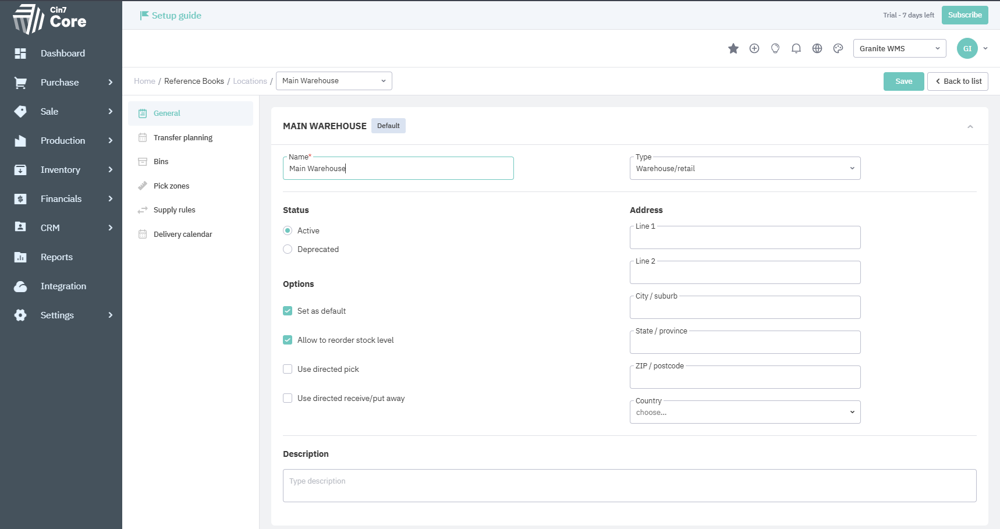
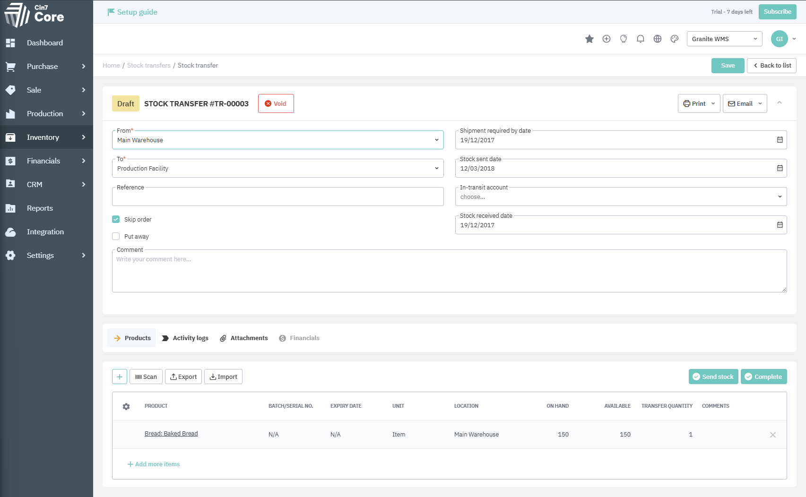
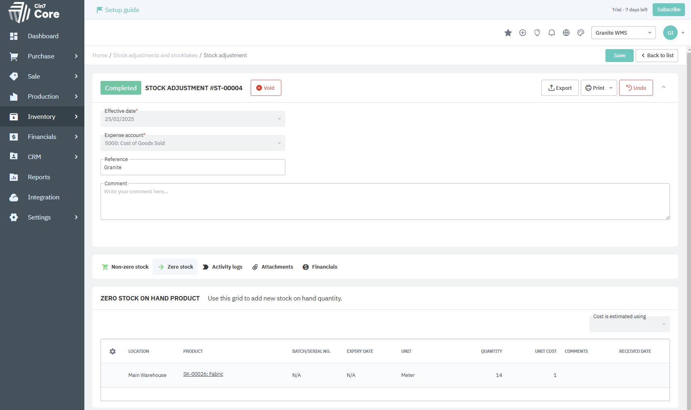
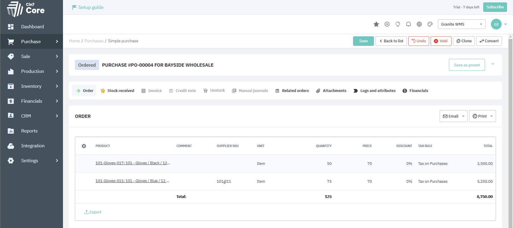
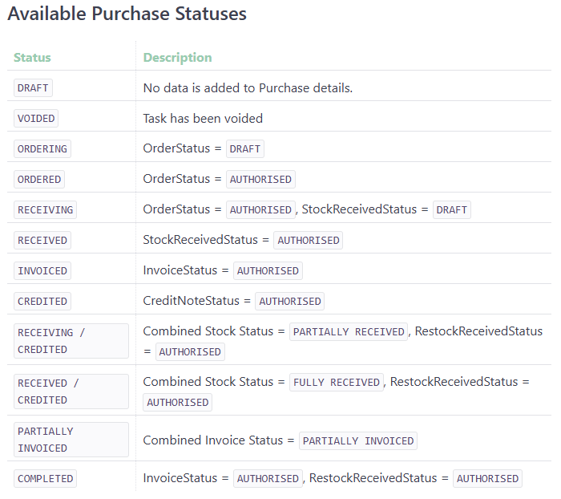
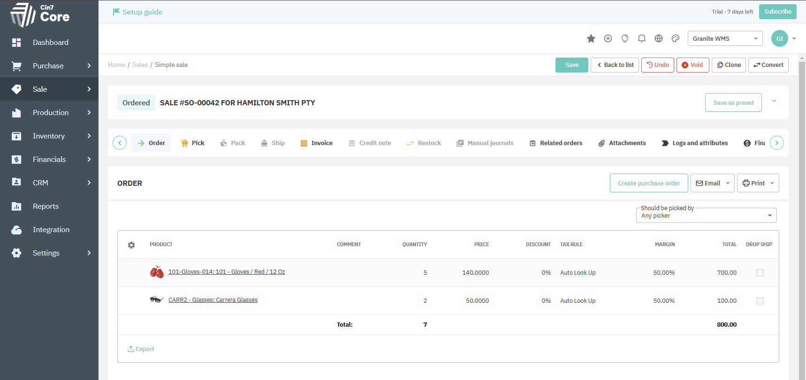
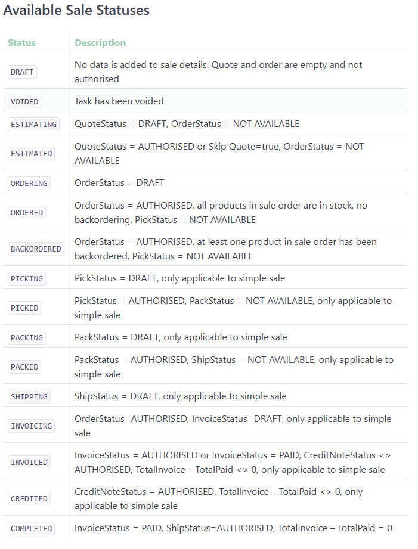

## Intro

The purpose of this document is to provide an overview of CIN7 in terms of integrating with Granite. For details on how integration will take place and which Granite transactions are supported please see the [SDK Provider](sdk-provider.md) and the [integration jobs](integration-jobs.md).

CIN7 has very good documentation which you can find [here](https://help.core.cin7.com/hc/en-us/categories/8314483542671-General) should you need more detail than this overview provides. 

<iframe src="https://share.descript.com/embed/aO5vgCPY5Zd" width="768" height="432" frameborder="0" allowfullscreen></iframe>

## CIN7 Business Objects:

### Product

A product in CIN7 is what will be integrated into a Granite as a MasterItem. It has all normal fields like: SKU, Name, Barcode, ect...

### Location

A Location in CIN7 will be used in Granite as an ERP Location. They can be hard to find, but are under Setting>Reference Books>Locations.
It is important to have this set up in Granite as all CIN7 transactions require the location.

### StockTransfer

The first transaction type is StockTransfer. This is a movement of stock from one CIN7 location to another. This will occur only when stock moves from one ERPLocation to another as CIN7 locations are used as ERPLocations in Granite. The example below only has one item, but it supports multiple items on a single transfer. 

### StockTake/Adjustment

The next transaction type is StockTake/Adjustment. CIN7 used the same transaction type for both. As you can see at the bottom of the image below, it has tabs for Zero Stock and Non-zero Stock. These simply show if it is creating stock where there was now stock before in that location or if it is adjusting an existing stock level. An interesting thing to note about this transaction, is that you specify the total stock at the location, rather than the amount that you are adjusting by and it will work out how much the stock is changing by. 

### Purchase

Next up are Purchases. These CIN7 documents are brought into Granite as Receiving documents. Each Purchase will have a Supplier (Inbound Trading Partner in Granite) and a location specified where the stock is going to be received. Below you can see an example of a purchase and all the available statuses.

Another thing to note about CIN7 purchase orders is that they can either be Simple or Advanced, and there is a configuration setting that affects which integration method must be used when posting transactions back to CIN7.

As described in the CIN7 documentation: 

> - **Simple Purchases** are used for purchases of goods or goods and services, with a single invoice and delivery. Most purchases will fall under a simple purchase.
> - **Advanced Purchases** allow partial invoicing and receipt of items while still being considered part of the same purchase. They also allow multiple credit notes to be issued for a single purchase order. You can convert simple purchases into advanced purchases but not vice versa.

#### Use Put Away 

There is a very important setting in CIN7 under Settings > General Settings > Purchase Process Customization called `Use Put Away`. From the CIN7 documentation: 

> Put away is applicable to Advanced purchases and the CIN7 Core Warehouse Management System. This splits the receiving process into two steps, receiving the goods, then putting them away into the correct locations or bins. Enable put away if you receive large quantities of goods at once before putting them away later. Disable put away if you receive each purchase and store it straight away.

If it is enabled, use the standard [RECEIVE](../cin7/sdk-provider.md#receive) method.
If it is disabled, use [POSTPUTAWAY](../cin7/sdk-provider.md#postputaway). 

### Sale

A CIN7 Sale is integrated into Granite as an Order document. It has a Customer(Outbound trading Partner) and a Location where the stock will be picked from. It is processed in three stages. Pick, Pack, and Ship. It must be processed in this order and each previous step needs to be completed before the next step. Below you can see an example and all of the available status. 

### Production Orders

Work in progress...
