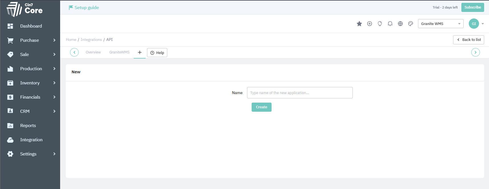
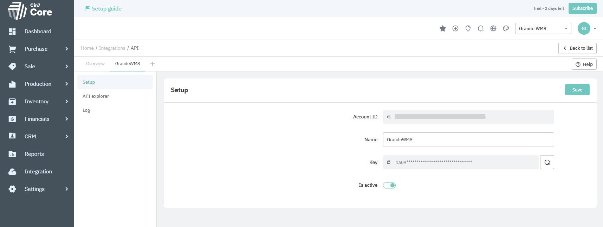
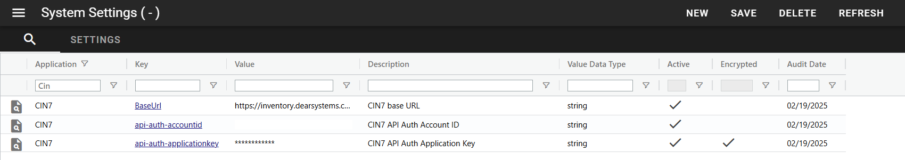

# Integration Jobs

!!! note
    This documentation is a work in progress and is intended to show the development progress of the integration with CIN7. As such, it may be subject to change as progress is made. 

Integration jobs are a special type of [Scheduler](../../scheduler/manual.md) job called [injected jobs](../../scheduler/manual.md#injected-jobs-integration-jobs). 
See below for information for specifics on how document and master data jobs work.

## Supported document types 
<div class="grid cards" markdown>

 -   ORDER

    ---

    CIN7 type: Sale

 -   RECEIVING

    ---

    CIN7 type: Advanced Purchase
 
 -  TRANSFER

    ---

    CIN7 type: Stock Transfer

 - WORKORDER

    ---
    CIN7 type: Finished Good

</div>


## How it works
The downwards integration, as with the upwards, is done though the CIN7 API. 

To be able to connect to the API you will need to create an API key in CIN7. To do so go to Integration>CoreAPI>AddNew as you can see in the image below. 



Once created, it will generate an Account ID and a Key (as below). These need to be added to system settings in Granite into api-auth-accountid and api-auth-applicationkey respectively. These system settings will be generated when the scheduler is run for the first time. Once you have added these you will need to restart the scheduler.



### Configure Scheduled Jobs

To create Scheduled Jobs run the following script:

```sql
INSERT INTO [GraniteDatabase].dbo.ScheduledJobs (isActive, JobName, JobDescription, [Type], InjectJob, Interval, IntervalFormat, AuditDate, AuditUser)
SELECT 0, 'CIN7 MasterItem Job', 'Syncs MasterItems from CIN7', 'INJECTED', 'Granite.Integration.CIN7.Job.MasterItem', '24', 'HOURS', GETDATE(), 'AUTOMATION'
WHERE NOT EXISTS (SELECT 1 FROM [GraniteDatabase].dbo.ScheduledJobs WHERE JobName = 'CIN7 MasterItem Job');

INSERT INTO [GraniteDatabase].dbo.ScheduledJobs (isActive, JobName, JobDescription, [Type], InjectJob, Interval, IntervalFormat, AuditDate, AuditUser)
SELECT 0, 'CIN7 Purchase Order ', 'Syncs PurchaseOrders from CIN7', 'INJECTED', 'Granite.Integration.CIN7.Job.PurchaseOrder', '5', 'MINUTES', GETDATE(), 'AUTOMATION'
WHERE NOT EXISTS (SELECT 1 FROM [GraniteDatabase].dbo.ScheduledJobs WHERE JobName = 'CIN7 Purchase Order ');

INSERT INTO [GraniteDatabase].dbo.ScheduledJobs (isActive, JobName, JobDescription, [Type], InjectJob, Interval, IntervalFormat, AuditDate, AuditUser)
SELECT 0, 'CIN7 Sales Order', 'Syncs SalesOrders from CIN7', 'INJECTED', 'Granite.Integration.CIN7.Job.SalesOrder', '5', 'MINUTES', GETDATE(), 'AUTOMATION'
WHERE NOT EXISTS (SELECT 1 FROM [GraniteDatabase].dbo.ScheduledJobs WHERE JobName = 'CIN7 Sales Order');

INSERT INTO [GraniteDatabase].dbo.ScheduledJobs (isActive, JobName, JobDescription, [Type], InjectJob, Interval, IntervalFormat, AuditDate, AuditUser)
SELECT 0, 'CIN7 Transfer Job', 'Syncs Transfers from CIN7', 'INJECTED', 'Granite.Integration.CIN7.Job.Transfer', '5', 'MINUTES', GETDATE(), 'AUTOMATION'
WHERE NOT EXISTS (SELECT 1 FROM [GraniteDatabase].dbo.ScheduledJobs WHERE JobName = 'CIN7 Transfer Job');

INSERT INTO [GraniteDatabase].dbo.ScheduledJobs (isActive, JobName, JobDescription, [Type], InjectJob, Interval, IntervalFormat, AuditDate, AuditUser)
SELECT 0, 'CIN7 Trading Partner Job', 'Syncs TradingPartners from CIN7', 'INJECTED', 'Granite.Integration.CIN7.Job.TradingPartner', '4', 'HOURS', GETDATE(), 'AUTOMATION'
WHERE NOT EXISTS (SELECT 1 FROM [GraniteDatabase].dbo.ScheduledJobs WHERE JobName = 'CIN7 Trading Partner Job');

INSERT INTO [GraniteDatabase].dbo.ScheduledJobs (isActive, JobName, JobDescription, [Type], InjectJob, Interval, IntervalFormat, AuditDate, AuditUser)
SELECT 0, 'CIN7 Product Availability Job', 'Syncs Product Availability from CIN7', 'INJECTED', 'Granite.Integration.CIN7.Job.ProductAvailability', '12', 'HOURS', GETDATE(), 'AUTOMATION'
WHERE NOT EXISTS (SELECT 1 FROM [GraniteDatabase].dbo.ScheduledJobs WHERE JobName = 'CIN7 Product Availability Job');

INSERT INTO [GraniteDatabase].dbo.ScheduledJobs (isActive, JobName, JobDescription, [Type], InjectJob, Interval, IntervalFormat, AuditDate, AuditUser)
SELECT 0, 'CIN7 Finished Goods Job', 'Syncs Finished Goods from CIN7', 'INJECTED', 'Granite.Integration.CIN7.Job.FinishedGoodsJob', '5', 'MINUTES', GETDATE(), 'AUTOMATION'
WHERE NOT EXISTS (SELECT 1 FROM [GraniteDatabase].dbo.ScheduledJobs WHERE JobName = 'CIN7 Finished Goods Job');

```

For the Product Availability Job you need this table.

```sql
CREATE TABLE [dbo].[Integration_ProductAvailability](
	[ProductAvailabilityID] [bigint] IDENTITY(1,1) NOT NULL,
	[ID] [uniqueidentifier] NOT NULL,
	[SKU] [nvarchar](100) NOT NULL,
	[Name] [nvarchar](500) NOT NULL,
	[Barcode] [nvarchar](50) NULL,
	[Location] [nvarchar](100) NOT NULL,
	[Bin] [nvarchar](50) NULL,
	[Batch] [nvarchar](50) NULL,
	[ExpiryDate] [datetime2](7) NULL,
	[OnHand] [decimal](18, 4) NOT NULL,
	[Allocated] [decimal](18, 4) NOT NULL,
	[Available] [decimal](18, 4) NOT NULL,
	[OnOrder] [decimal](18, 4) NOT NULL,
	[StockOnHand] [decimal](18, 4) NOT NULL,
	[InTransit] [decimal](18, 4) NOT NULL,
	[NextDeliveryDate] [datetime2](7) NULL,
   [Updated] [bit] NULL,
PRIMARY KEY CLUSTERED 
(
	[ProductAvailabilityID] ASC
)WITH (PAD_INDEX = OFF, STATISTICS_NORECOMPUTE = OFF, IGNORE_DUP_KEY = OFF, ALLOW_ROW_LOCKS = ON, ALLOW_PAGE_LOCKS = ON, OPTIMIZE_FOR_SEQUENTIAL_KEY = OFF) ON [PRIMARY]
) ON [PRIMARY]
GO
```

This view will populate the StockVariance screen using the ProductAvailability data.

```sql
CREATE VIEW [dbo].[ERP_StockOnHand]
AS
SELECT     Location AS LOCATION, Name AS ITEMNO, OnHand AS QTYONHAND, OnOrder AS QTYONORDER, 0 AS QTYSALORDR, 0 AS AVRCOST
FROM Integration_ProductAvailability
GO
```


### SystemSetting

- `BaseUrl` - CIN7 API base URL. This is set by default to https://inventory.dearsystems.com/ExternalApi/v2/
- `api-auth-accountid` - CIN7 API Account ID.
- `api-auth-applicationkey` - CIN7 API Application Key (encrypted).
- `SyncSuppliers` - Enable/disable syncing suppliers from CIN7 (default: true).
- `SyncCustomers` - Enable/disable syncing customers from CIN7 (default: true).
- `Locations` - CIN7 Locations to sync product availability for, comma delimited




### F# Mapping Scripts

The CIN7 integration uses F# scripts for configurable mapping between CIN7 entities and Granite entities. This allows customization of how data is transformed during integration without modifying compiled code.

<h4>Script Location</h4>

Mapping scripts are located in the `Configuration/Scripts/` directory within the integration job deployment folder. Each job type has its own configuration script:

- `MasterItemJobConfiguration.fsx` - MasterItem mappings
- `TradingPartnerJobConfiguration.fsx` - Trading Partner (Customer/Supplier) mappings
- `SalesOrderJobConfiguration.fsx` - Sales Order document mappings
- `PurchaseOrderJobConfiguration.fsx` - Purchase Order document mappings
- `TransferJobConfiguration.fsx` - Stock Transfer document mappings
- `FinishedGoodsJobConfiguration.fsx` - Finished Goods/Work Order document mappings

<h4>How It Works</h4>

1. On first run, the F# scripts are compiled into a DLL (`Granite.Integration.CIN7.Job.DynamicConfiguration.dll`)
2. The compiled DLL is loaded and used for all mapping operations
3. To apply changes to scripts, delete the compiled DLL and restart the scheduler - it will recompile automatically

<h4>Configuration Options</h4>

Each configuration script can define:

**Document Filtering:**

- `ManagedLocations` - Array of CIN7 location names. Only documents from these locations will be synced. If empty, all locations are synced.
- `SalesRepresentatives` - (Sales Orders only) Array of sales rep names. Only orders from these reps will be synced. If empty, all reps are included.
- `SkipDocument` - Custom function to skip specific documents based on any criteria.

**Field Configuration:**

- `ERPHeaderUpdateableFields` - Fields on the document header that can be updated from CIN7
- `ERPHeaderViewIgnoreFields` - Fields to ignore when comparing header changes
- `ERPDetailUpdateableFields` - Fields on document lines that can be updated from CIN7
- `ERPDetailViewIgnoreFields` - Fields to ignore when comparing line changes

**Mapping Functions:**

- `MapToSalesOrder` / `MapToPurchaseOrder` / `MapToTransfer` / `MapToWorkOrder` - Transform CIN7 documents to Granite documents
- `MapToMasterItem` - Transform CIN7 products to Granite MasterItems
- `MapCustomerToTradingPartner` / `MapSupplierToTradingPartner` - Transform CIN7 customers/suppliers to Granite Trading Partners

<h4>Example: Filtering by Location</h4>

To sync only documents from specific warehouses, modify the `ManagedLocations` array in the relevant configuration script:

```fsharp
member this.ManagedLocations = [|
    "Main Warehouse";
    "Distribution Center";|]
```

<h4>Example: Custom Document Filtering</h4>

To skip documents based on custom logic, modify the `SkipDocument` function:

```fsharp
member this.SkipDocument (sale: SaleResponse): bool = 
    // Skip draft orders
    sale.Status = "DRAFT" ||
    // Skip orders below minimum value
    sale.Total < 100.0m
```

<h4>Example: Custom Field Mapping</h4>

To customize how fields are mapped, modify the mapping function. For example, to map a custom field to the Description:

```fsharp
let document = Entities.Granite.Document(
    Number = sale.Order.SaleOrderNumber,
    Description = sale.CustomerReference, // Use customer reference instead of note
    // ... other fields
)
```

!!! warning
    After modifying any F# script, you must delete the compiled DLL (`Configuration/Granite.Integration.CIN7.Job.DynamicConfiguration.dll`) and restart the scheduler for changes to take effect.

### Document Jobs

GraniteScheduler runs injected jobs that fetch documents from CIN7 based on their specific criteria (see below for details on each job type). Documents that meet the criteria are inserted into the IntegrationDocumentQueue. The job then processes this queue.

When a record with Status 'ENTERED' is found, the job uses a CIN7 REST API request to fetch the information related to that document from CIN7 and apply the changes to the Granite document.

All valid changes to data in the Granite tables are logged to the Audit table, showing the previous value and the new value.

If a change is made in the ERP system that would put Granite into an invalid state, no changes are applied. Instead, the ERPSyncFailed field is set to true and the ERPSyncFailedReason field shows the reason for the failure. The IntegrationLog table will contain further details on the failure if applicable.

<h4>Sales Order (ORDER)</h4>

- Fetches CIN7 Sales that have been updated since the last integration time
- Maps to Granite document type ORDER
- Can filter by ManagedLocations and SalesRepresentatives in configuration
- Uses FromLocation for document lines

<h4>Purchase Order (RECEIVING)</h4>

- Fetches CIN7 Advanced Purchases that have been updated since the last integration time
- Maps to Granite document type RECEIVING
- Can filter by ManagedLocations in configuration
- Uses ToLocation for document lines

<h4>Transfer (TRANSFER)</h4>

- Fetches CIN7 Stock Transfers with status "ORDERED"
- Document type is determined dynamically based on managed locations:
    - Both locations managed → TRANSFER
    - Only FromLocation managed → ORDER (outbound)
    - Only ToLocation managed → RECEIVING (inbound)
- Can filter by ManagedLocations in configuration
- Uses both FromLocation and ToLocation for document lines

<h4>Work Order (WORKORDER)</h4>

- Fetches CIN7 Finished Goods with status "AUTHORISED"
- Maps to Granite document type WORKORDER
- Document lines include:
    - INPUT lines: Raw materials from OrderLines with FromLocation
    - OUTPUT line: Finished product with ToLocation and Batch
- Can filter by ManagedLocations in configuration


### Master data jobs
MasterItems and TradingPartners have their own Jobs. These Jobs fetch all StockItems, Vendors, and Customers from  CIN7 and compares them to the MasterItems and TradingPartners in Granite. Any inserts / updates are done as required. 

The document jobs also sync changes to the MasterItems that are on the document. This means that on sites that do not make many changes to their MasterItems it is better to limit running this job to once a day or even less frequently. 

Document Jobs do not automatically sync trading partners as they are not required to create to the document in Granite and as such are only synced when the TradingPartner Job runs. 

The mapping below is an example of the standard that is in place. It is configurable through the F# mapping scripts as with the documents.

**MasterItem Mapping:**

|| CIN7 Property       | Granite Property    |
||--------------------|--------------------|
|| SKU               | Code, FormattedCode |
|| Name              | Description        |
|| Category         | Category          |
|| Status           | isActive          |
|| UOM              | UOM               |
|| ID               | ERPIdentification |
|| Length           | Length            |
|| Width            | Width             |
|| Height           | Height            |
|| Weight           | UnitWeight        |
|| Barcode         | MasterItemAlias   |

**Trading Partner Mapping:**

|| CIN7 (Customer) Property     | Granite Property     |
||-----------------------------|---------------------|
|| Name                        | Code, Description    |
|| Status                      | isActive             |
|| ID                          | ERPIdentification     |
|| Contact.Name                | ContactPerson        |
|| Contact.Phone               | Tel                  |
|| Contact.Fax                 | Fax                  |
|| Contact.MobilePhone         | Mobile               |
|| Contact.Email               | Email                |
|| Address.Line1               | Address1             |
|| Address.Line2               | Address2             |
|| Address.City                | Address3             |
|| Address.State               | Address4             |
|| Address.Postcode           | Address5             |

*(Note: Suppliers are mapped similarly but with DocumentType set to "RECEIVING" instead of "ORDER")*

### Product Availability Job

- The job pulls CIN7 product availability (optionally per location if Locations system setting is a comma-separated list; empty = all locations).
- For each run it:
    1. Sets Updated = 0 on all rows in Integration_ProductAvailability.
    2. MERGEs incoming CIN7 rows on (ID, Location), updating quantities/barcodes/batches/expiry and sets Updated = 1. CIN7 ID is stored as a GUID (new GUID generated if CIN7 returns a non-GUID).
    3. Deletes any rows still Updated = 0, so only locations/items returned by CIN7 remain.
- No IntegrationDocumentQueue is used; it writes directly to Integration_ProductAvailability, which feeds the ERP_StockOnHand view for StockVariance.
- Default schedule in the example is every 12 hours; adjust the ScheduledJobs interval if you need fresher availability.


