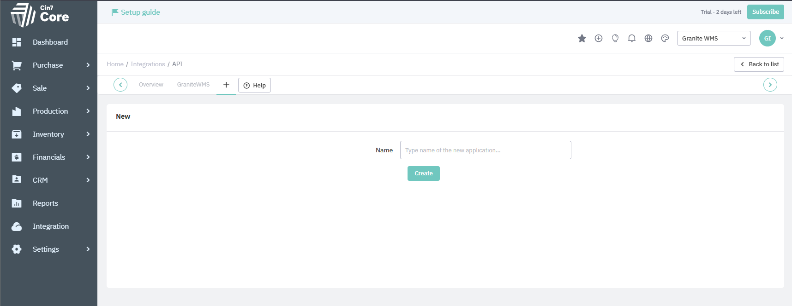
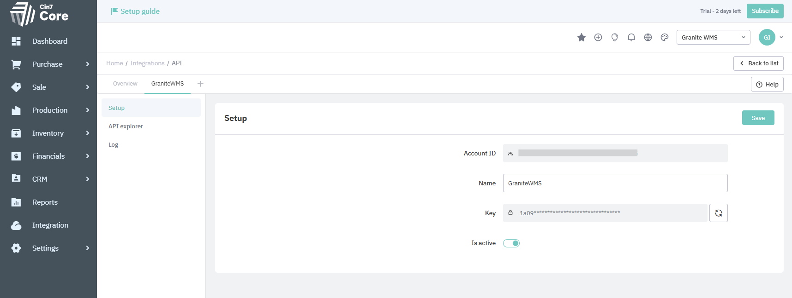
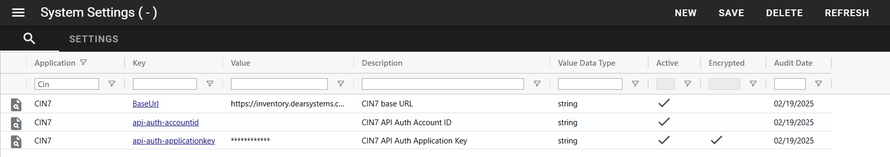

# SDK Provider

!!! note
    This documentation is a work in progress and is intended to show the development progress of the integration with CIN7. As such, it may be subject to change as progress is made. 


## How it connects
The upwards integration, as with the downwards, is done though the CIN7 API. 

To be able to connect to the API you will need to create an API key in CIN7. To do so go to Integration>CoreAPI>AddNew as you can see in the image below. 



Once created, it will generate an Account ID and a Key (as below). These need to be added to system settings in Granite into api-auth-accountid and api-auth-applicationkey respectively. These system settings will be generated when the integration service is run for the first time. Once you have added these you will need to restart the integration service.



### SystemSetting

- `BaseUrl` - CIN7 API base URL. This is set by default to https://inventory.dearsystems.com/ExternalApi/v2/
- `api-auth-accountid` - CIN7 API Account ID.
- `api-auth-applicationkey` - CIN7 API Application Key (encrypted).
- `DryRun` - Dry run mode (`true`/`false`). Default: `false`. When enabled, payloads are logged and requests are not sent to CIN7.
- `Carrier` - Default carrier for shipment operations. Default: empty.



## Integration Methods

Currently supported transactions/methods are:

- MOVE (Stock Transfer, POST)
- TRANSFER (Stock Transfer, POST)
- UPDATETRANSFERTOINTRANSIT (Stock Transfer, PUT)
- UPDATETRANSFERTOCOMPLETED (Stock Transfer, PUT)
- ADJUSTMENT (Stock Adjustment, POST)
- RECEIVE (Purchase Stock Receive, POST)
- POSTPUTAWAY (Purchase Stock Put Away, POST)
- PICK (Sale Fulfilment Pick, POST)
- PACK (Sale Fulfilment Pack, POST)
- CONSUME (Finished Goods Pick Lines, POST)
- MANUFACTURE (Finished Goods, PUT)

Outstanding transaction types:

- Replenish 
- Reclassify
- Scrap


### ADJUSTMENT

- Granite Transaction: **ADJUSTMENT**
- CIN7: **STOCK ADJUSTMENT**
- Supports:
    - Batch
    - Serial
    - Expiration Date
- Integration Post
    - False - Creates a new Stock Adjustment with the status Draft
    - True - Creates a new Stock Adjustment with the status Completed.
- Returns:
    Stock Adjustment Task ID

| Granite    | CIN7 Entity | Required | Behavior |
|------------|------------------|----------|-----------|
| Code                        | SKU           |Y||
| Qty                         | Qty  |Y||
| FromLocation                | Location  |Y||
| Batch                       | BatchSN  |N||
| Serial                      | BatchSN  |N||
| ExpirationDate              | ExpiryDate|N||

The quantity filed that is sent to CIN7 is the total qty of the product in that location so the integration provider uses this view to get that qty for each item being adjusted. This view needs to be created on the Granite Database. 

```sql
CREATE VIEW Integration_CIN7_StockOnHand
AS
select MasterItem.Code, Location.ERPLocation, ExpiryDate, Batch, SerialNumber, SUM(Qty) Qty
from TrackingEntity 
		INNER JOIN Location on TrackingEntity.Location_id = Location.ID
		INNER JOIN MasterItem ON TrackingEntity.MasterItem_id = MasterItem.ID
WHERE Location.NonStock = 0 AND TrackingEntity.InStock = 1
GROUP BY MasterItem.Code, Location.ERPLocation, ExpiryDate, Batch, SerialNumber

```

### MOVE

- Granite Transaction: **MOVE**
- CIN7: **STOCK Transfer**
- Supports:
    - Batch
    - Serial
    - Expiration Date
- Integration Post
    - False - Creates a new Stock Transfer with the status Draft
    - True - Creates a new Stock Transfer with the status Completed.
- Returns:
    Stock Transfer Task ID

| Granite    | CIN7 Entity | Required | Behavior |
|------------|------------------|----------|-----------|
| Code                        | SKU           |Y||
| Qty                         | Qty  |Y||
| FromLocation                | FromLocation  |Y||
| ToLocation                  | ToLocation  |Y||
| Batch                       | BatchSN  |N||
| Serial                      | BatchSN  |N||
| ExpirationDate              | ExpiryDate|N||

### TRANSFER

Standard TRANSFER posting and transfer status updates are implemented.

- Granite Transaction: **TRANSFER**
- CIN7: **STOCK Transfer**
- Supports:
    - Batch
    - Serial
    - Expiration Date
- Integration Post
    - False - Creates a new Stock Transfer with the status Draft
    - True - Creates a new Stock Transfer with the status Completed.
- Returns:
    Stock Transfer Task ID

| Granite    | CIN7 Entity | Required | Behavior |
|------------|------------------|----------|-----------|
| Document                   | OrderNumber |Y||
| Code                        | SKU           |Y||
| Qty                         | Qty  |Y||
| FromLocation                | FromLocation  |Y||
| ToLocation                  | ToLocation  |Y||
| Batch                       | BatchSN  |N||
| Serial                      | BatchSN  |N||
| ExpirationDate              | ExpiryDate|N||

### UPDATETRANSFERTOINTRANSIT

- Granite Transaction: **UPDATETRANSFERTOINTRANSIT**
- CIN7: **STOCK Transfer (PUT update to IN TRANSIT)**
- Behavior:
    - Uses Granite `Document` to resolve CIN7 `TaskID` from Granite `ERPIdentification`.
    - Validates that transfer lines match before update.
    - Sets transfer status to `IN TRANSIT`.
- Integration Post
    - False - Verifies CIN7 transfer quantities match Granite quantities before update.
    - True - Updates CIN7 transfer quantities to Granite quantities before update.
- Returns:
    Stock Transfer Task ID

### UPDATETRANSFERTOCOMPLETED

- Granite Transaction: **UPDATETRANSFERTOCOMPLETED**
- CIN7: **STOCK Transfer (PUT update to COMPLETED)**
- Behavior:
    - Uses Granite `Document` to resolve CIN7 `TaskID` from Granite `ERPIdentification`.
    - Validates that transfer lines match before update.
    - Sets transfer status to `COMPLETED`.
- Integration Post
    - False - Verifies CIN7 transfer quantities match Granite quantities before update.
    - True - Updates CIN7 transfer quantities to Granite quantities before update.
- Returns:
    Stock Transfer Task ID

### RECEIVE

- Granite Transaction: **RECEIVE**
- CIN7: **Purchase Stock Receive**
- Supports:
    - Batch
    - Serial
    - Expiration Date
- Behavior:
    - Uses Granite `Document` to resolve CIN7 `PurchaseID` from Granite `ERPIdentification`.
    - Reads `advanced-purchase` and reuses the first existing stock receiving task that has zero lines.
    - If no existing zero-line stock receiving task is found, uses `00000000-0000-0000-0000-000000000000` to create a new stock receiving task.
    - Summarizes transactions by item/location/tracking fields before building CIN7 lines.
- Integration Post
    - False - Posts with status `DRAFT`.
    - True - Also posts with status `DRAFT` (current provider behavior).
- Returns:
    Most recent Stock Receiving Task ID from the API response.

| Granite    | CIN7 Entity | Required | Behavior |
|------------|-------------|----------|-----------|
| Document                   | PurchaseID (via ERPIdentification) |Y||
| Code                        | ProductID / ProductCode           |Y||
| Qty                         | Quantity  |Y||
| ToLocation                  | Location  |Y||
| Batch                       | BatchSN  |N||
| Serial                      | BatchSN  |N||
| ExpirationDate              | ExpiryDate|N||

### POSTPUTAWAY

- Granite Transaction: **POSTPUTAWAY**
- CIN7: **Purchase Stock Put Away**
- Supports:
    - Batch
    - Serial
    - Expiration Date
- Behavior:
    - Uses Granite `Document` to resolve CIN7 `PurchaseID` from Granite `ERPIdentification`.
    - Reads `advanced-purchase` and attempts to reuse an open put-away task (`DRAFT` or `NOT AVAILABLE`).
    - Skips a put-away task when the linked invoice is not open and the put-away already has lines.
    - If no suitable open put-away task is found, uses `00000000-0000-0000-0000-000000000000` to create a new put-away task.
- Integration Post
    - Not used by the current implementation for this method.
- Returns:
    Put-Away Task ID

| Granite    | CIN7 Entity | Required | Behavior |
|------------|-------------|----------|-----------|
| Document                   | PurchaseID (via ERPIdentification) |Y||
| Code                        | ProductID / ProductCode           |Y||
| Qty                         | Quantity  |Y||
| ToLocation                  | Location  |Y||
| Batch                       | BatchSN  |N||
| Serial                      | BatchSN  |N||
| ExpirationDate              | ExpiryDate|N||

### PICK

- Granite Transaction: **PICK**
- CIN7: **Sale Fulfilment Pick**
- Supports:
    - Batch
    - Serial
    - Expiration Date
- Integration Post
    - False - Creates a new Sale Fulfilment Pick with the status Draft
    - True - Creates a new Sale Fulfilment Pick with the status Authorized.
- Returns:
    Sale Task ID

| Granite    | CIN7 Entity | Required | Behavior |
|------------|------------------|----------|-----------|
| Document                   | OrderNumber |Y||
| Code                        | SKU           |Y||
| Qty                         | Qty  |Y||
| FromLocation                  | Location  |Y||
| Batch                       | BatchSN  |N||
| Serial                      | BatchSN  |N||
| ExpirationDate              | ExpiryDate|N||

### PACK

- Granite Transaction: **PACK**
- CIN7: **Sale Fulfilment Pack**
- Supports:
    - Batch
    - Serial
    - Expiration Date
- Integration Post
    - False - Creates a new Sale Fulfilment Pack with the status Draft
    - True - Creates a new Sale Fulfilment Pack with the status Authorized.
- Returns:
    Sale Task ID

| Granite    | CIN7 Entity | Required | Behavior |
|------------|------------------|----------|-----------|
| Document                   | OrderNumber |Y||
| Code                        | SKU           |Y||
| Qty                         | Qty  |Y||
| ToLocation                  | Location  |Y||
| Batch                       | BatchSN  |N||
| Serial                      | BatchSN  |N||
| ExpirationDate              | ExpiryDate|N||


If the item that was picked has a expiry date, serial/batch it then needs to 
be packed using the tracking entity number so that the serial and batch gets sent with the Transactions. 
You need a separate view for the pack transactions that changes the integration type from pack to something else. 
You will also need to call integration through clr on a custom process. 

```sql
CREATE VIEW [dbo].[Integration_Transactions_PACKINGPOST]
AS
SELECT * FROM 
(SELECT DISTINCT 
    dbo.[Transaction].ID, dbo.[Transaction].Date, dbo.Users.Name AS [User], dbo.[Transaction].IntegrationStatus, dbo.[Transaction].IntegrationReady, dbo.MasterItem.Code, ISNULL(dbo.[Transaction].UOM, dbo.MasterItem.UOM) 
    AS UOM, dbo.[Transaction].UOMConversion, dbo.[Transaction].FromQty, dbo.[Transaction].ToQty, dbo.[Transaction].ActionQty, dbo.Location.ERPLocation AS FromLocationERPLocation, 
    Location_1.ERPLocation AS ToLocationERPLocation, dbo.[Document].Number AS [Document], dbo.DocumentDetail.LineNumber, MasterItem_1.Code AS FromCode, MasterItem_2.Code AS ToCode, dbo.TrackingEntity.Batch, 
    dbo.[Transaction].Comment, 
    CASE 
    WHEN (dbo.[Transaction].Type = 'PACK')
    THEN 'CUSTOMPACK'
    ELSE dbo.[Transaction].Type
    END AS Type, 
    dbo.[Transaction].Process, dbo.TrackingEntity.SerialNumber, dbo.[Document].Type AS DocumentType, dbo.[Transaction].IntegrationReference, 
    dbo.[Document].Description AS DocumentDescription, dbo.TrackingEntity.ExpiryDate, [log].Message, dbo.DocumentDetail.Cancelled AS DocumentLineCancelled, Location_1.Site AS ToSite, dbo.Location.Site AS FromSite, 
    Process.Name,
    CASE 
    WHEN dbo.[Transaction].Process ='PACKING' AND dbo.Process.IntegrationIsActive = 0  THEN 
    (SELECT IntegrationIsActive FROM dbo.Process WHERE [Name] = 'PACKINGPOST')
    ELSE dbo.Process.IntegrationIsActive END
    as IntegrationIsActive, 
    dbo.[Document].TradingPartnerCode AS DocumentTradingPartnerCode, dbo.[Transaction].DocumentReference AS TransactionDocumentReference, dbo.[Transaction].ReversalTransaction_id
FROM    dbo.[Transaction] INNER JOIN
        dbo.TrackingEntity ON dbo.[Transaction].TrackingEntity_id = dbo.TrackingEntity.ID INNER JOIN
        dbo.MasterItem ON dbo.TrackingEntity.MasterItem_id = dbo.MasterItem.ID INNER JOIN
        dbo.Users ON dbo.[Transaction].User_id = dbo.Users.ID LEFT OUTER JOIN
        dbo.Process ON dbo.[Transaction].Process = dbo.Process.Name LEFT OUTER JOIN
        dbo.Location AS Location_1 ON dbo.[Transaction].ToLocation_id = Location_1.ID LEFT OUTER JOIN
        dbo.Location ON dbo.[Transaction].FromLocation_id = dbo.Location.ID LEFT OUTER JOIN
        dbo.[Document] ON dbo.[Transaction].Document_id = dbo.[Document].ID LEFT OUTER JOIN
        dbo.MasterItem AS MasterItem_1 ON dbo.[Transaction].FromMasterItem_id = MasterItem_1.ID LEFT OUTER JOIN
        dbo.MasterItem AS MasterItem_2 ON dbo.[Transaction].ToMasterItem_id = MasterItem_2.ID LEFT OUTER JOIN
        dbo.DocumentDetail ON dbo.[Transaction].DocumentLine_id = dbo.DocumentDetail.ID OUTER APPLY
        (
            SELECT TOP(1) [Message]
            FROM dbo.IntegrationLog
            WHERE GraniteTransaction_id = [Transaction].ID
            ORDER BY [Date] DESC
        ) [log]
WHERE       dbo.[Transaction].Type = 'PACK' AND 
            IntegrationStatus = 0 AND ISNULL(ReversalTransaction_id, 0) = 0
) AS table_1
WHERE table_1.IntegrationIsActive = 1
GO
```

```sql
CREATE PROCEDURE [dbo].PrescriptPackingPostDocument (
   @input dbo.ScriptInputParameters READONLY 
)
AS
DECLARE @Output TABLE(
  Name varchar(max),  
  Value varchar(max)  
  )

SET NOCOUNT ON;

DECLARE @valid bit
DECLARE @message varchar(MAX)
DECLARE @stepInput varchar(MAX) 
SELECT @stepInput = Value FROM @input WHERE Name = 'StepInput' 


EXEC	[dbo].[clr_IntegrationPost]
		@transactionID = null,
		@document = @stepInput,
		@documents = null,
		@reference = null,
		@transactionType = N'CUSTOMPACK', -- Can be anything, just must match the view above
		@processName = N'PACKINGPOST',
		@success = @valid OUTPUT,
		@message = @message OUTPUT


INSERT INTO @Output
SELECT 'Message', @message
INSERT INTO @Output
SELECT 'Valid', @valid
INSERT INTO @Output
SELECT 'StepInput', @stepInput


SELECT * FROM @Output

```

### CONSUME

- Granite Transaction: **CONSUME**
- CIN7: **Finished Goods Pick Lines**
- Supports:
    - Batch
    - Serial
    - Expiration Date
    - UOM
- Behavior:
    - Uses a single Granite `Document` mapped to a CIN7 finished goods `TaskID`.
    - Groups transactions by item/batch/serial/expiry/UOM and posts pick lines.
    - Sets finished goods status to `IN PROGRESS`.
- Integration Post
    - Not used by the current implementation for this method.
- Returns:
    Finished Goods Task ID

| Granite    | CIN7 Entity | Required | Behavior |
|------------|-------------|----------|-----------|
| Document                   | TaskID (via ERPIdentification) |Y||
| Code                        | ProductID / ProductCode           |Y||
| Qty                         | Quantity  |Y||
| Batch                       | BatchSN  |N||
| Serial                      | BatchSN  |N||
| ExpirationDate              | ExpiryDate|N||
| UOM                         | Unit |N||

### MANUFACTURE

- Granite Transaction: **MANUFACTURE**
- CIN7: **Finished Goods (PUT update)**
- Supports:
    - Batch
    - Serial
    - Expiration Date
- Behavior:
    - Uses a single Granite `Document` mapped to a CIN7 finished goods `TaskID`.
    - Requires a single finished goods item per document.
    - Validates batch/serial and expiry against existing CIN7 finished goods data.
    - Updates CIN7 finished goods quantity to Granite quantity.
- Integration Post
    - False - Updates quantity only.
    - True - Updates quantity and sets `CompletionDate` to the current UTC datetime (completes the finished good in CIN7).
- Returns:
    Finished Goods Task ID

| Granite    | CIN7 Entity | Required | Behavior |
|------------|-------------|----------|-----------|
| Document                   | TaskID (via ERPIdentification) |Y||
| Qty                         | Quantity  |Y||
| Batch                       | BatchSN validation |N||
| Serial                      | BatchSN validation |N||
| ExpirationDate              | ExpiryDate validation|N||

