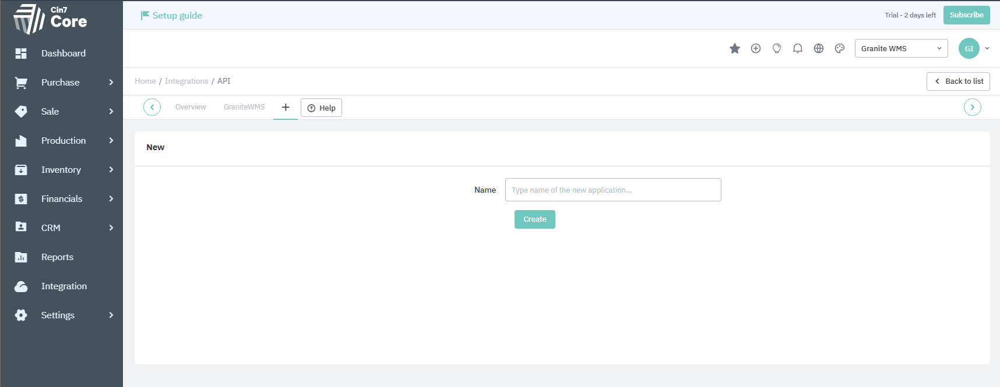
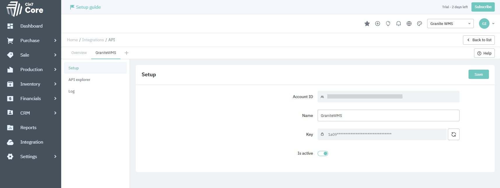
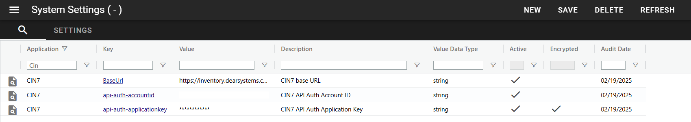

# SDK Provider

!!! note
    This documentation is a work in progress and is intended to show the development progress of the integration with CIN7. As such, it may be subject to change as progress is made. 


## How it connects
The upwards integration, as with the downwards, is done though the CIN7 API. 

To be able to connect to the API you will need to create an API key in CIN7. To do so go to Integration>CoreAPI>AddNew as you can see in the image below. 



Once created, it will generate an Account ID and a Key (as below). These need to be added to system settings in Granite into api-auth-accountid and api-auth-applicationkey respectively. These system settings will be generated when the integration service is run for the first time. Once you have added these you will need to restart the integration service.



### SystemSetting

- `BaseUrl` - CIN7 API base URL. This is set by default to https://inventory.dearsystems.com/ExternalApi/v2/
- `api-auth-accountid` - CIN7 API Account ID.
- `api-auth-applicationkey` - CIN7 API Application Key (encrypted).
- `DryRun` - Dry run mode (`true`/`false`). Default: `false`. When enabled, payloads are logged and requests are not sent to CIN7.
- `SetPurchaseOrderPutawayGroup` - Controls put-away grouping for `POSTPUTAWAY` (`true`/`false`). Default: `false`.
- `StockTakeExpenseAccount` - Expense account used when posting `STOCKTAKE` (Stocktake) and `PARTIALSTOCKTAKE` (Stock Adjustment) requests.
- `StockAdjustmentExpenseAccount` - Expense account used when posting `RECLASSIFY`, `ADJUSTMENT`, `SCRAP` and `TAKEON` (Stock Adjustment) requests. Default: empty.
- `Carrier` - Default carrier for shipment operations. Default: empty.



## Integration Methods

Currently supported transactions/methods are:

- MOVE (Stock Transfer, POST)
- REPLENISH (Stock Transfer, POST)
- TRANSFER (Stock Transfer, POST)
- UPDATETRANSFERTOINTRANSIT (Stock Transfer, PUT)
- UPDATETRANSFERTOCOMPLETED (Stock Transfer, PUT)
- STOCKTAKE (Stocktake, POST + PUT)
- PARTIALSTOCKTAKE (Stock Adjustment, POST)
- RECLASSIFY (Stock Adjustment, POST)
- ADJUSTMENT (Stock Adjustment, POST)
- SCRAP (Stock Adjustment, POST)
- TAKEON (Stock Adjustment, POST)
- RECEIVE (Purchase Stock Receive, POST)
- POSTPUTAWAY (Purchase Stock Put Away, POST)
- PICK (Sale Fulfilment Pick, POST)
- PACK (Sale Fulfilment Pack, POST)
- POSTPACKANDSHIP (Sale Fulfilment Pack and Ship, POST)
- SALECREDITNOTE (Sale Credit Note, VALIDATE)
- PURCHASECREDITNOTE (Purchase Credit Note, VALIDATE)
- CONSUME (Finished Goods Pick Lines, POST)
- MANUFACTURE (Finished Goods, PUT)

### Retry behavior

Requests to the CIN7 API are made through a shared retry pipeline. Responses with HTTP status `429` (Too Many Requests) or `503` (Service Unavailable) are automatically retried up to 2 times using exponential backoff with jitter, starting at a 3 second delay.

### Response handling

Every CIN7 API response is logged to the integration log with its HTTP status, the calling method and the response body. If CIN7 returns a body that is not JSON (for example an HTML error page), the method fails with the error `CIN7 API returned an invalid response - please check the integration logs for details` instead of a raw deserialization error.

### Batch and serial numbers

Granite `Batch` is mapped to CIN7 `BatchSN` in every method. The Granite `Serial` field is not sent to CIN7 and is ignored when grouping, matching and validating transactions. Serialised stock must therefore carry its serial number in the transaction `Batch` field for it to reach CIN7.

### STOCKTAKE

A stock take creates a CIN7 Stocktake for the counted location and then updates it with the Granite counts. The quantities submitted are the total quantities counted in Granite per item, batch and expiry date (see [Stocktake](./cin7-overview.md#stocktakeadjustment)). As such, all of the tracking entities for the given Masteritem in the ERPLocation should be counted so that the total count of that item is submitted on post. Use [PARTIALSTOCKTAKE](#partialstocktake) when only some of the stock in a location is counted.

- Granite Transaction: **STOCKTAKE**
- CIN7: **STOCKTAKE** (POST to create, PUT to update)
- Supports:
    - Batch
    - Expiration Date
- Behavior:
    - Requires all transactions to belong to a single session (`TransactionDocumentReference`) and a single location (`FromLocation` and `ToLocation` must be the same for every transaction).
    - Creates a CIN7 Stocktake for that location with `UseRelativeQuantity` enabled (so zero-stock products are included), the system setting `StockTakeExpenseAccount` as the account, and the reference `Granite Session: {sessionName}`.
    - Groups the Granite transactions by item, batch, expiry date and location, summing `ToQty` to get the counted quantity.
    - For each product CIN7 returns with stock on hand (`NonZeroStockOnHandProducts`), matched by SKU, batch and expiry date, sets the CIN7 `Adjustment` to the Granite counted quantity. CIN7 products that were not counted in Granite are sent back unchanged.
    - Counted items that CIN7 holds no stock for are added as `ZeroStockOnHandProducts` with the counted quantity; counts of zero are left out.
    - Updates the Stocktake with the resulting lines, keeping the status CIN7 returned on creation.
    - Dry run is not supported for this method - the post fails with an error when `DryRun` is enabled.
- Integration Post
    - Not used by the current implementation for this method.
- Returns:
    Stocktake Number

| Granite    | CIN7 Entity | Required | Behavior |
|------------|-------------|----------|-----------|
| TransactionDocumentReference | Reference |Y| Stock take session name |
| Code                        | SKU |Y||
| ToQty                       | Adjustment / Quantity  |Y| Summed per item, batch, expiry date and location |
| ToLocation                  | Location  |Y| Must match FromLocation |
| Batch                       | BatchSN  |N||
| ExpirationDate              | ExpiryDate|N||

### Stock Adjustments

PARTIALSTOCKTAKE, RECLASSIFY, ADJUSTMENT, SCRAP and TAKEON all post a CIN7 Stock Adjustment and share the following behavior:

- Each transaction is turned into one or more stock changes keyed by item code, batch, expiry date (date only) and location. Changes with the same key are netted together; keys whose changes cancel out are skipped, and if every key cancels out nothing is posted (the method returns `No stock changes`).
- Fetches CIN7 product availability (by SKU) for each item involved and finds the availability record matching the key. If no record exists, CIN7 is treated as holding zero stock for that key.
- The posted line quantity is the CIN7 `OnHand` quantity plus the net change, and the adjustment is posted with `UpdateOnHand` set to true so CIN7 applies it to the on-hand quantity rather than the available quantity. If any key would go negative, nothing is posted and the error lists every offending key with its current on-hand quantity, change, location and transaction ids.
- Resolves CIN7 `ProductID` from the availability record, falling back to the Granite MasterItem ERP ID. Throws if neither is found.
- Sets each line's comment to `Granite {Action} by: {net quantity}, transaction Ids: {transaction ids}`. The line expiry date is taken from the CIN7 availability record when one exists.
- Posts with CIN7 status `DRAFT` and a unit cost of 1.
- Serial numbers are ignored (see [Batch and serial numbers](#batch-and-serial-numbers)).

### PARTIALSTOCKTAKE

- Granite Transaction: **PARTIALSTOCKTAKE**
- CIN7: **STOCK ADJUSTMENT**
- Supports:
    - Batch
    - Expiration Date
- Behavior:
    - Requires all transactions to belong to a single session (`TransactionDocumentReference`) and a single location (`FromLocation` and `ToLocation` must be the same for every transaction).
    - The stock change per transaction is `ToQty - FromQty` for the item in `Code`, so only the items counted are adjusted and uncounted stock in the location is left as is.
    - Uses system setting `StockTakeExpenseAccount` for the CIN7 adjustment account.
    - Reference is set to `Partial Stock Take for session {sessionName}`.
    - See [Stock Adjustments](#stock-adjustments) for the shared posting behavior.
- Integration Post
    - Not used by the current implementation for this method.
- Returns:
    Stock Adjustment Task ID

| Granite    | CIN7 Entity | Required | Behavior |
|------------|-------------|----------|-----------|
| TransactionDocumentReference | Reference |Y| Stock take session name |
| Code                        | ProductID (via availability or Master Item ERP ID) |Y||
| FromQty                     | -  |Y| Used with ToQty to calculate the change |
| ToQty                       | Quantity (change = ToQty - FromQty) |Y||
| FromLocation                | Location  |Y| Must match ToLocation |
| ToLocation                  | Location  |Y| Must match FromLocation |
| Batch                       | BatchSN  |N||
| ExpirationDate              | ExpiryDate|N||

### RECLASSIFY

- Granite Transaction: **RECLASSIFY**
- CIN7: **STOCK ADJUSTMENT**
- Supports:
    - Batch
    - Expiration Date
- Behavior:
    - Requires a single location: `FromLocation` and `ToLocation` must be the same for every transaction.
    - Reduces the `FromCode` item by `ActionQty` and increases the `ToCode` item by `ActionQty` at that location.
    - Uses system setting `StockAdjustmentExpenseAccount` for the CIN7 adjustment account.
    - Reference is set to `Granite Reclassify. Transaction ids: {transaction ids}`.
    - See [Stock Adjustments](#stock-adjustments) for the shared posting behavior.
- Integration Post
    - Not used by the current implementation for this method.
- Returns:
    Stock Adjustment Task ID

| Granite    | CIN7 Entity | Required | Behavior |
|------------|-------------|----------|-----------|
| FromCode                    | ProductID (via availability or Master Item ERP ID) |Y| Source item, quantity reduced by ActionQty |
| ToCode                      | ProductID (via availability or Master Item ERP ID) |Y| Destination item, quantity increased by ActionQty |
| ActionQty                   | Quantity delta |Y||
| FromLocation                | Location  |Y| Must match ToLocation |
| ToLocation                  | Location  |Y| Must match FromLocation |
| Batch                       | BatchSN  |N||
| ExpirationDate              | ExpiryDate|N||

### ADJUSTMENT

- Granite Transaction: **ADJUSTMENT**
- CIN7: **STOCK ADJUSTMENT**
- Supports:
    - Batch
    - Expiration Date
- Behavior:
    - Requires a single `FromLocation` across all transactions.
    - The stock change per transaction is `ToQty - FromQty` for the `FromCode` item.
    - Uses system setting `StockAdjustmentExpenseAccount` for the CIN7 adjustment account.
    - Reference is set to `Granite Adjustment. Transaction ids: {transaction ids}`.
    - See [Stock Adjustments](#stock-adjustments) for the shared posting behavior.
- Integration Post
    - Not used by the current implementation for this method.
- Returns:
    Stock Adjustment Task ID

| Granite    | CIN7 Entity | Required | Behavior |
|------------|-------------|----------|-----------|
| FromCode                    | ProductID (via availability or Master Item ERP ID) |Y||
| FromQty                     | -  |Y| Used with ToQty to calculate the change |
| ToQty                       | Quantity (change = ToQty - FromQty) |Y||
| FromLocation                | Location  |Y||
| Batch                       | BatchSN  |N||
| ExpirationDate              | ExpiryDate|N||

### SCRAP

- Granite Transaction: **SCRAP**
- CIN7: **STOCK ADJUSTMENT**
- Supports:
    - Batch
    - Expiration Date
- Behavior:
    - Requires a single `FromLocation` across all transactions.
    - Reduces the `FromCode` item by `ActionQty` at that location.
    - Uses system setting `StockAdjustmentExpenseAccount` for the CIN7 adjustment account.
    - Reference is set to `Granite Scrap. Transaction ids: {transaction ids}`.
    - See [Stock Adjustments](#stock-adjustments) for the shared posting behavior.
- Integration Post
    - Not used by the current implementation for this method.
- Returns:
    Stock Adjustment Task ID

| Granite    | CIN7 Entity | Required | Behavior |
|------------|-------------|----------|-----------|
| FromCode                    | ProductID (via availability or Master Item ERP ID) |Y||
| ActionQty                   | Quantity (reduced by ActionQty) |Y||
| FromLocation                | Location  |Y||
| Batch                       | BatchSN  |N||
| ExpirationDate              | ExpiryDate|N||

### TAKEON

- Granite Transaction: **TAKEON**
- CIN7: **STOCK ADJUSTMENT**
- Supports:
    - Batch
    - Expiration Date
- Behavior:
    - Requires a single `FromLocation` across all transactions.
    - Increases the `FromCode` item by `ActionQty` at that location.
    - Uses system setting `StockAdjustmentExpenseAccount` for the CIN7 adjustment account.
    - Reference is set to `Granite Take On. Transaction ids: {transaction ids}`.
    - See [Stock Adjustments](#stock-adjustments) for the shared posting behavior.
- Integration Post
    - Not used by the current implementation for this method.
- Returns:
    Stock Adjustment Task ID

| Granite    | CIN7 Entity | Required | Behavior |
|------------|-------------|----------|-----------|
| FromCode                    | ProductID (via availability or Master Item ERP ID) |Y||
| ActionQty                   | Quantity (increased by ActionQty) |Y||
| FromLocation                | Location  |Y||
| Batch                       | BatchSN  |N||
| ExpirationDate              | ExpiryDate|N||

### MOVE

- Granite Transaction: **MOVE**
- CIN7: **STOCK Transfer**
- Supports:
    - Batch
    - Expiration Date
- Integration Post
    - False - Creates a new Stock Transfer with the status Draft
    - True - Creates a new Stock Transfer with the status Completed and the completion date set to the posting time.
- Returns:
    Stock Transfer Task ID

| Granite    | CIN7 Entity | Required | Behavior |
|------------|------------------|----------|-----------|
| Code                        | SKU           |Y||
| Qty                         | Qty  |Y||
| FromLocation                | FromLocation  |Y||
| ToLocation                  | ToLocation  |Y||
| Batch                       | BatchSN  |N||
| ExpirationDate              | ExpiryDate|N||

### REPLENISH

- Granite Transaction: **REPLENISH**
- CIN7: **STOCK Transfer**
- Behavior:
    - Identical to [MOVE](#move): a replenishment is posted as a new Stock Transfer between the single from and to location of the transactions.
- Integration Post
    - False - Creates a new Stock Transfer with the status Draft
    - True - Creates a new Stock Transfer with the status Completed and the completion date set to the posting time.
- Returns:
    Stock Transfer Task ID

### TRANSFER

Standard TRANSFER posting and transfer status updates are implemented.

- Granite Transaction: **TRANSFER**
- CIN7: **STOCK Transfer**
- Supports:
    - Batch
    - Expiration Date
- Integration Post
    - False - Creates a new Stock Transfer with the status Draft
    - True - Creates a new Stock Transfer with the status Completed and the completion date set to the posting time.
- Returns:
    Stock Transfer Task ID

| Granite    | CIN7 Entity | Required | Behavior |
|------------|------------------|----------|-----------|
| Document                   | OrderNumber |Y||
| Code                        | SKU           |Y||
| Qty                         | Qty  |Y||
| FromLocation                | FromLocation  |Y||
| ToLocation                  | ToLocation  |Y||
| Batch                       | BatchSN  |N||
| ExpirationDate              | ExpiryDate|N||

### UPDATETRANSFERTOINTRANSIT

- Granite Transaction: **UPDATETRANSFERTOINTRANSIT**
- CIN7: **STOCK Transfer (PUT update to IN TRANSIT)**
- Behavior:
    - Uses Granite `Document` to resolve CIN7 `TaskID` from Granite `ERPIdentification`.
    - Throws if the CIN7 transfer is already `IN TRANSIT`.
    - Requires a single `FromLocation` and a single `ToLocation` across the transactions, and checks them against the CIN7 transfer. Because either pick or receive transactions may be used, the update only fails when both the from and the to location differ from CIN7.
    - Matches transfer lines to Granite transactions by SKU and whichever of batch/expiry the line specifies, flagging lines with no matching transaction, transactions claimed by more than one line, and quantity mismatches.
    - Sets transfer status to `IN TRANSIT`.
- Integration Post
    - False - Validates only; throws if any line discrepancies are found:
        - If the transfer is a skip-order transfer or already has lines in CIN7, those lines are validated against the Granite transactions and sent back unchanged.
        - If the transfer is order-driven and has no lines yet, the order lines are validated against the Granite transactions by SKU (quantities must match, and every Granite transaction must be matched), and the transfer lines are then built from the Granite transactions (grouped by item, batch and expiry, CIN7 `ProductID` resolved via Granite MasterItem ERP ID).
    - True - Behavior depends on whether CIN7 has already returned transfer lines:
        - If the transfer is a skip-order transfer or already has lines in CIN7, updates those line quantities to match Granite quantities. A line with no matching Granite transaction causes the update to fail with a line discrepancy error. Granite transactions not claimed by any line are grouped and appended as new lines (CIN7 `ProductID` resolved via Granite MasterItem ERP ID), tagged with a `Comments` note.
        - If the transfer is order-driven and has no lines yet, the transfer lines are built directly from the Granite transactions without being matched against the order lines.
- Returns:
    Stock Transfer Task ID

### UPDATETRANSFERTOCOMPLETED

- Granite Transaction: **UPDATETRANSFERTOCOMPLETED**
- CIN7: **STOCK Transfer (PUT update to COMPLETED)**
- Behavior:
    - Uses Granite `Document` to resolve CIN7 `TaskID` from Granite `ERPIdentification`.
    - Throws if the CIN7 transfer is already `COMPLETED`.
    - Requires a single `FromLocation` and a single `ToLocation` across the transactions, and checks them against the CIN7 transfer. Because either pick or receive transactions may be used, the update only fails when both the from and the to location differ from CIN7.
    - Matches transfer lines to Granite transactions by SKU and whichever of batch/expiry the line specifies, flagging lines with no matching transaction, transactions claimed by more than one line, and quantity mismatches.
    - Sets transfer status to `COMPLETED` with the completion date set to the posting time.
- Integration Post
    - False - Validates only; throws if any line discrepancies are found:
        - If the transfer is a skip-order transfer, is `IN TRANSIT`, or already has lines in CIN7, those lines are validated against the Granite transactions and sent back unchanged.
        - If the transfer is order-driven and has no lines yet, the order lines are validated against the Granite transactions by SKU (quantities must match, and every Granite transaction must be matched), and the transfer lines are then built from the Granite transactions (grouped by item, batch and expiry, CIN7 `ProductID` resolved via Granite MasterItem ERP ID).
    - True - Behavior depends on the state of the CIN7 transfer:
        - If the transfer is `IN TRANSIT`, its quantities can no longer be changed: the lines are validated against the Granite transactions (as for the non-posting case) and sent back unchanged.
        - If the transfer is a skip-order transfer or already has lines in CIN7, updates those line quantities to match Granite quantities. A line with no matching Granite transaction causes the update to fail with a line discrepancy error. Granite transactions not claimed by any line are grouped and appended as new lines (CIN7 `ProductID` resolved via Granite MasterItem ERP ID), tagged with a `Comments` note.
        - If the transfer is order-driven and has no lines yet, the transfer lines are built directly from the Granite transactions without being matched against the order lines.
- Returns:
    Stock Transfer Task ID

### RECEIVE

- Granite Transaction: **RECEIVE**
- CIN7: **Purchase Stock Receive**
- Supports:
    - Batch
    - Expiration Date
- Behavior:
    - Uses Granite `Document` to resolve CIN7 `PurchaseID` from Granite `ERPIdentification`.
    - Reads `advanced-purchase` and reuses the first existing stock receiving task that has zero lines and is still open (status `DRAFT` or `NOT AVAILABLE`). Receiving tasks in any other status are never reused.
    - If no existing open zero-line stock receiving task is found, uses `00000000-0000-0000-0000-000000000000` to create a new stock receiving task.
    - Summarizes transactions by item/location/tracking fields before building CIN7 lines.
- Integration Post
    - False - Posts with status `DRAFT`.
    - True - Also posts with status `DRAFT` (current provider behavior).
- Returns:
    Most recent Stock Receiving Task ID from the API response.

| Granite    | CIN7 Entity | Required | Behavior |
|------------|-------------|----------|-----------|
| Document                   | PurchaseID (via ERPIdentification) |Y||
| Code                        | ProductID / ProductCode           |Y||
| Qty                         | Quantity  |Y||
| ToLocation                  | Location  |Y||
| Batch                       | BatchSN  |N||
| ExpirationDate              | ExpiryDate|N||

### POSTPUTAWAY

- Granite Transaction: **POSTPUTAWAY**
- CIN7: **Purchase Stock Put Away**
- Supports:
    - Batch
    - Expiration Date
- Behavior:
    - Uses Granite `Document` to resolve CIN7 `PurchaseID` from Granite `ERPIdentification`.
    - When `SetPurchaseOrderPutawayGroup` is `false` (default), reads `advanced-purchase` and attempts to reuse an open put-away task (`DRAFT` or `NOT AVAILABLE`).
    - In default mode, skips reusing a put-away task when the linked invoice is not open and the put-away already has lines.
    - When `SetPurchaseOrderPutawayGroup` is `true`, requires a single `TransactionDocumentReference`, extracts the numeric suffix that follows the last underscore (for example `ABC_123` -> `123`), and matches that value to CIN7 `InvoicingAndReceivingNumber`.
    - With put-away grouping enabled, reuses the matching put-away task's `TaskID` when it is open (`DRAFT` or `NOT AVAILABLE`); otherwise uses `00000000-0000-0000-0000-000000000000` to create a new put-away task.
    - With put-away grouping enabled, if no put-away task matches the `InvoicingAndReceivingNumber`, falls back to the matching invoice's `TaskID` if one exists; if neither a matching put-away task nor a matching invoice is found, throws an exception.
    - In default (non-grouping) mode, if no suitable open put-away task is found, uses `00000000-0000-0000-0000-000000000000` to create a new put-away task.
- Integration Post
    - Not used by the current implementation for this method.
- Returns:
    Put-Away Task ID

| Granite    | CIN7 Entity | Required | Behavior |
|------------|-------------|----------|-----------|
| Document                   | PurchaseID (via ERPIdentification) |Y||
| Code                        | ProductID / ProductCode           |Y||
| Qty                         | Quantity  |Y||
| ToLocation                  | Location  |Y||
| Batch                       | BatchSN  |N||
| ExpirationDate              | ExpiryDate|N||

### PICK

- Granite Transaction: **PICK**
- CIN7: **Sale Fulfilment Pick**
- Supports:
    - Batch
    - Expiration Date
- Integration Post
    - False - Creates a new Sale Fulfilment Pick with the status Draft
    - True - Creates a new Sale Fulfilment Pick with the status Authorized.
- Returns:
    Sale Task ID

| Granite    | CIN7 Entity | Required | Behavior |
|------------|------------------|----------|-----------|
| Document                   | OrderNumber |Y||
| Code                        | SKU           |Y||
| Qty                         | Qty  |Y||
| FromLocation                  | Location  |Y||
| Batch                       | BatchSN  |N||
| ExpirationDate              | ExpiryDate|N||

### PACK

- Granite Transaction: **PACK**
- CIN7: **Sale Fulfilment Pack**
- Supports:
    - Batch
    - Expiration Date
- Integration Post
    - False - Creates a new Sale Fulfilment Pack with the status Draft
    - True - Creates a new Sale Fulfilment Pack with the status Authorized.
- Returns:
    Sale Task ID

| Granite    | CIN7 Entity | Required | Behavior |
|------------|------------------|----------|-----------|
| Document                   | OrderNumber |Y||
| Code                        | SKU           |Y||
| Qty                         | Qty  |Y||
| ToLocation                  | Location  |Y||
| Batch                       | BatchSN  |N||
| ExpirationDate              | ExpiryDate|N||

### POSTPACKANDSHIP

- Granite Transaction: **POSTPACKANDSHIP**
- CIN7: **Sale Fulfilment Pack and Ship**
- Supports:
    - Batch
    - Expiration Date
- Behavior:
    - Uses Granite `Document` to resolve CIN7 `TaskID` from Granite `ERPIdentification`.
    - Posts pack lines to `sale/fulfilment/pack` with status `AUTHORISED`.
    - Resolves carrying entities and maps carrying entity barcodes to CIN7 `Box`.
    - Posts shipment lines to `sale/fulfilment/ship` using system setting `Carrier`.
    - Uses a default box barcode of `1` when no carrying-entity barcodes are found.
- Integration Post
    - False - Posts shipment with status `DRAFT`.
    - True - Posts shipment with status `AUTHORISED`.
- Returns:
    Sale Task ID

| Granite    | CIN7 Entity | Required | Behavior |
|------------|-------------|----------|-----------|
| Document                   | TaskID (via ERPIdentification) |Y||
| Code                        | SKU / ProductID           |Y||
| Qty                         | Quantity  |Y||
| ToLocation                  | Location  |Y||
| Batch                       | BatchSN  |N||
| ExpirationDate              | ExpiryDate|N||


If the item that was picked has a expiry date, serial/batch it then needs to 
be packed using the tracking entity number so that the serial and batch gets sent with the Transactions. 
You need a separate view for the pack transactions that changes the integration type from pack to something else. 
You will also need to call integration through clr on a custom process. 

```sql
CREATE VIEW [dbo].[Integration_Transactions_PACKINGPOST]
AS
SELECT * FROM 
(SELECT DISTINCT 
    dbo.[Transaction].ID, dbo.[Transaction].Date, dbo.Users.Name AS [User], dbo.[Transaction].IntegrationStatus, dbo.[Transaction].IntegrationReady, dbo.MasterItem.Code, ISNULL(dbo.[Transaction].UOM, dbo.MasterItem.UOM) 
    AS UOM, dbo.[Transaction].UOMConversion, dbo.[Transaction].FromQty, dbo.[Transaction].ToQty, dbo.[Transaction].ActionQty, dbo.Location.ERPLocation AS FromLocationERPLocation, 
    Location_1.ERPLocation AS ToLocationERPLocation, dbo.[Document].Number AS [Document], dbo.DocumentDetail.LineNumber, MasterItem_1.Code AS FromCode, MasterItem_2.Code AS ToCode, dbo.TrackingEntity.Batch, 
    dbo.[Transaction].Comment, 
    CASE 
    WHEN (dbo.[Transaction].Type = 'PACK')
    THEN 'CUSTOMPACK'
    ELSE dbo.[Transaction].Type
    END AS Type, 
    dbo.[Transaction].Process, dbo.TrackingEntity.SerialNumber, dbo.[Document].Type AS DocumentType, dbo.[Transaction].IntegrationReference, 
    dbo.[Document].Description AS DocumentDescription, dbo.TrackingEntity.ExpiryDate, [log].Message, dbo.DocumentDetail.Cancelled AS DocumentLineCancelled, Location_1.Site AS ToSite, dbo.Location.Site AS FromSite, 
    Process.Name,
    CASE 
    WHEN dbo.[Transaction].Process ='PACKING' AND dbo.Process.IntegrationIsActive = 0  THEN 
    (SELECT IntegrationIsActive FROM dbo.Process WHERE [Name] = 'PACKINGPOST')
    ELSE dbo.Process.IntegrationIsActive END
    as IntegrationIsActive, 
    dbo.[Document].TradingPartnerCode AS DocumentTradingPartnerCode, dbo.[Transaction].DocumentReference AS TransactionDocumentReference, dbo.[Transaction].ReversalTransaction_id
FROM    dbo.[Transaction] INNER JOIN
        dbo.TrackingEntity ON dbo.[Transaction].TrackingEntity_id = dbo.TrackingEntity.ID INNER JOIN
        dbo.MasterItem ON dbo.TrackingEntity.MasterItem_id = dbo.MasterItem.ID INNER JOIN
        dbo.Users ON dbo.[Transaction].User_id = dbo.Users.ID LEFT OUTER JOIN
        dbo.Process ON dbo.[Transaction].Process = dbo.Process.Name LEFT OUTER JOIN
        dbo.Location AS Location_1 ON dbo.[Transaction].ToLocation_id = Location_1.ID LEFT OUTER JOIN
        dbo.Location ON dbo.[Transaction].FromLocation_id = dbo.Location.ID LEFT OUTER JOIN
        dbo.[Document] ON dbo.[Transaction].Document_id = dbo.[Document].ID LEFT OUTER JOIN
        dbo.MasterItem AS MasterItem_1 ON dbo.[Transaction].FromMasterItem_id = MasterItem_1.ID LEFT OUTER JOIN
        dbo.MasterItem AS MasterItem_2 ON dbo.[Transaction].ToMasterItem_id = MasterItem_2.ID LEFT OUTER JOIN
        dbo.DocumentDetail ON dbo.[Transaction].DocumentLine_id = dbo.DocumentDetail.ID OUTER APPLY
        (
            SELECT TOP(1) [Message]
            FROM dbo.IntegrationLog
            WHERE GraniteTransaction_id = [Transaction].ID
            ORDER BY [Date] DESC
        ) [log]
WHERE       dbo.[Transaction].Type = 'PACK' AND 
            IntegrationStatus = 0 AND ISNULL(ReversalTransaction_id, 0) = 0
) AS table_1
WHERE table_1.IntegrationIsActive = 1
GO
```

```sql
CREATE PROCEDURE [dbo].PrescriptPackingPostDocument (
   @input dbo.ScriptInputParameters READONLY 
)
AS
DECLARE @Output TABLE(
  Name varchar(max),  
  Value varchar(max)  
  )

SET NOCOUNT ON;

DECLARE @valid bit
DECLARE @message varchar(MAX)
DECLARE @stepInput varchar(MAX) 
SELECT @stepInput = Value FROM @input WHERE Name = 'StepInput' 


EXEC	[dbo].[clr_IntegrationPost]
		@transactionID = null,
		@document = @stepInput,
		@documents = null,
		@reference = null,
		@transactionType = N'CUSTOMPACK', -- Can be anything, just must match the view above
		@processName = N'PACKINGPOST',
		@success = @valid OUTPUT,
		@message = @message OUTPUT


INSERT INTO @Output
SELECT 'Message', @message
INSERT INTO @Output
SELECT 'Valid', @valid
INSERT INTO @Output
SELECT 'StepInput', @stepInput


SELECT * FROM @Output

```

### SALECREDITNOTE

- Granite Transaction: **SALECREDITNOTE**
- CIN7: **Sale Credit Note**
- Supports:
    - Batch
    - Expiration Date
- Behavior:
    - Uses Granite `Document` to resolve the document's `ERPIdentification`. Throws if no ERP ID is found.
    - The `ERPIdentification` written by the Sale Credit Note job is the composite `{saleId}:{creditNoteNumber}` (because a credit note on a simple sale shares its ID with the sale). Only the sale ID part is sent to CIN7; a value that is not in this composite form fails with a clear error.
    - Fetches the credit note from `sale/creditnote` and matches it by `TaskID`.
    - Validates each CIN7 restock line against Granite transactions by SKU and whichever of batch/expiry the line specifies, flagging lines with no matching transaction, transactions claimed by more than one line, quantity mismatches, and Granite transactions with no matching restock line.
    - Does not post anything to CIN7 - throws (and logs) an exception listing all validation errors found.
- Integration Post
    - Not used by the current implementation for this method.
- Returns:
    Sale Credit Note Task ID

| Granite    | CIN7 Entity | Required | Behavior |
|------------|-------------|----------|-----------|
| Document                   | TaskID (via ERPIdentification) |Y||
| Code                        | SKU  |Y||
| ActionQty                   | Quantity  |Y||
| Batch                       | BatchSN  |N||
| ExpirationDate              | ExpiryDate|N||

### PURCHASECREDITNOTE

- Granite Transaction: **PURCHASECREDITNOTE**
- CIN7: **Purchase Credit Note**
- Supports:
    - Batch
    - Expiration Date
- Behavior:
    - Uses Granite `Document` to resolve the document's `ERPIdentification`. Throws if no matching ERP ID is found.
    - The `ERPIdentification` written by the Purchase Credit Note job is the composite `{purchaseId}:{creditNoteNumber}` (because a credit note on a simple purchase shares its ID with the purchase). Only the purchase ID part is sent to CIN7; a value that is not in this composite form fails with a clear error.
    - Fetches the credit note from `advanced-purchase/creditnote` and matches it by `TaskID`.
    - Validates each CIN7 unstock line against Granite transactions by SKU and whichever of batch/expiry the line specifies (expiry compared by date only, ignoring time-of-day), flagging lines with no matching transaction, transactions claimed by more than one line, quantity mismatches, and Granite transactions with no matching unstock line.
    - Does not post anything to CIN7 - throws (and logs) an exception listing all validation errors found.
- Integration Post
    - Not used by the current implementation for this method.
- Returns:
    Purchase Credit Note Task ID

| Granite    | CIN7 Entity | Required | Behavior |
|------------|-------------|----------|-----------|
| Document                   | PurchaseID/TaskID (via ERPIdentification) |Y||
| Code                        | SKU  |Y||
| ActionQty                   | Quantity  |Y||
| Batch                       | BatchSN  |N||
| ExpirationDate              | ExpiryDate|N||

### CONSUME

- Granite Transaction: **CONSUME**
- CIN7: **Finished Goods Pick Lines**
- Supports:
    - Batch
    - Expiration Date
- Behavior:
    - Uses a single Granite `Document` mapped to a CIN7 finished goods `TaskID`.
    - Groups transactions by item/batch/expiry and posts one pick line per group, summing the quantity. Quantities are posted as-is in the CIN7 product unit; the Granite UOM is not sent (the CIN7 pick line `Unit` is read-only) and no unit conversion is applied.
    - Sets finished goods status to `IN PROGRESS`.
- Integration Post
    - Not used by the current implementation for this method.
- Returns:
    Finished Goods Task ID

| Granite    | CIN7 Entity | Required | Behavior |
|------------|-------------|----------|-----------|
| Document                   | TaskID (via ERPIdentification) |Y||
| Code                        | ProductID / ProductCode           |Y||
| Qty                         | Quantity  |Y| Summed per item, batch and expiry date; no UOM conversion |
| Batch                       | BatchSN  |N||
| ExpirationDate              | ExpiryDate|N||

### MANUFACTURE

- Granite Transaction: **MANUFACTURE**
- CIN7: **Finished Goods (PUT update)**
- Supports:
    - Batch
    - Expiration Date
- Behavior:
    - Uses a single Granite `Document` mapped to a CIN7 finished goods `TaskID`.
    - Requires a single finished goods item per document.
    - Validates batch and expiry against existing CIN7 finished goods data. A missing batch on either side is treated as an empty batch, so an unbatched Granite finished good matches an unbatched CIN7 finished good.
    - Updates CIN7 finished goods quantity to Granite quantity.
    - When posting with integration post enabled, follows the quantity update by posting `finishedGoods/pick` with status `COMPLETED` and a completion datetime.
    - On API errors, attempts to deserialize and surface CIN7 error details in the returned exception message.
- Integration Post
    - False - Updates quantity only.
    - True - Updates quantity, then posts a follow-up completed finished-goods pick update.
- Returns:
    Finished Goods Task ID

| Granite    | CIN7 Entity | Required | Behavior |
|------------|-------------|----------|-----------|
| Document                   | TaskID (via ERPIdentification) |Y||
| Qty                         | Quantity  |Y||
| Batch                       | BatchSN validation |N||
| ExpirationDate              | ExpiryDate validation|N||

