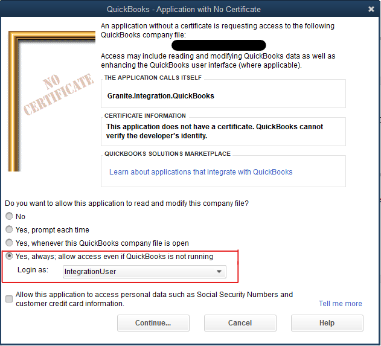

# QuickBooks Desktop
This document contains all of the information needed to install and configure QuickBooks Desktop integration.

QuickBooks integration works a bit differently from integration with other ERP systems. Because of the limitations imposed by the QuickBooks Desktop SDK, we cannot use the standard integration service and scheduler as we normally would. Instead, QuickBooks integration is implemented using a native Windows Forms application.

**`Take Note`** At the moment only downward integration is supported in the QuickBooks integration application.

Currently there are jobs for fetching the following from QuickBooks into Granite:

- Master Items
- Trading Partners
- Invoices
- Sales Orders
- Purchase Orders

## Setup

QuickBooks integration must be installed on the same machine as the QuickBooks SDK. It is best to put the integration application on the same machine as the QuickBooks company file, but if this is not possible the company file MUST at least be accessible from the machine you install on.

**`Take Note`** You will need the QuickBooks Admin user credentials to allow the integration application to connect to QuickBooks. 
You will also need a dedicated QuickBooks user that the integration application can use.

1. Check if the client's version of QuickBooks is 32bit or 64bit. You can check by opening QuickBooks Desktop and pressing F2:
    

2. Ensure you have the matching bitness Granite.Integration.QuickBooks.Native install files from the release folder

3. Paste the folder containing the application into the standard install directory `C:\Program Files (x86)\Granite WMS\`

4. In the `Granite.Integration.QuickBooks.Native.exe.config` file, configure your connection string to the Granite database:

        <connectionStrings>
		    <add name="CONNECTION" connectionString="Data Source=.\SQL2019;Initial Catalog=Granite;Persist Security Info=True;User ID=******;Password=*******" providerName="System.Data.SqlClient" />
	    </connectionStrings>

5. Configure the `QuickBooksCompanyFile` in the SystemSettings table, and enable the scheduled jobs that you want to run.

6. Log in to the QuickBooks company with the `Admin` user, and then run the integration application. 
QuickBooks will pop up a dialog where you need to give permission for the application to connect to QuickBooks, and select a user for it to use:
    


## Settings

The settings for QuickBooks integration are configured in the SystemSettings table in the Granite database. 
You can configure these from the Webdesktop as well if it is already installed. 
This section describes each of the settings.

##### QuickBooksCompanyFile
This is the file path to the QuickBooks company file that the integration application will connect to.

##### MasterItemSyncEnable
Enables syncing MasterItems from QuickBooks to Granite

##### MasterItemSyncInterval
Interval to sync MasterItems at. Measured in seconds

##### MasterItemSyncInventoryItems
Enable or disable syncing Inventory Items

##### MasterItemSyncAssemblyItems
Enable or disable syncing Assembly Items

##### MasterItemSyncServiceItems
Enable or disable syncing Service Items

##### SalesOrderSyncEnable
Enables syncing Sales Orders from QuickBooks to Granite

##### SalesOrderSyncInterval
Interval to sync Sales Orders at. Measured in seconds

##### SalesOrderPrefix
Prefix that will be applied to Sales Order numbers when they are synced to Granite.
This setting is not required, but it is useful to avoid conflicts if different document types are using the same prefix (or none at all) in QuickBooks.

##### SalesOrderAfterHeaderSyncProcedure
Name of stored procedure that will run after each SalesOrder header is synced to Granite.

**`See Also`** [After Header Sync Procedures](#after-header-sync-procedures)

##### InvoiceSyncEnable
Enables syncing Invoices from QuickBooks to Granite

##### InvoiceSyncInterval
Interval to sync Invoices at. Measured in seconds

##### InvoicePrefix
Prefix that will be applied to Invoice numbers when they are synced to Granite.
This setting is not required, but it is useful to avoid conflicts if different document types are using the same prefix (or none at all) in QuickBooks.

##### InvoiceAfterHeaderSyncProcedure
Name of stored procedure that will run after each Invoice header is synced to Granite

**`See Also`** [After Header Sync Procedures](#after-header-sync-procedures)

##### PurchaseOrderSyncEnable
Enables syncing Purchase Orders from QuickBooks to Granite

##### PurchaseOrderSyncInterval
Interval to sync Purchase Orders at. Measured in seconds

##### PurchaseOrderPrefix
Prefix that will be applied to Purchase Order numbers when they are synced to Granite.
This setting is not required, but it is useful to avoid conflicts if different document types are using the same prefix (or none at all) in QuickBooks.

##### PurchaseOrderAfterHeaderSyncProcedure
Name of stored procedure that will run after each PurchaseOrder header is synced to Granite

**`See Also`** [After Header Sync Procedures](#after-header-sync-procedures)

##### TradingPartnerSyncEnable
Enables syncing TradingPartners from QuickBooks to Granite

##### TradingPartnerSyncInterval
Interval to sync TradingPartners at. Measured in seconds

## How it works

The QuickBooks integration app makes use of the QuickBooks Desktop SDK to connect to the company file and copy data into Granite.
This is the method that we use for all data access in QuickBooks

### Document Jobs

Each time a document sync job runs, it queries QuickBooks for the documents that have been edited on the current date. 
The application then checks the Granite `IntegrationDocumentQueue` table to see if the modified documents have already been integrated or are already queued.
It does this by comparing the edited documents `ModifiedDate` timestamp to the `LastUpdateDateTime` timestamp and checking the `Status` field in the `IntegrationDocumentQueue` table.

If the `ModifiedDate` is newer than the last successfully synced entry in the `IntegrationDocumentQueue` table, a new entry will be added to the table queuing the document for integration.

After entering all of the documents that need to be synced into the `IntegrationDocumentQueue` table, the application will go through the entries in the table one by one and ensure that each document is copied into Granite.

If there is a [after header sync procedure](#after-header-sync-procedures) configured for the document type, after each Document record is created/updated and before the lines are synced the procedure will fire. 

Next, all MasterItems specified on the document being synced are inserted if they are missing, or updated if there are any changes.

Finally, each document line is inserted if it is missing, or updated if there are any applicable changes.

#### Syncing a specific document

It is possible to manually add a record to the `IntegrationDocumentQueue` table if you need a specific document to sync. 
If you have the ERP_id of the document it is best to specify it - but if not, the application should be able to find the document using only the document number and type.

#### After Header Sync Procedures

After header sync procedures can be configured for each type of document. 
These are SQL stored procedures that allow you to apply any necessary custom logic to documents as they sync. 
The stored procedure must take the document ID as an input like this: 

```sql
CREATE PROCEDURE [dbo].[InvoiceAfterHeaderSync] 
	@DocumentID bigint
    ...
```

### MasterItem Job

The MasterItem job can fetch three types of items from QuickBooks:

- Inventory Items
- Assembly Items
- Service Items

Each of these can be enabled or disabled individually in SystemSettings.

When the MasterItem job runs, it will fetch items only from the lists that are enabled in SystemSettings.

### TradingPartner Job

The TradingPartner job syncs two types of trading partners from QuickBooks:

- Customers
- Vendors


### Manual Job Execution

If you click the `Tools` button near the top of the integration application interface, you will see an option to execute a manual sync of each job type.
For document jobs, the calendar allows you to select a range of dates to fetch the modified documents from. 

**`Take Note`** It can be a slow process to fetch multiple days worth of documents. On a moderately busy site it would be advisable to manually sync jobs in batches of 3 to 4 days at a time.

The MasterItem and TradingPartner jobs do not make use of the calendar - they will always fetch the full list from QuickBooks for comparison to Granite.


