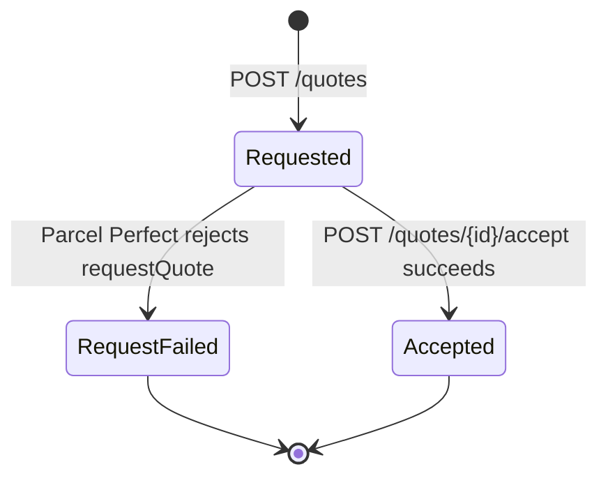

# Parcel Perfect Service

The Parcel Perfect integration is a standalone ASP.NET Core (.NET 10) service built on ServiceStack. It is published as its own container image (`granite.integration.parcel-perfect`) rather than deployed into IIS alongside the Integration Service.

!!! note
    This service only handles courier **quoting and waybill/collection conversion**. There is no downward sync job — Parcel Perfect has no document or master-data feed back into Granite today.

## Architecture Overview

- **ASP.NET Core / ServiceStack** — REST API exposing the quote endpoints below.
- **SQL Server (OrmLite)** — persists every quote, its parcels, the rates Parcel Perfect returned, and every accept/convert attempt, directly in the Granite database.
- **HttpClient-based Parcel Perfect client** — wraps Parcel Perfect's own `ecomService v32` JSON API.

### Key Components

- **QuoteServices** — the two REST endpoints (`CreateQuote`, `AcceptQuote`).
- **IParcelPerfectClient / ParcelPerfectClient** — wraps the underlying `ecomService` HTTP calls (`requestQuote`, `updateService`, `quoteToWaybill`, `quoteToCollection`).
- **IQuoteRepository / QuoteRepository** — OrmLite persistence for quotes, parcels, rates and conversions.
- **ParcelPerfectDbInitializer** — a hosted service that creates the four audit tables on startup if they don't already exist (greenfield service, no migration framework).
- **Health check** — `GET /up`.

## Setup

### Prerequisites

1. A connection string to the Granite database — the service creates its own tables in it automatically.
2. Parcel Perfect account details:
    - **AccountNumber** — the Parcel Perfect account code (`accnum` on every request).
    - **TokenId** — the API token (`token_id`) issued by Parcel Perfect.
    - **BaseUrl** — the `ecomService v32` JSON endpoint to call (sandbox vs. production differ).

### Installation

1. **Configure `appsettings.json`**

    ```json
    {
      "ConnectionStrings": {
        "Granite": "Server=YOUR_SERVER;Database=YOUR_GRANITE_DB;User ID=Granite;Password=YOUR_PASSWORD;TrustServerCertificate=true;"
      },
      "ParcelPerfect": {
        "BaseUrl": "https://adpdemo.pperfect.com/ecomService/v32/Json/",
        "TokenId": "YOUR_TOKEN_ID",
        "AccountNumber": "YOUR_ACCOUNT_NUMBER"
      }
    }
    ```

    !!! warning
        The checked-in `appsettings.json` points at Parcel Perfect's **sandbox** environment (`adpdemo.pperfect.com`) with a demo token. Replace `BaseUrl`, `TokenId` and `AccountNumber` with the client's real production values before going live.

2. **Deploy the service** as a container (see `PublishProfile: DefaultContainer` in the project) and point it at the Granite database.

3. **Verify installation** — `GET /up` should return a healthy status. The four `ParcelPerfectQuote*` tables should appear in the Granite database on first start.

## Configuration Reference

| Key | Description | Required |
|-----|-------------|----------|
| `ConnectionStrings:Granite` | Connection string to the Granite SQL Server database | Yes |
| `ParcelPerfect:BaseUrl` | Base URL of Parcel Perfect's `ecomService v32` JSON API | Yes |
| `ParcelPerfect:TokenId` | Parcel Perfect API token (`token_id`) | Yes |
| `ParcelPerfect:AccountNumber` | Parcel Perfect account number (`accnum`), sent on every quote request | Yes |

!!! note "Prepaid credit"
    Converting a quote into a waybill or collection (`AcceptQuote`) requires the Parcel Perfect account to have sufficient **prepaid credit**. If the balance is insufficient, Parcel Perfect rejects the conversion (`errorcode 1`, "Not enough prepaid credit") even though the original quote succeeded.

## API

### `POST /quotes` — Create a quote

Requests a courier quote for a shipment. Persists a `ParcelPerfectQuote` (and its parcel lines) locally and returns Parcel Perfect's rate options.

**Request**

| Field | Type | Required | Notes |
|-------|------|----------|-------|
| `Reference` | string | Yes | Caller's own reference for the quote |
| `SpecialInstructions` | string | No | |
| `Origin` | QuoteParty | Yes | Sender address |
| `Destination` | QuoteParty | Yes | Receiver address |
| `Parcels` | list of QuoteParcel | Yes | One entry per carton/parcel |
| `WaybillReferences` | list of string | No | Printed on the waybill, one per page |

**QuoteParty**

| Field | Type | Required |
|-------|------|----------|
| `PersonName` | string | Yes |
| `ContactName` | string | No |
| `AddressLine1` | string | Yes |
| `AddressLine2`–`AddressLine4` | string | No |
| `PostalCode` | string | Yes |
| `Phone` | string | No |
| `Cell` | string | No |

**QuoteParcel**

| Field | Type | Required | Notes |
|-------|------|----------|-------|
| `ItemNo` | string | Yes | |
| `Description` | string | Yes | |
| `Pieces` | int | No | Defaults to 1 |
| `Length`, `Width`, `Height` | decimal | Yes | |
| `ActualMassKg` | decimal | Yes | |

**Response**

| Field | Notes |
|-------|-------|
| `QuoteId` | Granite's own quote ID — used to accept the quote |
| `PpQuoteNumber` | Parcel Perfect's quote number |
| `Rates` | List of `{ ServiceCode, Description, Price }` — the options available to accept |

### `POST /quotes/{QuoteId}/accept` — Accept a quote

Accepts one of the rated service codes and converts the quote into either a waybill or a collection.

**Request**

| Field | Type | Required | Notes |
|-------|------|----------|-------|
| `QuoteId` | long | Yes | From the create-quote response |
| `ServiceCode` | string | Yes | Must be one of the `Rates` returned for this quote |
| `ConversionType` | `Waybill` (1) / `Collection` (2) | Yes | |
| `SpecialInstructions` | string | No | |
| `PrintWaybill` | bool | No | Defaults to `true` |
| `PrintLabels` | bool | No | Defaults to `true` |
| `CollectionDate` | date | Only for `Collection` | |
| `CollectionStartTime` | string | Only for `Collection` | Exact `"HH:mm"`, e.g. `"08:00"` |
| `CollectionEndTime` | string | Only for `Collection` | Exact `"HH:mm"`, e.g. `"17:00"` |

!!! note
    `CollectionDate`, `CollectionStartTime` and `CollectionEndTime` are required when `ConversionType` is `Collection`, and the two time fields must parse as exact `HH:mm` — send plain strings, not `DateTime`/time-of-day values.

**Response**

| Field | Notes |
|-------|-------|
| `WaybillNumber` | |
| `ConversionType` | Echoes the request |
| `CollectionDate` | Only set for `Collection` |
| `CollectionNumber` | Only set for `Collection` — the new collection request's own number |
| `Total` | Actual charged amount incl. VAT — can differ from the originally quoted price |
| `WaybillPdfBase64` | Present when `PrintWaybill` was requested |
| `LabelsPdfBase64` | Present when `PrintLabels` was requested |

**Validation errors**

| Condition | Result |
|-----------|--------|
| `QuoteId` doesn't exist | 404 |
| Quote isn't in the `Requested` state, or has no Parcel Perfect quote number | 400 |
| `ServiceCode` wasn't one of the rates returned for this quote | 400 |
| Collection fields missing or not `HH:mm` when `ConversionType` is `Collection` | 400 |

## Quote Lifecycle



Each accept *attempt* is recorded separately (`Pending` → `Succeeded`/`Failed`) rather than overwriting a single outcome, so a retry after a Parcel Perfect failure stays auditable — the latest conversion row is the current outcome for a quote.

## Database

Four tables, created automatically on startup (`CreateTableIfNotExists` — no migration framework, this is a greenfield service):

| Table | Purpose |
|-------|---------|
| `ParcelPerfectQuote` | One row per quote request — origin/destination, status, and the raw request/response JSON exchanged with Parcel Perfect |
| `ParcelPerfectQuoteParcel` | Parcel/carton lines for a quote |
| `ParcelPerfectQuoteRate` | Rate options Parcel Perfect returned for a quote |
| `ParcelPerfectQuoteConversion` | One row per accept *attempt* — keeps retries auditable |

## Error Handling

- Any non-zero `errorcode`, unparseable body, or non-2xx HTTP response from Parcel Perfect raises an internal exception, which this service surfaces to callers as **HTTP 502** carrying Parcel Perfect's own error message.
- The raw request/response JSON exchanged with Parcel Perfect is always persisted for troubleshooting, even on failure.
- The Parcel Perfect API token (`token_id`) is never written to logs.

## Underlying Parcel Perfect API

This service is a Granite-shaped wrapper around Parcel Perfect's own `ecomService v32` JSON API — form-urlencoded POSTs with a `method`/`class` dispatch pair and the payload as a JSON string in a `params` field, returning an `{ errorcode, errormessage, total, results }` envelope. Nothing outside this service calls that API directly.

## Resources

- Calling this service: [SQL CLR Invocation](sql-clr-invocation.md)
