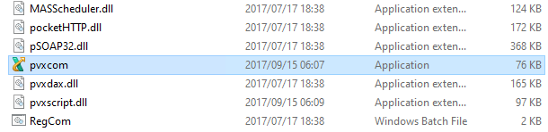
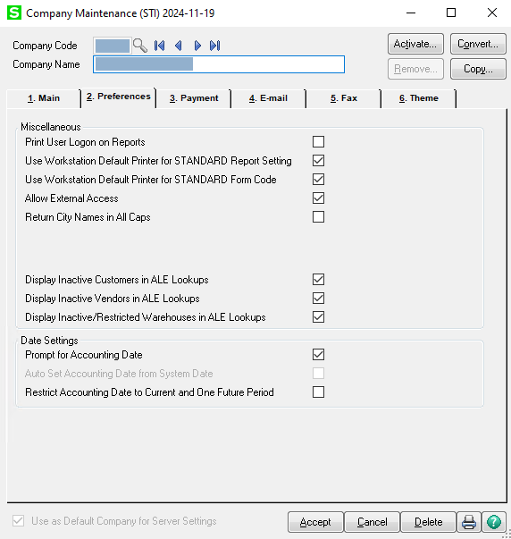

# SDK Provider

The Sage 100 SDK provider is responsible for mapping Granite transactions to the relevant format for posting to Sage 100. It makes use of the Sage 100 Business Object Interface to post to Sage 100.

The Business Object Interface is access through an instance of ProvideX OLE Server. The ProvideX OLE Server is a COM-based automation server used by Sage 100 (formerly MAS 90/200) to provide access to its Business Object Interface (BOI). This server facilitates communication between external applications and Sage 100’s internal business logic and data.
The ProvideX OLE Server is created from the pvxcom.exe. The default pathway is C:\Program Files (x86)\Common Files\Sage\Common Components




## Setup
1. The Sage 100 SDK provider has currently only been tested against the 2018 version. If not on this version please reach out to the Development team. 

2. **Copy** everything in the `Providers\Sage100\2018` folder into the Integration Service folder (root folder).

3. Ensure that the `SDKProvider.config` copied correctly
    ```xml
        <unity xmlns="http://schemas.microsoft.com/practices/2010/unity">
            <assembly name="Granite.Integration.Sage100" />
            <namespace name="Granite.Integration.Sage100" />
            <containers>
                <container name="Provider">
                    <register type="Granite.Integration.Contract.IProvider, Granite.Integration.Contract"
                                mapTo="Granite.Integration.Sage100.Provider, Granite.Integration.Sage100">
                    </register>
                </container>
            </containers>
        </unity>
    ```

4. Configure your connection string and endpoint in the `Granite.Integration.Web.exe.config` file

5. Ensure that the Sage 100 company is setup to allow external access. This setting seen below can be found under company maintenance > preferences



## Settings

!!! note
    To pick up any changes to the SystemSettings table, the integrationService will need to be restarted.

The settings for Sage 11 are configures in the SystemSettings table. The IntegrationService will pick up the settings using the Application name specified in it's `.config` file:
IF the setting is missing from the config file or left empty, the IntegrationService will default to using `IntegrationSage100` as the SystemSettingsApplicationName.
You can browse to the IntegrationService's `/config` page to have the IntegrationService create the default setting in the SystemSettings table for you.

### Config File Settings

```xml
    <add key="SystemSettingsApplicationName" value="IntegrationSage100" />
    <add key="EndPoint" value="http://:40091/" />
```

#### SystemSettingsApplicationName
The Application name of the entries in the SystemSettings table that you want to use for this integration service.
This setting allows you to have multiple integration services running with different settings.

### Database SystemSettings
The script to insert the default settings is located in the GraniteDatabase release.
```
~\GraniteDatabase\Data\SystemSettings\SystemSettingsSage100.sql
```


| Application        | Key                                     | Value | Description                                             | 
|--------------------|-----------------------------------------|-------|---------------------------------------------------------|
| IntegrationSage100 | UserName                                  |       | Sage100 user name                                       |
| IntegrationSage100 | Password                                |       | Sage100 user password                                   |
| IntegrationSage100 | CompanyCode                               |       | Sage100 company ID                                      |
| IntegrationSage100 | homePath                              | C:\Sage\Sage 100 Premium\MAS90      | Path to folder where sage is installed   |

## Integration Methods

By default if the method name below is the same as a Granite Transaction type, it will autowire the integration.
If you require a different integration action you can specify the name below in the Process IntegrationMethod property.                                   


### TAKEON
- Granite Transaction: **TAKEON**
- Sage100: **IM Transaction Receipt**
- Supports: 
    - Integration Reference
- IntegrationPost:
    - False - Saves transaction
    - True - Saves transaction
- Returns:
    - EntryNo

| Granite                | Sage 100 BOI | Required | Sage 100 Table | Behaviour |
|------------------------|--------------|----------|---------------|-----------|
| Reference              | Batch        | N        | GL_CompanyActiveBatch | If batch grouping of transactions is enabled, reference will be used as the BatchNo
| MasterItemCode         | ItemCode     | Y        | IM_TransactionDetail ||
| FromLocation            | WarehouseCode | Y       | IM_TransactionDetail ||
| Qty                    | TransactionQty | Y      | IM_TransactionDetail ||

### ADJUSTMENT / SCRAP 

- Granite Transaction: **ADJUSTMENT / SCRAP**
- Sage100: **IM Transaction Adjustment**
- Supports: 
    - Integration Reference
- IntegrationPost:
    - False - Saves transaction
    - True - Saves transaction
- Returns:
    - EntryNo

| Granite                | Sage 100 BOI | Required | Sage 100 Table | Behaviour |
|------------------------|--------------|----------|---------------|-----------|
| Reference              | Batch        | N        | GL_CompanyActiveBatch | If batch grouping of transactions is enabled, reference will be used as the BatchNo
| MasterItemCode         | ItemCode     | Y        | IM_TransactionDetail ||
| FromLocation            | WarehouseCode | Y       | IM_TransactionDetail ||
| Qty                    | TransactionQty | Y      | IM_TransactionDetail ||

### RECLASSIFY

- Granite Transaction: **RECLASSIFY**
- Sage100: **IM Transaction Adjustment**
- Supports: 
    - Integration Reference
- IntegrationPost:
    - False - Saves transaction
    - True - Saves transaction
- Returns:
    - EntryNo

| Granite                | Sage 100 BOI | Required | Sage 100 Table | Behaviour |
|------------------------|--------------|----------|---------------|-----------|
| Reference              | Batch        | N        | GL_CompanyActiveBatch | If batch grouping of transactions is enabled, reference will be used as the BatchNo
| FromMasterItemCode         | ItemCode     | Y        | IM_TransactionDetail ||
| FromLocation            | WarehouseCode | Y       | IM_TransactionDetail ||
| ToMasterItemCode         | ItemCode     | Y        | IM_TransactionDetail ||
| ToLocation            | WarehouseCode | Y       | IM_TransactionDetail ||
| Qty                    | TransactionQty | Y      | IM_TransactionDetail ||

### MOVE / TRANSFER / REPLENISH
- Granite Transaction: **MOVE / TRANSFER / REPLENISH**
- Sage100: **IM Transaction Transfer**
- Supports: 
    - Integration Reference
- IntegrationPost:
    - False - Saves transaction
    - True - Saves transaction
- Returns:
    - EntryNo

| Granite                | Sage 100 BOI | Required | Sage 100 Table | Behaviour |
|------------------------|--------------|----------|---------------|-----------|
| Reference              | Batch        | N        | GL_CompanyActiveBatch | If batch grouping of transactions is enabled, reference will be used as the BatchNo
| MasterItemCode         | ItemCode     | Y        | IM_TransactionDetail ||
| FromLocation           | WarehouseCode | Y       | IM_TransactionDetail ||
| ToLocation             | ToWarehouseCode | Y       | IM_TransactionDetail ||
| Qty                    | TransactionQty | Y      | IM_TransactionDetail ||


### RECEIVE
- Granite Transaction: **RECEIVE**
- Sage100: **PO Receipt of Goods**
- Supports: 
    - Integration Reference
- IntegrationPost:
    - False - Saves receipt
    - True - Saves receipt
- Returns:
    - ReceiptNo

| Granite                | Sage 100 BOI | Required | Sage 100 Table | Behaviour |
|------------------------|--------------|----------|---------------|-----------|
| Reference              | Batch        | N        | GL_CompanyActiveBatch | If batch grouping of receipts is enabled, reference will be used as the BatchNo
| MasterItemCode         | ItemCode     | Y        | PO_ReceiptDetail ||
| FromLocation           | WarehouseCode | Y       | PO_ReceiptDetail ||
| Qty                    | QuantityReceived | Y      | PO_ReceiptDetail ||

### PICK
- Granite Transaction: **PICK**
- Sage100: **SO Invoice**
- Supports: 
    - Integration Reference
- IntegrationPost:
    - False - Saves invoice
    - True - Saves invoice
- Returns:
    - ReceiptNo

| Granite                | Sage 100 BOI | Required | Sage 100 Table | Behaviour |
|------------------------|--------------|----------|---------------|-----------|
| Reference              | Batch        | N        | GL_CompanyActiveBatch | If batch grouping of receipts is enabled, reference will be used as the BatchNo
| MasterItemCode         | ItemCode     | Y        | SO_InvoiceDetail ||
| FromLocation           | WarehouseCode | Y       | SO_InvoiceDetail ||
| Qty                    | QuantityShipped | Y      | SO_InvoiceDetail ||

### CREATESHIPMENT

!!! note
    This is alternative method to be used on Pick transactions. Creates a shipment in Sage100 rather than an invoice.

- Granite Process IntegrationMethod: **CREATESHIPMENT**
- Sage100: **SO Invoice**
- Supports: 
    - Integration Reference
- IntegrationPost:
    - False - Saves shipment
    - True - Saves shipment
- Returns:
    - ReceiptNo

| Granite                | Sage 100 BOI | Required | Sage 100 Table | Behaviour |
|------------------------|--------------|----------|---------------|-----------|
| Reference              | Batch        | N        | GL_CompanyActiveBatch | If batch grouping of receipts is enabled, reference will be used as the BatchNo
| MasterItemCode         | ItemCode     | Y        | SO_InvoiceDetail ||
| FromLocation           | WarehouseCode | Y       | SO_InvoiceDetail ||
| Qty                    | QuantityShipped | Y      | SO_InvoiceDetail ||

