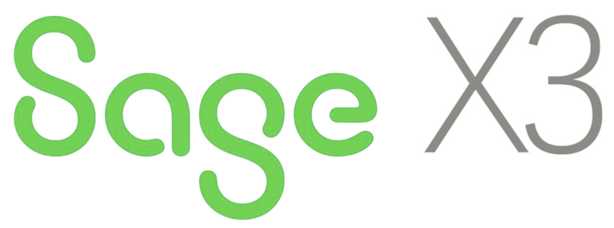
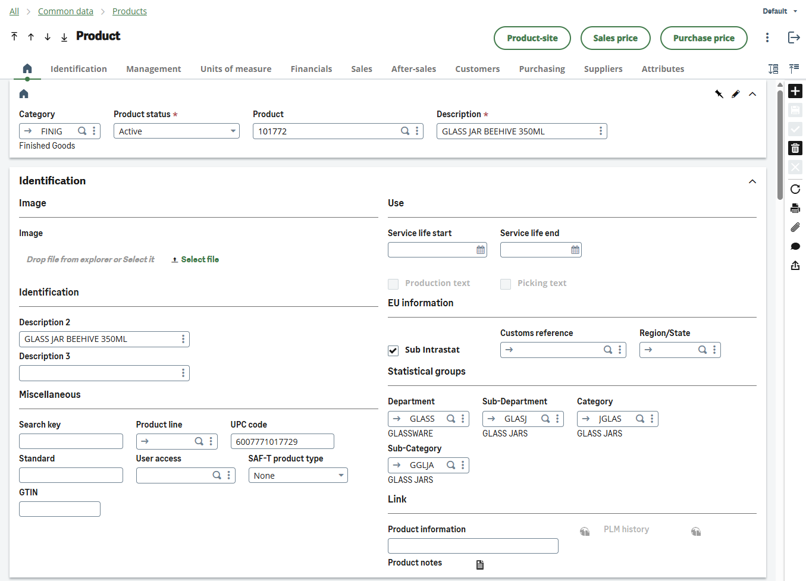
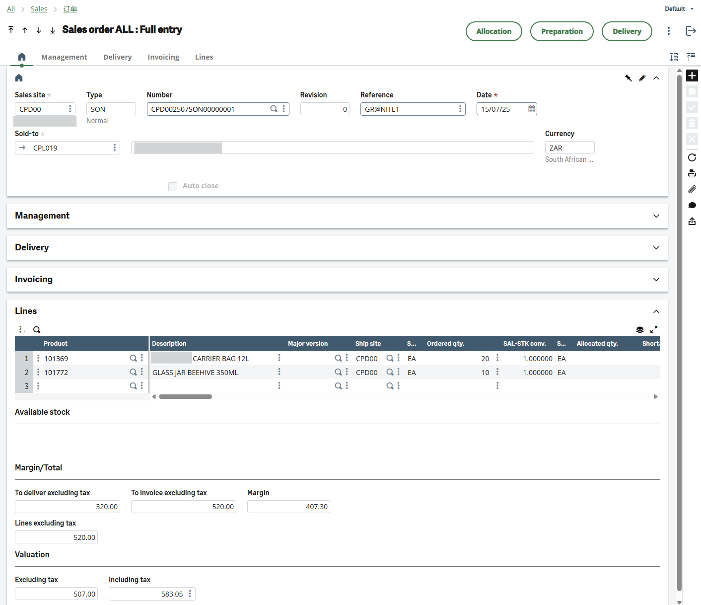
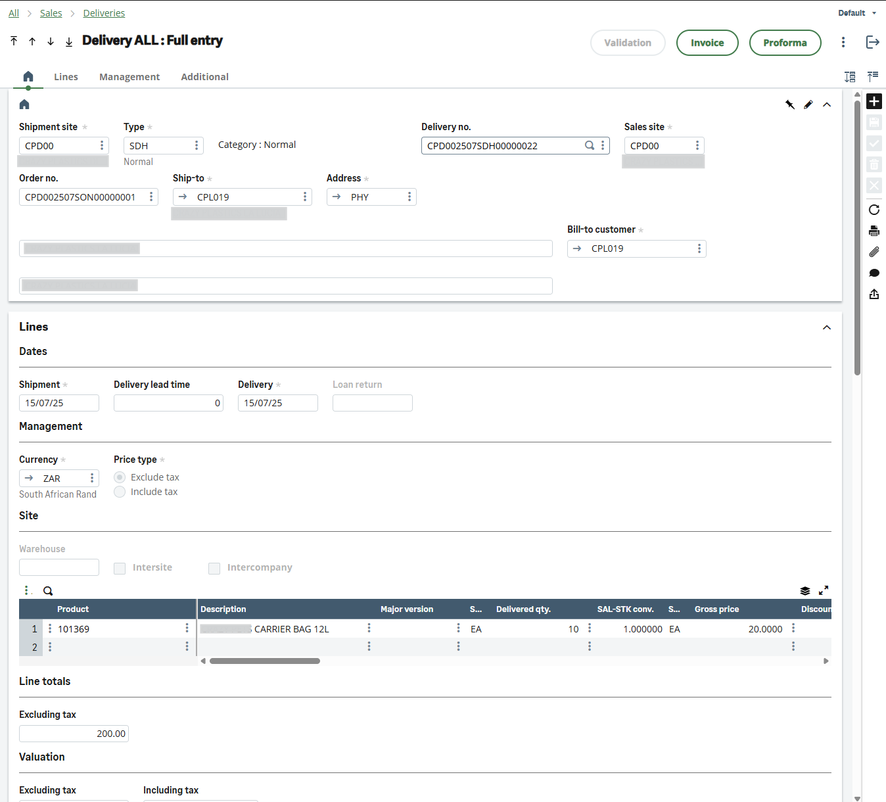
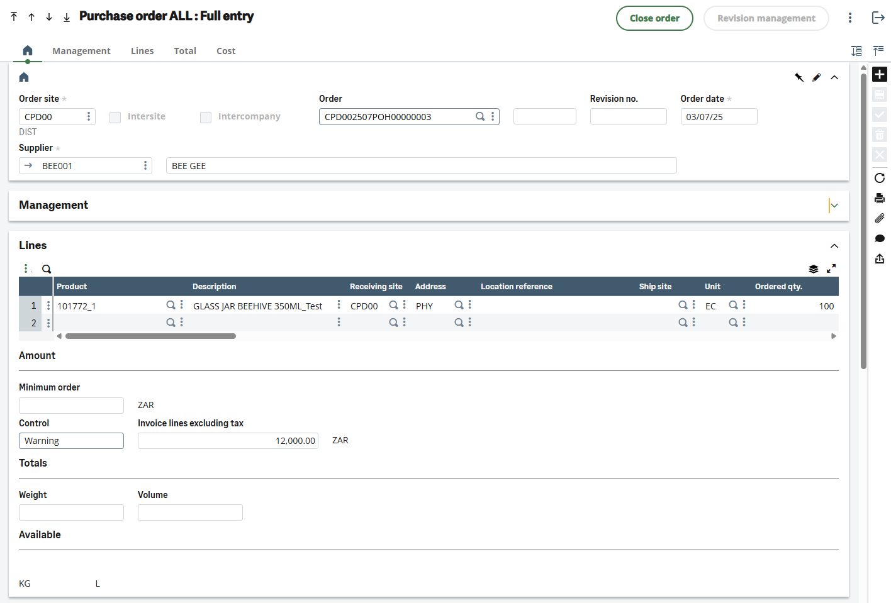
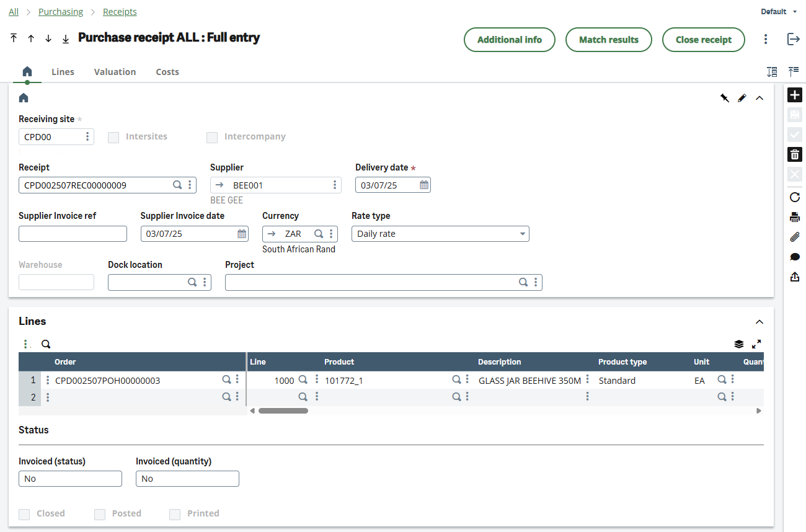

The purpose of this document is to provide an overview of Sage X3 in terms of integrating with Granite. For details on how integration will take place and which Granite transactions are supported please see the [SDK Provider](sdk-provider.md).

Sage X3 is a comprehensive enterprise resource planning (ERP) solution designed for mid-market and enterprise organizations. It provides integrated business management capabilities across finance, manufacturing, distribution, and customer relationship management. Sage X3 offers flexible deployment options and strong integration capabilities through its web service interface.

## Sage X3 Business Objects:

### Items (Products)

An item in Sage X3 represents a product, service, or component that can be bought, sold, manufactured, or tracked. Items in Sage X3 have comprehensive attributes including SKU (Item Reference), descriptions, units of measure, costing methods, and inventory parameters. These items integrate into Granite as MasterItems.

### Sites and Storage Locations

Sage X3 uses a hierarchical location structure with Sites (facilities) at the top level and Storage Locations within each site. Sites represent physical locations like warehouses or manufacturing plants, while storage locations provide detailed bin-level tracking. These Sites are used in Granite as ERP Locations and are essential for all inventory transactions.

### Sales Orders

Sales Orders in Sage X3 manage customer demand from quotation through delivery and invoicing. The sales order process includes order entry, allocation, picking, packing, delivery, and invoicing stages. Each sales order contains header information (customer, delivery address, terms) and line details (items, quantities, pricing). These are brought into Granite as Sales Orders

### Sales Deliveries

Sales Deliveries represent the physical fulfillment of sales orders. They track the actual goods shipped to customers and include delivery notes, shipping information, and quantity confirmations. Sales deliveries can be created from one or multiple sales orders and form the basis for customer invoicing. A sales delivery is created when posting picking transactions from Granite

### Purchase Orders

Purchase Orders manage supplier relationships and procurement processes. They include supplier information, delivery terms, item details, quantities, and pricing. Purchase orders in Sage X3 support complex approval workflows, multi-site deliveries, and integration with budgeting and requisition systems. These documents are brought into Granite as Purchase orders

### Purchase Receipts

Purchase Receipts document the physical receipt of goods from suppliers. They validate quantities received against purchase orders, handle quality control processes, and trigger accounts payable processes. Purchase receipts support partial deliveries, over-receipts, and integration with inspection workflows. A purchase receipt is created when posting receiving transactions from Granite.

### Stock Movements

Stock Movements in Sage X3 provide comprehensive inventory transaction tracking. This includes transfers between locations, adjustments for cycle counts, allocations for sales orders, and consumption for manufacturing. All stock movements maintain complete audit trails with timestamps, user information, and reason codes.

