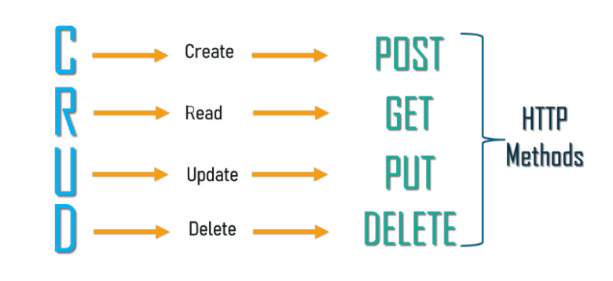

# Repository API


The primary objective of the Repository API is to offer a unified interface for **persisting data** into Granite. These operations encompass tasks for creating, reading, updating, and deleting data (CRUD).

In addition to serving our applications, third parties can utilize this API to retrieve data for **integration** purposes.

The **WebDesktop** is the sole Granite application using the Repository API by default.

---
## Setup

##### Requirements

- .Net Core 6
- [IIS](../iis/getting-started.md)
- Sufficient permissions for folder and file access and IIS application creation
  
##### IIS settings

**`Take note`**
WebDAVModule is a installed feature/module of IIS.
When WebDAVModule is installed and enable it can cause issues with PUT/DELETE operations.
The symptoms will be that you cannot delete or edit any data in the WebDesktop.

`The error you would receive is a 405 Method not allowed.`

Open the web.config file and change the following section.
```xml
<modules runAllManagedModulesForAllRequests="true">
    <remove name="WebDAVModule" />
</modules>
```
---

## Application Settings

The settings below are configured in the `appsettings.json`.

##### ConnectionStrings [CONNECTION]

Granite database connection string.

``` json
 "ConnectionStrings": {
    "CONNECTION": "Data Source=.;Initial Catalog=Granite;Persist Security Info=True;User ID=Granite"
  },
```

##### AllowedOrigins

The 'allowed origins' is a list of addresses for applications requiring access to the API. 
This may also include third parties utilizing the API. 
By default, the only address that requires configuration is the Granite **WebDesktop** address.

Example single address
```json

"AllowedOrigins": [ "https://192.168.1.10:8081" ]
```
Example multiple
```json

"AllowedOrigins": [ "https://192.168.1.10:8081", "https://192.168.1.20:3009" ],
```

##### DateTimeFormat

- DateTimeFormat: this needs to be the same as in the WebDesktop appsettings.json, 
- Take Note: the WebDesktop requires capital DD/MM/YYYY and the below format as follows dd'/'MM'/'yyyy
- This is due to the technology used on the frontend compared to backend

- The date / time format in all returning data.
- Date and Times is a combination of your SQL query value and the Web Desktop Grid layout. You need to setup in accordance.

```json
"DateTimeFormat": "MM'/'dd'/'yyyy",
```

##### UseSameSiteCookies

Same Site Cookies are a good default to use in your Apps which restricts cookies from being sent cross-site in order to prevent against cross-site request forgery (CSRF) attacks.
Cookies are typically sent to third parties in cross origin requests. This can be abused to do CSRF attacks.

Default set to true. (value type Boolean)
```json
  "UseSameSiteCookies": true,
```
Disable if 3rd parties need access to the API. 
```json
  "UseSameSiteCookies": false,
```

---

## Getting Started

The API is fully documented through the swagger and metadata pages.

- Swagger UI (https://Your_Address:port/**swagger-ui**/)
- MetaData (https://Your_Address:port/**json/metadata**/)

To communicate with the API you first need to 'sign in' authorize.

- Via the Swagger UI navigate to the POST auth operation.

```
auth => POST = auth/{provider} 
```
Enter the username and password in the **Body** and click [Try it out].

```json
{
  "UserName": "UserName",
  "Password": "Password",
}
```

If the Username and Password was valid you should receive a **200 OK** response.