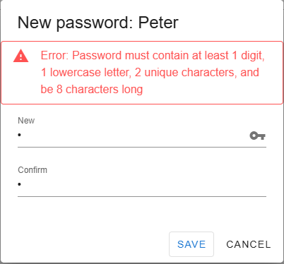

# Security settings 

The following settings are optional and related to Granite security. Configuration is managed within the SystemSettings database table.

Important Notes:
- Each setting is activated by the isActive value in the table.
- The Value field is used to configure the specific parameters for each setting.
- Once a security policy is breached, the **UsersCredential** table will be updated to enforce the policy.

### PasswordFailedAttempts

- Description: Defines the maximum number of failed login attempts allowed before a user account is locked.
- Configuration: Specify the number of failed attempts as the Value.

### PasswordRecoveryMinutes

- Description: Resets the failed login attempt counter after a specified duration (in minutes).
- Dependency: This setting only takes effect if PasswordFailedAttempts is active.
- Configuration: Specify the recovery duration (in minutes) as the Value.

### EnablePasswordStrength

- Description: Enforces a strong password policy for all new passwords while retaining previous passwords.
- Configuration: when active set the Value to one of the options below ranging from 1 to 5.
  
| Value | Name       | Description                                                                 |
|-------|------------|-----------------------------------------------------------------------------|
| 1     | VeryWeak   | Minimum 4 characters with at least 1 unique character. No digits, lowercase, uppercase, or special characters required. |
| 2     | Weak       | Minimum 8 characters with at least 2 unique characters. Must include digits and lowercase letters. Uppercase and special characters are not required. |
| 3     | Medium     | Minimum 12 characters with at least 3 unique characters. Must include digits, lowercase, and uppercase letters. Special characters are not required. |
| 4     | Strong     | Minimum 14 characters with at least 4 unique characters. Must include digits, lowercase, uppercase, and special characters. |
| 5     | VeryStrong | Minimum 16 characters with at least 5 unique characters. Must include digits, lowercase, uppercase, and special characters.   |

### EnablePasswordExpiry

- Description: Activates password expiration, requiring users to update their passwords after a set period.
- Configuration: Specify the expiration period (in days) as the Value.

----

` Examples of application handling security breaches`

----

