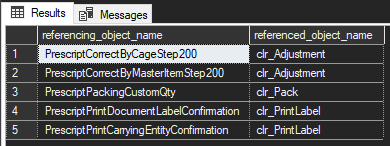
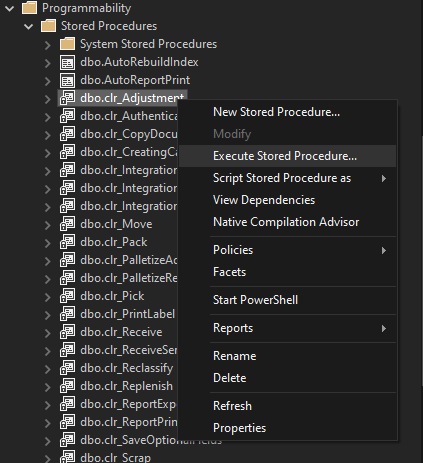

# Version 6 Upgrade Guide
This document explains the process of upgrading SQLCLR from version 5 to version 6 (Business API version).
You will only need to do this if you upgrading an existing database to version 6. New version 6 installs come with SQLCLR.

## What has changed

### Certificate 
The certificate that was used to sign the assemblies that contain the SQLCLR code expired in August 2024. 
The certificate and associated login are created on the master database. SQLCLR needs to be removed from all databases before they can be replaced.

### Outputs 
All outputs have be changed from responseCode and responseJson to success and message. 
While this requires some overhead to change initially it will greatly simplify using SQLCLR in future. 
Rather than building in handling into the prescript the valid and message can directly be set from the output.

### BusinessAPI
In version 6 the BusinessAPI has replaced the WebService. This has a few affects. The first is that the system setting needs to be changes to include the address of the BusinessAPI rather than the WebService.
The next is that many have different parameters. 

## Upgrade Steps:

1. [Remove the old certificate and login](#remove-the-old-certificate-and-login)
2. [Install new SQLCLR](#install-new-sqlclr)
3. [Identify all place it has been used](#identify-all-place-it-has-been-used)
4. [Apply changes for each procedure](#apply-changes-for-each-procedure)

### Remove the old certificate and login

As the certificate is installed on master and is used by all SQLCLR in all databases it will have to first be remove from all databases first. Run the following script against all databases where SQLCLR is installed.

```sql
IF EXISTS (SELECT * FROM sys.objects WHERE NAME = 'report_AddReportParameter')
	DROP FUNCTION [report_AddReportParameter]
GO
IF EXISTS (SELECT * FROM sys.objects WHERE NAME = 'email_AddTemplateParameter')
	DROP FUNCTION [email_AddTemplateParameter]
GO
IF EXISTS (SELECT * FROM sys.objects WHERE NAME = 'email_CreateReportAttachment')
	DROP FUNCTION [email_CreateReportAttachment]
GO
IF EXISTS (SELECT * FROM sys.objects WHERE NAME = 'email_AddReportParameter')
	DROP FUNCTION [email_AddReportParameter]
GO
IF EXISTS (SELECT * FROM sys.objects WHERE NAME = 'email_AddReportAttachment')
	DROP FUNCTION [email_AddReportAttachment]
GO
IF EXISTS (SELECT * FROM sys.objects WHERE NAME = 'email_CreateExcelAttachment')
	DROP FUNCTION [email_CreateExcelAttachment]
GO
IF EXISTS (SELECT * FROM sys.objects WHERE NAME = 'email_AddExcelAttachmentFilter')
	DROP FUNCTION [email_AddExcelAttachmentFilter]
GO
IF EXISTS (SELECT * FROM sys.objects WHERE NAME = 'email_AddExcelAttachmentOrderBy')
	DROP FUNCTION [email_AddExcelAttachmentOrderBy]
GO
IF EXISTS (SELECT * FROM sys.objects WHERE NAME = 'email_AddExcelAttachment')
	DROP FUNCTION [email_AddExcelAttachment]
GO
IF EXISTS (SELECT * FROM sys.objects WHERE NAME = 'email_AddFileAttachment')
	DROP FUNCTION [email_AddFileAttachment]
GO
IF EXISTS (SELECT * FROM sys.objects WHERE NAME = 'export_AddOrderBy')
	DROP FUNCTION [export_AddOrderBy]
GO
IF EXISTS (SELECT * FROM sys.objects WHERE NAME = 'export_AddFilter')
	DROP FUNCTION [export_AddFilter]
GO
IF EXISTS (SELECT * FROM sys.objects WHERE NAME = 'clr_Receive')
	DROP PROCEDURE [clr_Receive]
GO
IF EXISTS (SELECT * FROM sys.objects WHERE NAME = 'clr_IntegrationPost')
	DROP PROCEDURE [clr_IntegrationPost]
GO
IF EXISTS (SELECT * FROM sys.objects WHERE NAME = 'clr_IntegrationPostToEndpoint')
	DROP PROCEDURE [clr_IntegrationPostToEndpoint]
GO
IF EXISTS (SELECT * FROM sys.objects WHERE NAME = 'clr_IntegrationUpdate')
	DROP PROCEDURE [clr_IntegrationUpdate]
GO
IF EXISTS (SELECT * FROM sys.objects WHERE NAME = 'clr_TakeOn')
	DROP PROCEDURE [clr_TakeOn]
GO
IF EXISTS (SELECT * FROM sys.objects WHERE NAME = 'clr_Scrap')
	DROP PROCEDURE [clr_Scrap]
GO
IF EXISTS (SELECT * FROM sys.objects WHERE NAME = 'clr_Adjustment')
	DROP PROCEDURE [clr_Adjustment]
GO
IF EXISTS (SELECT * FROM sys.objects WHERE NAME = 'clr_Move')
	DROP PROCEDURE [clr_Move]
GO
IF EXISTS (SELECT * FROM sys.objects WHERE NAME = 'clr_Palletize')
	DROP PROCEDURE [clr_Palletize]
GO
IF EXISTS (SELECT * FROM sys.objects WHERE NAME = 'clr_Replenish')
	DROP PROCEDURE [clr_Replenish]
GO
IF EXISTS (SELECT * FROM sys.objects WHERE NAME = 'clr_Reclassify')
	DROP PROCEDURE [clr_Reclassify]
GO
IF EXISTS (SELECT * FROM sys.objects WHERE NAME = 'clr_Pick')
	DROP PROCEDURE [clr_Pick]
GO
IF EXISTS (SELECT * FROM sys.objects WHERE NAME = 'clr_Pack')
	DROP PROCEDURE [clr_Pack]
GO
IF EXISTS (SELECT * FROM sys.objects WHERE NAME = 'clr_PrintLabel')
	DROP PROCEDURE [clr_PrintLabel]
GO
IF EXISTS (SELECT * FROM sys.objects WHERE NAME = 'clr_StockTakeCount')
	DROP PROCEDURE [clr_StockTakeCount]
GO
IF EXISTS (SELECT * FROM sys.objects WHERE NAME = 'clr_StockTakeHold')
	DROP PROCEDURE [clr_StockTakeHold]
GO
IF EXISTS (SELECT * FROM sys.objects WHERE NAME = 'clr_StockTakeRelease')
	DROP PROCEDURE [clr_StockTakeRelease]
GO
IF EXISTS (SELECT * FROM sys.objects WHERE NAME = 'clr_ReportPrint')
	DROP PROCEDURE [clr_ReportPrint]
GO
IF EXISTS (SELECT * FROM sys.objects WHERE NAME = 'clr_ReportExportToFile')
	DROP PROCEDURE [clr_ReportExportToFile]
GO
IF EXISTS (SELECT * FROM sys.objects WHERE NAME = 'clr_TemplateEmail')
	DROP PROCEDURE [clr_TemplateEmail]
GO
IF EXISTS (SELECT * FROM sys.objects WHERE NAME = 'clr_SimpleEmail')
	DROP PROCEDURE [clr_SimpleEmail]
GO
IF EXISTS (SELECT * FROM sys.objects WHERE NAME = 'clr_TableExport')
	DROP PROCEDURE [clr_TableExport]
GO
IF EXISTS (SELECT * FROM sys.objects WHERE NAME = 'clr_GetWarehouseCost')
	DROP PROCEDURE [clr_GetWarehouseCost]
GO
IF EXISTS (SELECT * FROM sys.objects WHERE NAME = 'clr_GetStockTakeBatch')
	DROP PROCEDURE [clr_GetStockTakeBatch]
GO
IF EXISTS (SELECT * FROM sys.objects WHERE NAME = 'clr_CallFoodcoAPI')
	DROP PROCEDURE [clr_CallFoodcoAPI]
GO
IF EXISTS (SELECT * FROM sys.objects WHERE NAME = 'clr_JsonTest')
	DROP PROCEDURE [clr_JsonTest]
GO
IF EXISTS (SELECT * FROM sys.objects WHERE NAME = 'clr_GetJson')
	DROP PROCEDURE [clr_GetJson]
GO

IF EXISTS (SELECT * FROM sys.assemblies WHERE NAME = 'SQLCLR')
	DROP ASSEMBLY [SQLCLR]
GO
IF EXISTS (SELECT * FROM sys.assemblies WHERE NAME = 'JsonFx')
	DROP ASSEMBLY JsonFx
GO
```

Next you can remove the login and certificate with the following script:

```sql
USE master
GO
IF EXISTS(SELECT * FROM sys.syslogins WHERE name = 'CLRLogin')
	BEGIN 
		PRINT N'Removing Login';
		DROP LOGIN CLRLogin;
	END
GO
IF EXISTS(SELECT * FROM sys.certificates WHERE name = 'CLRCERT')
	BEGIN
		PRINT 'Removing certificate...'
		DROP Certificate CLRCERT
	END
GO
```

### Install new SQLCLR

Now you can run the version 6 SQLCLR_install.sql script from the deploy folder.

### Identify all place it has been used

As a result of the changes listed in the [what has changed](#what-has-changed) section above you will need to alter the prescripts using any of the SQLCLR procedures.

To find all of these procedures you can use the following script:
```sql
SELECT	referencing_object_name = OBJECT_NAME(sd.referencing_id),
		referenced_object_name = COALESCE(OBJECT_NAME(sd.referenced_id), sd.referenced_entity_name)
FROM	sys.sql_expression_dependencies sd
		LEFT JOIN sys.objects so ON sd.referencing_id = so.object_id
		LEFT JOIN sys.objects so_referenced ON sd.referenced_id = so_referenced.object_id
WHERE sd.referenced_entity_name LIKE 'clr_%';
```

The first column is the prescript and the second is SQLCLR procedure executed in the script.



### Apply changes for each procedure

To alter the existing procedure the simplest process will be to right click on the procedure and select execute.
Fill in test info to get the formatting of the execute. 


You can then replace the existing exec in prescript with the new one. Here you can see a before and after using clr_Adjustment. 

BEFORE:
```sql
EXECUTE [dbo].[clr_Adjustment] 
   @userID = @userID
  ,@inventoryIdentifier = @inventoryIdentifier
  ,@qty = @qty
  ,@comment = @comment
  ,@reference = @reference
  ,@adjustmentType = @adjustmentType
  ,@integrationReference = @integrationReference
  ,@processName = @processName
  ,@responseCode = @responseCode OUTPUT
  ,@responseJSON = @responseJSON OUTPUT

IF @responseCode = 200
BEGIN
	SELECT @valid = 1
	SELECT @message = CONCAT('Successfully adjusted ', @TrackingEntityBarcode, ' to ', @QtyToAdjustTo)  
END
ELSE
BEGIN
	SELECT @valid = 0
	SELECT @message = @responseJSON
END
```
AFTER:
```sql
EXEC	[dbo].[clr_Adjustment]
		@userName = @UserName,
		@trackingEntityIdentifier = @inventoryIdentifier,
		@adjustmentQty = @qty,
		@comment = @comment,
		@reference = @reference,
		@adjustmentType = @adjustmentType,
		@integrationReference = @integrationReference,
		@processName = @processName,
		@success = @valid OUTPUT,
		@message = @message OUTPUT
```
The main things to note are that you pass the UserName instead of the userID. This paired with being able to directly set the valid and message makes using the SQLCLR procedures far simpler. 

In this example the SQLCLR is the last action in the prescript so you can directly set the @valid and @message. If this is not the case, you can check if it succeeded like this:

```sql
EXEC	[dbo].[clr_Adjustment]
		@userName = @UserName,
		@trackingEntityIdentifier = @inventoryIdentifier,
		@adjustmentQty = @qty,
		@comment = @comment,
		@reference = @reference,
		@adjustmentType = @adjustmentType,
		@integrationReference = @integrationReference,
		@processName = @processName,
		@success = @success OUTPUT,
		@message = @message OUTPUT

IF(@success = 1) -- 1 indicates success
	BEGIN 
		-- Continue with logic here
	END

```

