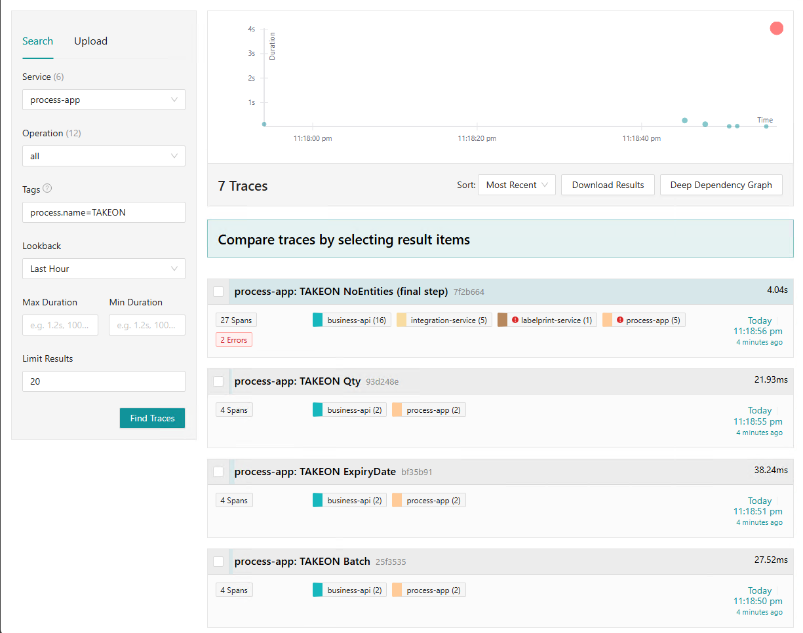
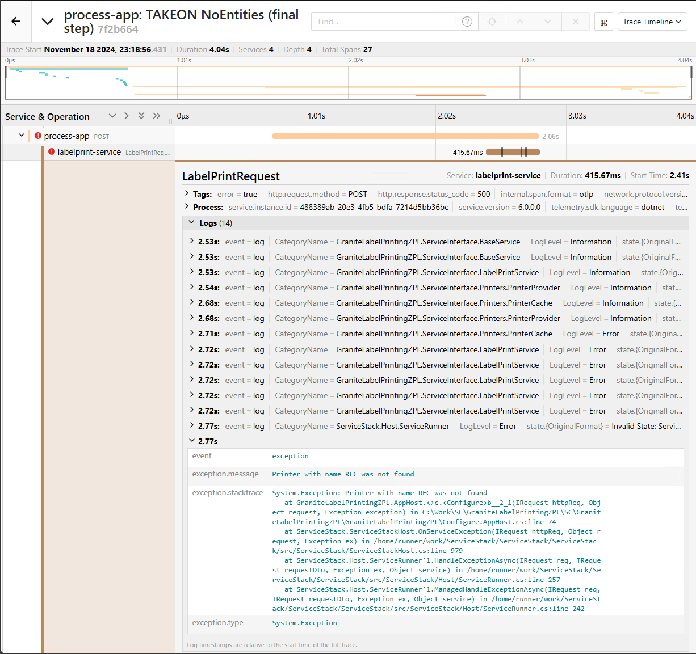
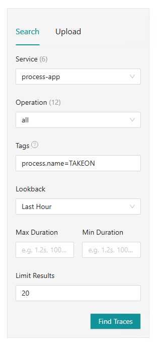
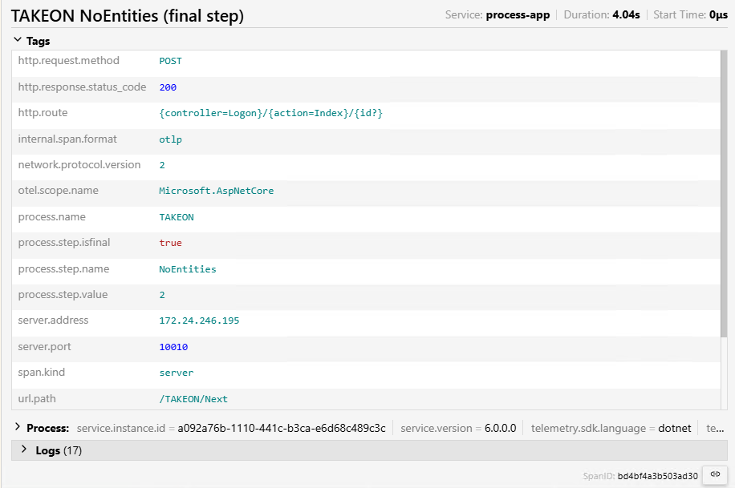
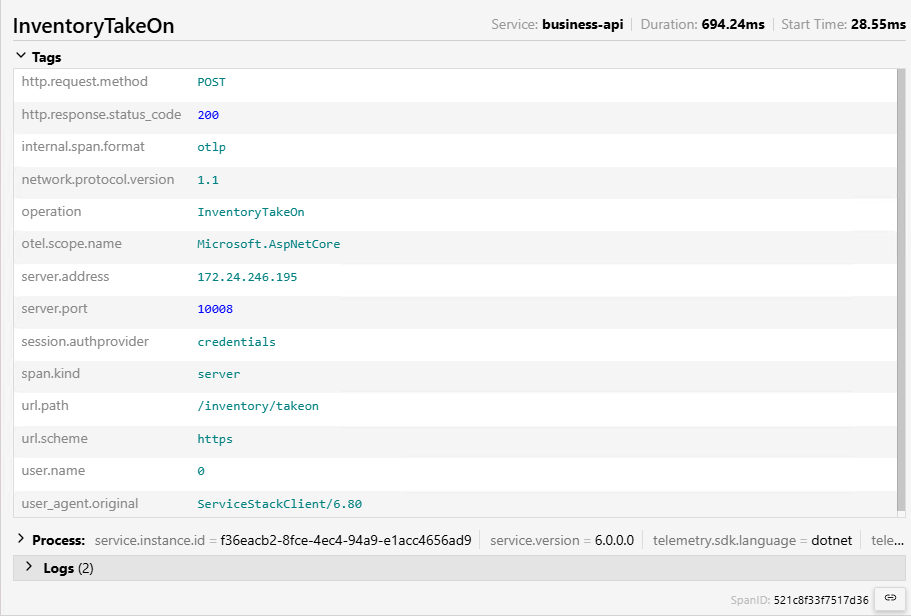

# Jaeger
Jaeger is an observability platform that allows you to view a complete picture of what happens across all of Granite's various layers when a user does something.
This is almost like looking at the logs, but instead of having to hunt down the specific entry that corresponds to what you're looking at in another file, the correlation is all done for you.

## Setup

In order to use Jaeger, you will need the complete GraniteTelemetry pack installed. This pack includes 3 components:

- Elasticsearch - The database that stores the telemetry information
- Jaeger Collector - The service that receives all of the trace data from Granite applications and stores it in Elasticsearch
- Jaeger UI - The front end that allows you to view and query trace data stored in Elasticsearch

### The easy way
The easiest way is to install GraniteTelemetry alongside the rest of Granite WMS, using [Scaffold](../scaffold/manual.md).
If you select GraniteTelemetry as one of the applications to install, Scaffold will guide you through the process.

### The manual way
If you need to install Jaeger from scratch, you can use the `install.ps1` script in the GraniteTelemetry folder.

!!! note
    If you are running the installation script manually, please ensure that any existing installations have been uninstalled before attempting the install.
    If you are not sure if any components are already installed, you can run the `uninstall.ps1` script to make certain they are removed.

To run the script, you can execute it from powershell. When you do, ensure that you pass the necessary parameters in:

```powershell
.\install.ps1 -ElasticSearchMemory "500m" -ElasticSearchPort 40060 -JaegerCollectorHostPort "192.168.0.41:40061" -JaegerUIHostPort "192.168.0.41:40062"
```

- **ElasticSearchMemory**:

    The amount of memory that Elasticsearch can use. 
    You can specify 10 gigabytes as "10g" or 500 megabytes as "500m".
    At a bare minimum, you should allow Elasticsearch 500m of memory. 
    The more users your site has, the more memory will be required to ensure that all trace data is captured.

- **ElasticSearchPort**:

    The port number that Elasticsearch will use.
    Elasticsearch will always be bound to localhost.

- **JaegerCollectorHostPort**:

    The IP address or hostname and port number that Jaeger Collector will use. 
    Take note of this address, you will need to set this address as the `CollectorEndpoint` in the appsettings.json file of each application that will send trace data to be recorded.

- **JaegerUIHostPort**:

    The IP address or hostname and port number that Jaeger UI will use.
    Take note of this address, you will use this address to browse to the page where you can query the trace data.

### Elasticsearch ILM policy
The Index Lifecycle Management policy determines how long trace data is kept in the Elasticsearch database. 
By default, the policy is that trace data will be deleted once it is 30 days old.

You can configure the policy by posting a new one to the Elasticsearch API once Elasticsearch is installed.

To change the number of days to keep trace data, you only need to change the `min_age` property

```http
PUT /_ilm/policy/jaeger-ilm-policy HTTP/1.1
content-type: application/json

{
  "policy": {
    "phases": {
      "hot": {
        "min_age": "0ms",
        "actions": {
          "rollover": {
            "max_age": "1d"
          },
          "set_priority": {
            "priority": 100
          }
        }
      },
      "delete": {
        "min_age": "30d",
        "actions": {
          "delete": {}
        }
      }
    }
  }
}
```

## Traces & spans

Jaeger records each user action and the related backend operations and stores them together in a trace. 
A trace is made up of spans, each span reflecting a specific part of the system that was triggered as a result of a user action.

Here we can see traces representing multiple steps in a TAKEON process:


We can see that there are errors on the final step. Clicking on the trace allows us to drill down and see the spans that make up this trace.
Here we can see where the errors are actually coming from:


Drilling down further into the labelprint-service entry we can see each of the logs that are related to this request, as well as the error message that was returned:



## Querying Jaeger

{ align=right }

You can select the service that you want to query from the dropdown. 

If you are running multiple instances of Granite that are pointing to the same telemetry collector, 
the service name can be set in each of the services' config files. This will allow you to distinguish between the environments in Jaeger.

The Operation dropdown allows you to select a specific operation on the API to filter by. 
For APIs this corresponds to the operation name from the ServiceStack `/metadata` page.
For the Process App, the operation name will be the name of the process and the step name.


You can use the tags of a span to query Jaeger for trace data.

You can only search for exact matches on tags. There is no LIKE operator in Jaeger.

Click the question mark above the tags field for more details on filtering using tags.


## Tags
You can find tags by expanding a trace to see what each service is recording.

Process App tags example:


Business API tags example:


There are a lot of tags included by default, but we've added some Granite specific ones to help you find what you're looking for. 
See the sections below for the specific tags added to each service.

### Process App

- `user.name`   
The username of the user performing this transaction
- `process.name`    
Name of the process 
- `process.step.isfinal`    
True if it is the final step of the process, otherwise false
- `process.step.name`	
Name of the process step
- `process.step.value`  
The value the user entered on this step.

### Business API

- `user.name`   
The username of the user making the request
- `session.authprovider`    
The authentication method being used for this request (credentials / api-key)
- `request.origin`  
Only used when the request comes from SQLCLR, most other requests will show the parent span in Jaeger's trace waterfall. 
- `operation`   
The operation that was performed on the API. This corresponds to the Operations on the `/metadata` page

### Custodian API

- `user.name`   
The username of the user making the request
- `session.authprovider`    
The authentication method being used for this request (credentials / api-key)
- `request.origin`  
Only used when the request comes from SQLCLR, most other requests will show the parent span in Jaeger's trace waterfall. 
- `operation`   
The operation that was performed on the API. This corresponds to the Operations on the `/metadata` page

### Scheduler
- `job.name`    
Name of the job as defined in the ScheduledJobs.Name column
- `job.type`    
The type of job (EMAIL, STOREDPROCEDURE, INJECTED)

### Labelprinting ZPL
- `request.origin`  
Only used when the request comes from SQLCLR, most other requests will show the parent span in Jaeger's trace waterfall. 
- `operation`   
The operation that was performed on the API. This corresponds to the Operations on the `/metadata` page

### Integration Service
- `request.origin`  
Only used when the request comes from SQLCLR, most other requests will show the parent span in Jaeger's trace waterfall. 
- `operation`   
The operation that was performed on the API. This corresponds to the Operations on the `/metadata` page