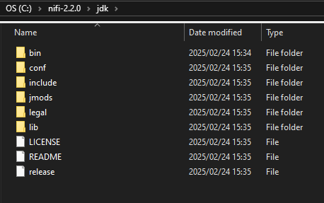
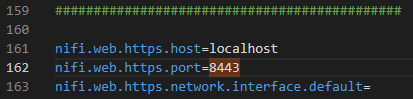
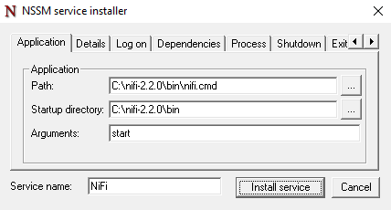

# Apache NiFi

!!! warning
    Under construction

## Setup

Download the following:

- [NiFi Standard](https://nifi.apache.org/download/)
- [Java development kit x64 Compressed Archive](https://www.oracle.com/za/java/technologies/downloads/)
- [NSSM](https://nssm.cc/download)

### Create JDK folder

Once you have extracted all the NiFi files, create a new folder inside the folder you will run Nifi from called `jdk`.
Paste all of the files from the JDK compressed archive into the jdk folder:



### Update Environment Variables

Now we need to point NiFi to where we have the JDK installed. Browse into NiFi's `bin` folder and edit the `nifi-env.cmd` file to look like this:

```batch
rem Set application home directory based on parent directory of script location
pushd %~dp0..
set NIFI_HOME=%CD%
popd

rem Set Java version
set JAVA_HOME=%NIFI_HOME%\jdk

rem Set run directory for process identifier tracking
set NIFI_PID_DIR=%NIFI_HOME%\run

rem Set application log directory
set NIFI_LOG_DIR=%NIFI_HOME%\logs
```

By default NiFi will run on port 8443. If you need to change the port, open the `nifi\conf\nifi.properties` file and set the port on line 162:



### Configure nifi.cmd for Service Compatibility

By default, the NiFi startup script is designed to launch the application in a separate, minimized window. When running as a Windows Service, **NSSM** must stay "attached" to the process to monitor its health. If this change is not made, NSSM will think NiFi has crashed and will enter a restart loop.

1. Browse to the `nifi\bin` folder and open `nifi.cmd` in a text editor (like Notepad++ or VS Code).
2. Find the block of code (typically around line 65) that handles the `start` command. 
3. **Remove** the `start /MIN "Apache NiFi"` portion of the command so that the script calls the Java executable directly.

**Before:**
```batch
) else if %RUN_COMMAND% == "start" (
  rem Start bootstrap process in new minimized window
  call start /MIN "Apache NiFi" "%JAVA_EXE%" %JAVA_MEMORY% %JAVA_PARAMS% org.apache.nifi.bootstrap.BootstrapProcess %RUN_COMMAND%
)
```

**After**
```batch
) else if %RUN_COMMAND% == "start" (
  rem Call Java directly so NSSM can track the process
  call "%JAVA_EXE%" %JAVA_MEMORY% %JAVA_PARAMS% org.apache.nifi.bootstrap.BootstrapProcess %RUN_COMMAND%
)
```


### NSSM Service Install

Next, copy the `nssm.exe` into the the `nifi\bin` folder. 
Open a terminal window and browse to the `nifi\bin` folder, then execute the following

```cmd
nssm install NiFi
```

Enter the path to the `nifi.cmd` file and provide Nssm with the folder path and start argument, then click Install Service:

