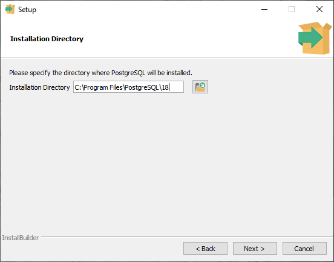
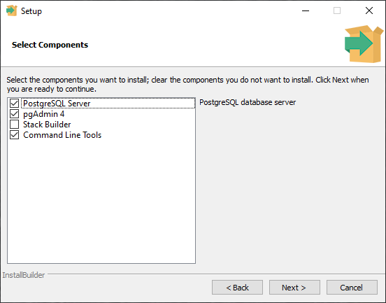
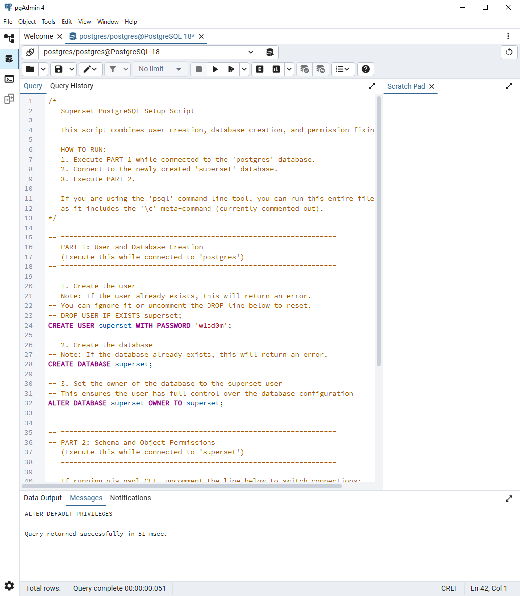
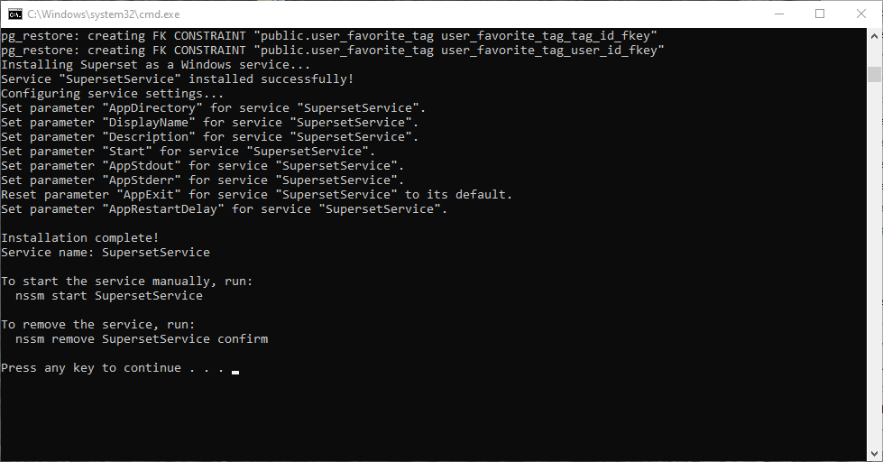
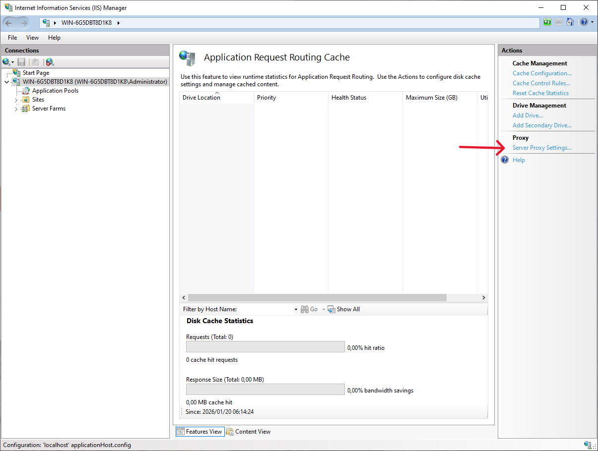
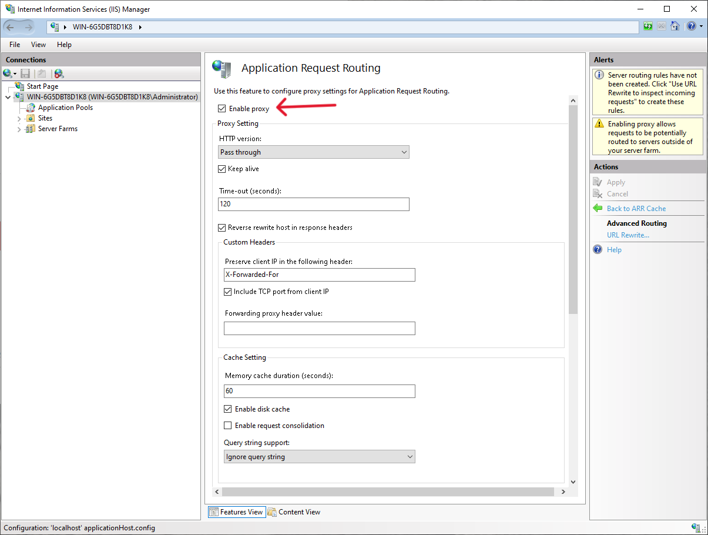
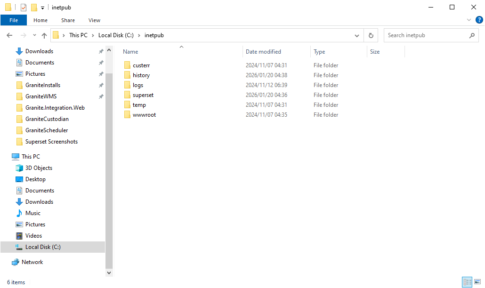
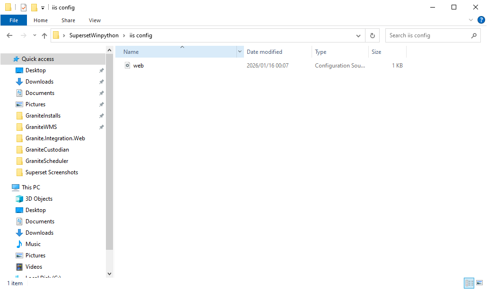
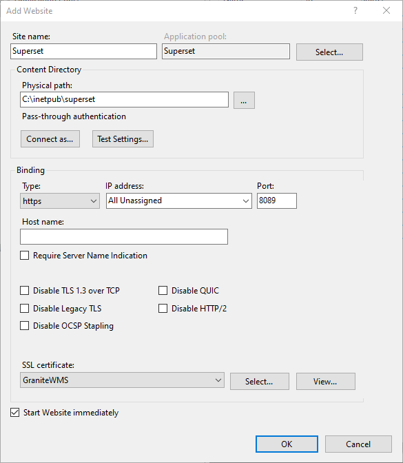

# Superset

Apache Superset is an open-source business intelligence and data visualization platform that allows users to explore and visualize data through interactive dashboards and charts. It provides a user-friendly interface for creating sophisticated visualizations without requiring extensive coding knowledge, making it accessible for both technical and non-technical users to analyze and present data insights.

## Setup

All files for standalone Superset install can be found in the dropbox folder: (Todo - add superset location)

### Install Postgresql 
The first step is to install Postgresql 18 with the included installer postgresql-18.1-2-windows-x64.exe

It is a simple click next installer. 

Be sure to leave the install path as "C:\Program Files\PostgreSQL"

And uncheck Stackbuilder from the components to install

Set the password as you please, just remember it.

Leave the port as the standard

### Postgresql Database and User
Now that Postgresql is installed. Run pgAdmin. 

Then run the script provided in the folder (setup_superset_db.sql) to create the user and the database needed. You will have to run each one separately by highlighting it. Be sure to run each statement. 

### Install Superset

Now the easy part. If you have completed the above steps. Run the install_superset.bat file. This will create superset as a windows service. 

You can now start the service.

And Browse to [http://localhost:8088](http://localhost:8088) to log in. Please reach out to the development team for the password. Unless you have the wisdom to guess it.

## IIS Config

By default, Superset runs on http. This is fine while testing but if it is going to be used in production then it is essential to have it served via https. In order to do this, you can create a reverse proxy in IIS. 

You will first need to install [Application Request Routing](https://www.iis.net/downloads/microsoft/application-request-routing)

Once installed, in IIS double click Application Request Routing to open it. (You may need to close IIS and open it again for it to appear)

Then in server proxy settings

Check enable proxy. You can leave everything as default

Now, create a folder named superset in "C:\inetpub"

Copy the web.config file from the SupersetInstall/iis config folder to that new folder.

Once you have done that, you can create a new IIS website pointing to "C:\inetpub\superset" and set it up as https. 

