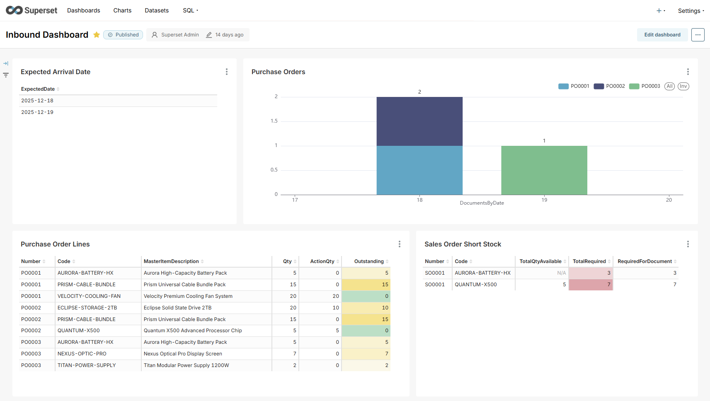

# Superset

Apache Superset is an open-source business intelligence and data visualization platform that allows users to explore and visualize data through interactive dashboards and charts. It provides a user-friendly interface for creating sophisticated visualizations without requiring extensive coding knowledge, making it accessible for both technical and non-technical users to analyze and present data insights.

