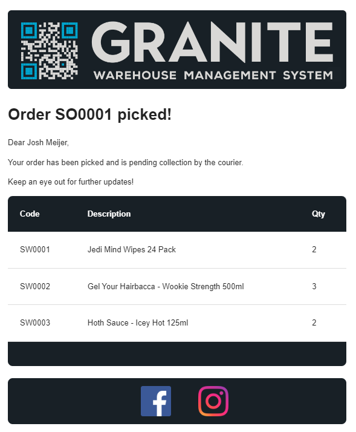
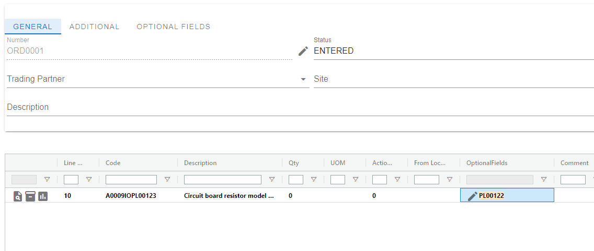
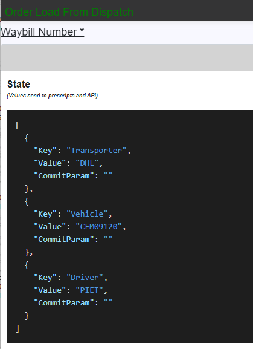
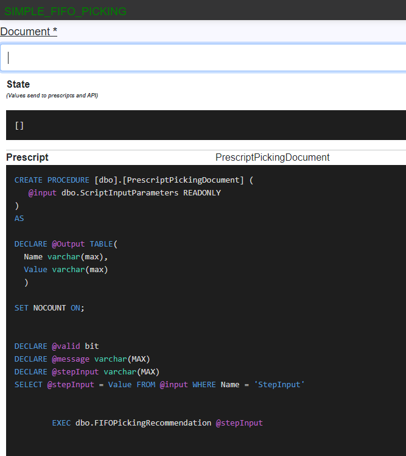

# Granite WMS What's New V 5.0

## New Applications Overview

- [Process Catalog](#process-catalog) - A process catalogue that allows you to easily share your process configurations with the team
- [Utility API](#utility-api) - A brand new API, home to our new [SSRS Reporting Service](#ssrs-reporting-service) and [Email Service](#email-service)

## WebDesktop Changes Overview

- [Document](#document) - Document capture enhancements
- [Optional Fields Location](#optionalfields) - Support for Optional Fields for Locations
- [Optional Fields Document](#optionalfields) - Support for Optional Fields for Document
- [Optional Fields DocumentDetail](#optionalfields) - Support for Optional Fields for Document Detail
- [Pre-Script preview](#prescript-preview) - Preview Pre-Scripts in WebDesktop
- [System Settings Encryption](#systemsettings-encryption) - Allow encryption of sensitive data stored in System settings
- [Database Migration](#Database-Migration) - Easy migration / upgrade of version 4.5 to 5.0 via webdesktop.

## Process Changes Overview
- [Silent Steps](#silent-steps) - Unlimited silent steps
- [Debug Mode](#debug-mode) - Use by technical team to view webtemplates, scripts while executing a process

---
## Process Catalog
`Functionality not intended for end-user.`

Introducing new functionality that empowers consultants to seamlessly share Processes as Templates and securely store them in the cloud. 
Moreover, this update enables users to conveniently access all shared templates from the central store and deploy them to production environments with ease

Webdesktop Publish Process

An easy to follow wizard to publish any Process as a template. 
 

Webdesktop Process Catalog

Search, preview and deploy templates with an easy to understand UI.


## Utility API

The Granite Utility API is a brand new API that will be home to various services that enhance Granite's capabilities.

The first two services that the Utility API will launch with are a SSRS Reporting Service to provide easy ways of interacting with SSRS from SQLCLR, and a new Email Service that is intended to replace the emailing currently built into the Scheduler. The new Email Service will also support the SSRS Reporting Service from the get go, allowing you to seamlessly attach SSRS Reports when sending emails.

### Email Service

This new Email Service aims to make sending emails simpler, and at the same time far more powerful. We've achieved this by introducing [Email Templates](#email-templates), which are based on the same technology as the ProcessApp's Web Templates. In addition to Email Templates, the new Email Service is fully supported by SQLCLR, which means no more inserting directly into tables to send once off emails!

Sending emails with [attachments](#attachments) is also now simpler than it's ever been. When you request an email to be sent, you can specify parameters for the [SSRS Reporting Service](#ssrs-reporting-service) which will render your reports, save them to disk and attach them to the email - all in a single request.


#### Email Templates

Email templates allow you to create good looking responsive emails without the hassle of writing out all that html. This is done by keeping things simple - we use markdown for text formatting, and a standard layout that can be built upon. You can customize templates using script methods similar to the ones you're already familiar with from WebTemplates.

A templated email without any further customization looks like this:


And with just a few script methods you can build it into this:




#### Attachments

To attach an SSRS report to an email, we simply add the report path, file type and report parameters that we want to use to generate the attachment when we create our email:

```sql
DECLARE @subject nvarchar(max)
DECLARE @body nvarchar(max)
DECLARE @toEmailAddresses nvarchar(max)
DECLARE @ccEmailAddresses nvarchar(max)
DECLARE @bccEmailAddresses nvarchar(max)
DECLARE @reportAttachments nvarchar(max)
DECLARE @excelAttachments nvarchar(max)
DECLARE @fileAttachments nvarchar(max)
DECLARE @responseCode int
DECLARE @responseJSON nvarchar(max)
DECLARE @PickingReport varchar(max)

SET @PickingReport = dbo.email_CreateReportAttachment('/PickingReport', 'PDF')                  
-- Creating the report that we want to attach. The reportPath is /PickingReport, and fileType is PDF
SET @PickingReport = dbo.email_AddReportParameter(@PickingReport, 'documentNumber', 'SO0001')       
-- Adding a parameter that will be used to call the SSRS report. The parameter named 'documentNumber' will be set to 'SO0001'
SET @reportAttachments = dbo.email_AddReportAttachment(@reportAttachments, @PickingReport)      
-- Lastly, we add the picking report to the list of report attachments. 
SET @subject = 'Example Clr Mail' 
SET @toEmailAddresses = 'email1@gmail.com;email2@gmail.com'

EXECUTE [dbo].[clr_SimpleEmail] 
   @subject
  ,@body
  ,@toEmailAddresses
  ,@ccEmailAddresses
  ,@bccEmailAddresses
  ,@reportAttachments
  ,@excelAttachments
  ,@fileAttachments
  ,@responseCode OUTPUT
  ,@responseJSON OUTPUT

  SELECT @responseCode, @responseJSON
```


### SSRS Reporting Service

The SSRS Reporting Service adds some new functionality to Reporting 'tool-box' by enabling saving of reports to either PDF or EXCEL from a SQLCLR procedure. Printing SSRS reports has been improved and moved to this service. It is now allows for printing reports with multiple parameters and is far simpler to set up and execute with SQLCLR calls. 

### SQL Export Service

The last piece of functionality being added with the Utility API is the SQL Export service. This service allows for exporting of data from Tables and Views to either Excel or CSV. Supporting filtering, order by, offset, limit, and shipping from the start with SQLCLR calls, this service aims to make it easier than ever to get data out of the Granite Database. 

---
## WebDesktop Changes

### Document 

Several small changes was made to reduce errors and to facilitate a better experience when capturing documents.

- Open the item dialog when user click new line.
- If a from, to or intransit location is captured in the previous line it will carry over to the next.


- Disable the edit of the header of the document when user is busy with line editing.

### Optionalfields

We have introduced support for optional fields in Locations, Documents, and Document Details.

`Example showcasing an optional field at the line level.`




### Prescript Preview

Easily preview the prescript of a ProcessStep in a readonly view.

`Example: Icon displayed next to the prescript name trigger for a preview.`


### Systemsettings Encryption

`To ensure safety across the board, we have implemented encryption in our System Settings for storing sensitive information.`
These values can never be viewed, and are securely stored with encryption keys.

`Take Note` We require all current system settings to migrate sensitive setting in version 5 as part of the upgrade procedure.


### Grid menu clear options

Options to clear selection and filters.


## Silent Steps

We're excited to announce our support for silent steps within the range of **200-299**. This enhancement grants users the flexibility to set up an unlimited number of silent steps within this range. The motivation behind this update is to meet the growing demands related to tasks such as sending emails or generating reports.

We highly recommend segregating these new silent steps from your regular ones, as it enhances clarity and simplifies support processes.

It's important to note that silent step 200 will halt execution if validation fails, preventing any subsequent silent steps from running. However, starting from step **201** onwards, execution will proceed regardless of validation status.


## Debug Mode
`Functionality not intended for end-user.`

When accessing the Debug Mode within the ProcessApp, users gain invaluable insights into each Business Process setup and configuration. 
This specialized mode enables users to examine prescripts and web template syntax, as well as analyze the current state of the application in detail.

Debug Mode facilitates a systematic walkthrough of each process step, empowering users to thoroughly review their setup and identify potential issues with precision. 

By offering a comprehensive view of the application's internal processes, Debug Mode enhances efficiency in debugging, enabling users to streamline problem-solving and optimization efforts effectively.

### Application State 



### Prescript syntax



### WebTemplate syntax


