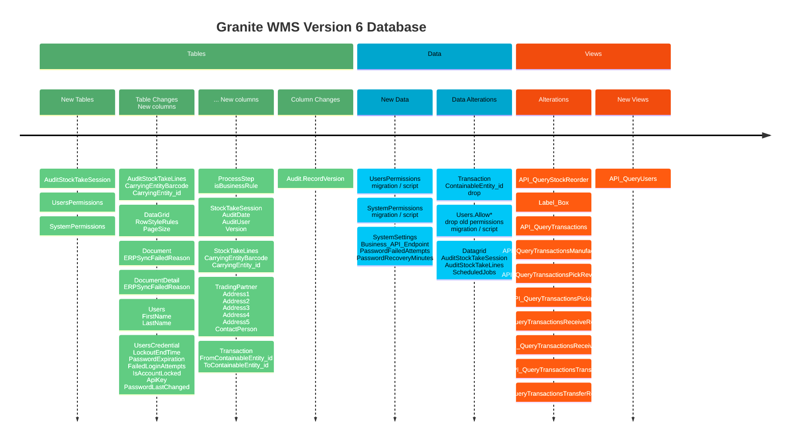
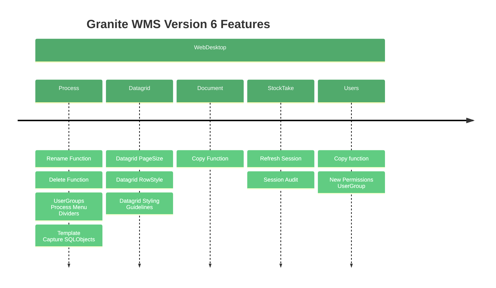
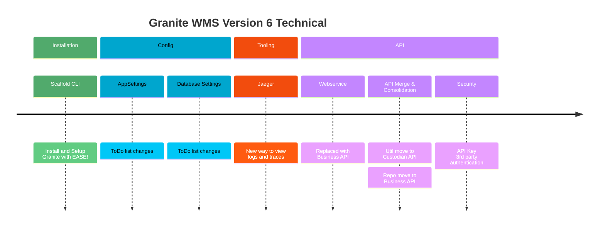

# Cheat Sheet

## Database

```mermaid
%%{init: { 'logLevel': 'debug', 'theme': 'default' , 'themeVariables': {
              'cScale0': '#51AA6C', 'cScaleLabel0': '#ffffff',
              'cScale1': '#00A6CE',
              'cScale2': '#F24C0D', 'cScaleLabel2': '#ffffff'
       } } }%%
    timeline
        title Granite WMS Version 6 Database
       
        section Tables
          New Tables : AuditStockTakeSession : UsersPermissions : SystemPermissions  

          Table Changes <br> New columns : AuditStockTakeLines <br> CarryingEntityBarcode <br> CarryingEntity_id : DataGrid <br> RowStyleRules  <br>  PageSize : Document <br> ERPSyncFailedReason : DocumentDetail <br> ERPSyncFailedReason : Users <br> FirstName  <br>  LastName : UsersCredential <br> LockoutEndTime  <br>  PasswordExpiration  <br>  FailedLoginAttempts  <br>  IsAccountLocked  <br>  ApiKey  <br>  PasswordLastChanged

          ... New columns : ProcessStep <br> isBusinessRule : StockTakeSession <br> AuditDate <br> AuditUser <br> Version : StockTakeLines  <br> CarryingEntityBarcode <br> CarryingEntity_id  : TradingPartner <br> Address1 <br> Address2 <br> Address3 <br> Address4 <br> Address5 <br> ContactPerson : Transaction <br> FromContainableEntity_id <br> ToContainableEntity_id
        
         Column Changes : Audit.RecordVersion

         section Data

          New Data : UsersPermissions <br> migration / script : SystemPermissions <br> migration / script : SystemSettings <br> Business_API_Endpoint <br> PasswordFailedAttempts <br> PasswordRecoveryMinutes
          Data Alterations : Transaction <br> ContainableEntity_id <br> drop : Users.Allow* <br> drop old permissions <br> migration / script  : Datagrid <br> AuditStockTakeSession <br> AuditStockTakeLines <br> ScheduledJobs
         section Views
          Alterations : API_QueryStockReorder : Label_Box : API_QueryTransactions : API_QueryTransactionsManufacture : API_QueryTransactionsPickReversal : API_QueryTransactionsPicking : API_QueryTransactionsReceiveReversal : API_QueryTransactionsReceiving : API_QueryTransactionsTransfer : API_QueryTransactionsTransferReversal

          New Views : API_QueryUsers


```

## Features

```mermaid
%%{init: { 'logLevel': 'debug', 'theme': 'default' , 'themeVariables': {
              'cScale0': '#51AA6C', 'cScaleLabel0': '#ffffff',
              'cScale1': '#00A6CE',
              'cScale2': '#F24C0D', 'cScaleLabel2': '#ffffff'
       } } }%%
    timeline
        title Granite WMS Version 6 Features

        section WebDesktop
          Process : Rename Function:  Delete Function:  UserGroups <br> Process Menu Dividers  : Template <br> Capture SQLObjects

          Datagrid : Datagrid PageSize : Datagrid RowStyle : Datagrid Styling Guidelines
          
          Document : Copy Function

          StockTake : Refresh Session : Session Audit

          Users: Copy function : New Permissions <br> UserGroup
```

## Technical

```mermaid
%%{init: { 'logLevel': 'debug', 'theme': 'default' , 'themeVariables': {
              'cScale0': '#51AA6C', 'cScaleLabel0': '#ffffff',
              'cScale1': '#00A6CE',
              'cScale2': '#F24C0D', 'cScaleLabel2': '#ffffff'
       } } }%%
    timeline
        title Granite WMS Version 6 Technical

        section Installation
          Scaffold CLI : Install and Setup Granite with EASE!

        section Config
          AppSettings : ToDo list changes
          Database Settings : ToDo list changes


        section Tooling
          Jaeger : New way to view logs and traces  

        section API
          Webservice : Replaced with Business API
          
          API Merge & Consolidation: Util move to Custodian API
          : Repo move to Business API

          Security : API Key <br> 3rd party authentication 
        
       
            
```

