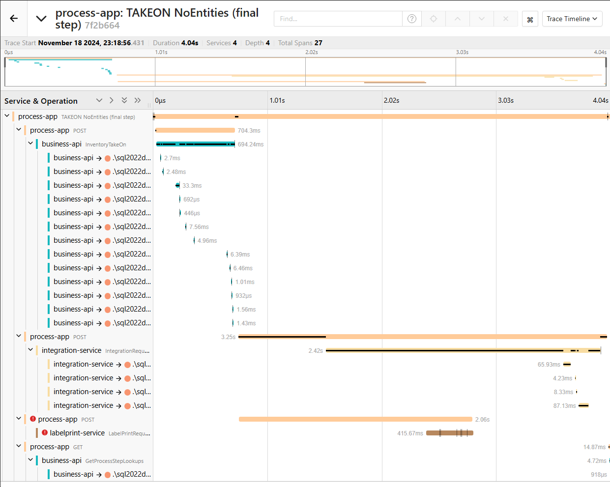
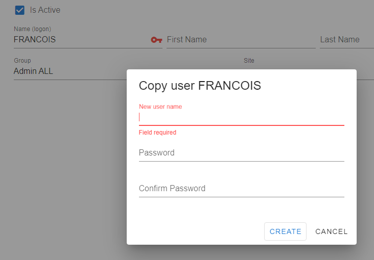

# Granite WMS What's New V 6.0
`Not released`

*Also see [V6 Cheat Sheet](../V6/cheatsheet.md) for a high level overview and reference* 

## API Consolidation changes

`these changes will impact settings and configuration of the endpoint addresses. please review`

- The **Util API** is now merged into the **Custodian API**, consolidating functionalities under the unified name: Custodian API.
- The **Repo API** is now merged into the new **Business API**, consolidating functionalities under the unified name: Business API.
  
___
## Overview

### New Applications & Tools

- [Scaffold CLI](#scaffold) - A simple to use CLI application (command line interface) to install, setup and configure Granite WMS.
- [Business API](#business-api) - An upgraded replacement for the Webservice, and also the new home for the Repo API functionality
- [Jaeger](#system-observability-with-jaeger) - Your new favorite way to "check the logs"

### New Integration Providers

- [Sage 100](../../integration/sage100/index.md)
- [Acumatica](../../integration/acumatica/index.md)
- [Sage Intacct](../../integration/intacct/index.md)

### Webdesktop Enhancements

- [Document Copy](#document-copy) - Functionality to copy any document as a new document. Allowing the user to change the type of document.
- [Data Capture](#datacapture-feature) - A new feature that gives you the ability to easily create input forms to streamline your users' experience capturing repetitive data.
- [Data Grid Improvements](#data-grid-improvements) - Data Grids now support conditional formatting and configurable page sizes
- [Process Management](#process-management-changes) - Styled Menu dividers  
- [StockTake Session Auditing](#stocktake-session-management-improvements) - Stocktake session creation criteria are now audited, giving you better visibility
- [User Management](#changes-to-user-management) - User permissions are now managed at the User Group level. You can also copy users from within the Webdesktop    
- [Process Template](#process-template-sqlobjects) - Allow user to add any SQLObjects (View, Proc, Table, Function) to process template.
 
### Security & Permissions changes

- [Security Settings](#security-settings) - Opt-in system wide settings that allow you enforce policies like password strength and user account lock outs
- [API Keys](#api-keys) - a new way of authenticating against our APIs
- [Changes to Permissions](#changes-to-permissions) - Permissions are no longer columns on the user table

___
## Scaffold
<iframe src="https://share.descript.com/embed/jY8IZ5GAL32" width="640" height="360" frameborder="0" allowfullscreen></iframe>

Scaffold is a straightforward command line interface that makes it easy to install, setup, and configure Granite WMS.
## Business API
In this first release of the Business API, our aim is that you shouldn't notice any major differences between it and the Webservice & Repo API. However, this doesn't mean nothing has changed. Under the hood we've moved away from the legacy technology the Webservice was built on. This modernization enhances our ability to adapt to new requirements, allowing us to respond to business needs more quickly and efficiently. With this new API, we are better positioned to support innovation and deliver improved services to our users.

The Repo API has been moved into it's new home without any major changes. There have been some bug fixes, but nothing has materially changed.

On the Webservice functionality side, while the aim is to remain as consistent as possible, there are some changes to the behaviour in the Business API. The most notable change is that creating a pallet will require a location. This is to ensure better transactional consistency throughout the lifetime of the pallet. This means that you will need to have a Location step _before_ any CarryingEntity step that creates pallets. This affects the following process types:

- Take On
- Manufacture
- Receiving
- Return
- Palletize

Aside from that, the other changes are fixes that require no changes to processes:

- All Transaction types write FromContainableEntity_id and ToContainableEntity_id where applicable
- STOCKTAKERELEASE requires the TrackingEntity to be on hold.
- QCRELEASE Pallet writes ActionQty to transaction
- RECEIVING & TAKEON of a MasterItem with DirectOnHold writes ProcessName to QCHOLD transaction
- RECEIVING a document with the same item with multiple ToLocations correctly validates the ToLocation
- MANUFACTURE validates against document detail TO Location (Webservice incorrectly validates against FROM Location)
- BarcodeMaster will skip barcodes for failed transactions more often than the Webservice - this is part of the strategy to avoid assigning barcodes twice.

You can find out more in the [Business API manual](../../business-api/manual.md) 
___
## System observability with Jaeger

In V6 we're aiming to make it easier than ever to track down issues. 
To achieve this, we've added OpenTelemetry instrumentation into almost all of our existing applications. 
This allows us to collect all the information that you would normally see in each application's log file (and much more), and correlate the information to view a complete picture of what happened when a user did something.

All of this information (called trace data) is sent to Jaeger's Elasticsearch database, where it is stored for as long as you need it.

The Jaeger UI gives you visibility of everything that happens when a user takes an action like this:

To learn more about Jaeger and Opentelemetry, and how to query trace data take a look at our [Jaeger documentation](../../tools/jaeger.md)
___
## Webdesktop Enhancements

### Document Copy
<iframe src="https://share.descript.com/embed/slZUqnHkFMg" width="640" height="360" frameborder="0" allowfullscreen></iframe>

### [Datacapture Feature](../../webdesktop/datacapture/data-capture.md)

<iframe src="https://share.descript.com/embed/XnsGLzgZkiW" width="640" height="360" frameborder="0" allowfullscreen></iframe>

### Data Grid Improvements 
- [Page Size](../../webdesktop/datagrid/datagrid.md#page-size) configuration
- [Row Formatting](../../webdesktop/datagrid/datagrid.md#row-formatting) rule based row formatting
- [Styling Guidelines](../../webdesktop/datagrid/datagrid.md#styling-guidelines) built in style classes for improved look across application  
<iframe src="https://share.descript.com/embed/X27OtafGcj2" width="640" height="360" frameborder="0" allowfullscreen></iframe>

### Process Management changes

- Rename process 
- Delete process 
- Process menu dividers

<iframe src="https://share.descript.com/embed/F1TEUB5PWxq" width="640" height="360" frameborder="0" allowfullscreen></iframe>

---

### Stocktake Session management improvements

- Refresh button
- Stock Session (heading) audit

<iframe src="https://share.descript.com/embed/nXrFmWnpEwl" width="640" height="360" frameborder="0" allowfullscreen></iframe>

### Changes to User management
- new support for copying users, carry over all setups
  

- new permissions management in user groups

### Process Template SQLObjects

- Include adhoc SQL views, functions or stored procedures
 
<iframe src="https://share.descript.com/embed/tyzK3FNH0C1" width="640" height="360" frameborder="0" allowfullscreen></iframe>

### Minor Changes
- `new` MasterItem Alias SQL view preview. Allow user to preview the SQL view configured for MasterItem Alias.
  
___
## Security & Permissions changes

### Security Settings
Security Settings are opt-in System Settings that allow you to configure Granite's security policy to meet your customers' requirements. 
These settings allow you to configure things like password strength requirements, and lock out of user accounts after a certain number of failed attempts.
For all the details see the dedicated documentation for [Security Settings](../../security/system-security.md).

### API Keys
As part of the security overhaul, we've introduced API keys. 
These can be used in place of a user name and password to authenticate against our Business API.
This change will allow third-parties a much more seamless experience in working with our APIs.
SQLCLR is also making use of this new authentication method in the background.

Find out more about our [API key implementation](../../security/api-keys.md)

### Changes to Permissions
User permissions have changed significantly in V6. 
We no longer have permissions columns on the `Users` table, instead we have two tables called `SystemPermissions` and `UsersPermissions`.

- `SystemPermissions` - this is where permissions are defined. For a user or group to have a permission, the permission must exist in this table.
- `UsersPermissions` - This is where permissions are assigned to UserGroups. An entry linking a user or user group to a system permission grants the user / group that permission.

This change from fields to records to manage permissions will enable smoother migrations in the future, new permissions will no longer require schema changes.

If a User Group is assigned a permission, all of the users that belong to that group automatically have that permission as well. A user can never have less permissions than the group that they belong to.

Our V6 migration fully converts old user permissions to the new format. 
For a mapping of old permissions to new permissions see [user permissions](../../security/user-permissions.md).
___