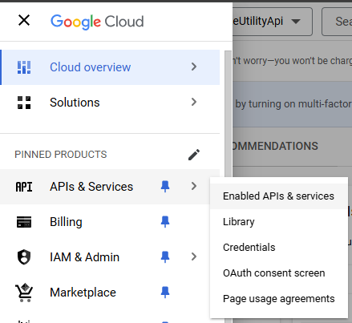
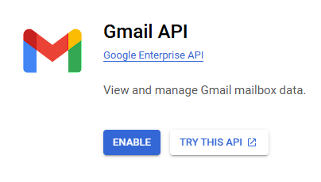
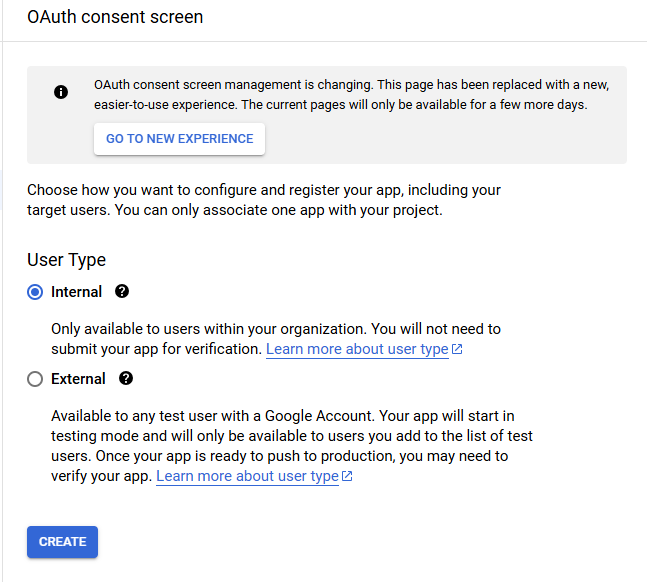
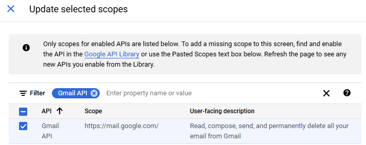

# Email Service

## Configuration

!!! warning "Google shutting down access to sending mails via smtp"
    As of January 2025, the Utility API will not be able to send emails using smtp.

    If you are using a Gmail address to send emails, you will need to [enable API access for the account](#allow-gmail-account-api-access) and set the new EmailProvider setting to `GMAIL`


Settings for the Email Service are configured in the `SystemSettings` table. You can find the insert script for the settings in the GraniteDatabase install folder:

```
"...\GraniteDatabase\Data\SystemSettings\SystemSettingsUtilityAPI.sql"
```

You should have the following settings after running the script:

| Application		| Key					| Value						| Description																								| ValueDataType | isEncrypted	| isActive	|
|-------------------|-----------------------|---------------------------|-----------------------------------------------------------------------------------------------------------|---------------|---------------|-----------|
| Granite.Utility	| UserName				|                   		| Username for the account that will be used to send email													| string		| False			| True		|
| Granite.Utility	| Password				|                           | Password for the account that will be used to send email                                                  | string	    | True			| True		|
| Granite.Utility	| Host					| smtp.gmail.com			| The address of the SMTP server																			| string		| False			| True		|
| Granite.Utility	| Port					| 587						| Port number to be used when accessing the SMTP server														| int			| False			| True		|
| Granite.Utility	| EnableSsl				| true						| Use SSL when accessing the SMTP server. True or False														| bool			| False			| True		|
| Granite.Utility	| From					|                   		| Email address that will be used to send mail																| string		| False			| True		|
| Granite.Utility	| FromName				|           				| The sender name that will display to users who receive emails												| string		| False			| True		|
| Granite.Utility	| RetryInterval			| 30						| Number of seconds to wait before retrying processing an email												| int			| False			| True		|
| Granite.Utility	| MaxNumberOfRetries	| 3							| Maximum number of times to retry processing an email.             										| int			| False			| True		|
| Granite.Utility	| EmailAttachmentFolder |							| Full filepath to folder to export email attachments to. Leave empty to use the Utility API install folder | string		| False			| True		|
| Granite.Utility	| EmailProvider         |							| Provider to use for sending emails. If empty, we will use the SMTP provider.                              | string		| False			| True		|

!!! note "Password isEncrypted is True"
    You will only be able to change the value of this setting from the Webdesktop System Settings page

### Email Providers

Email Providers allow us to configure the way that we send emails for different types of email accounts.
At the moment we support sending email using a SMTP server directly, or using the Gmail API.

Note that as of January 2025, Gmail no longer allows sending emails using their SMTP server directly.
This is why configuring the UtilityApi to send email via a Gmail account works slightly differently.

To configure the `EmailProvider`, set the name of the provider you want to use in SystemSettings.
If the `EmailProvider` setting is empty, it will default to using the SMTP provider.

#### SMTP
##### Required settings

- UserName - User name to use when connecting to the SMTP server
- Password - Password to use when connecting to the SMTP server
- Host - The host address of the SMTP server (server name or IP)
- Port - The port number to use when accessing the SMTP server
- EnableSsl - Use SSL when accessing the SMTP server. True or False
- From - The email address that you are sending mail from
- FromName - The sender name that will display to users who receive emails

#### Gmail
##### Required settings

- UserName - The Client ID used to connect to the Gmail API
- Password - The Client secret used to connect to the Gmail API
- From - The email address that you are sending mail from
- FromName - The sender name that will display to users who receive emails

##### Allow Gmail account API access

!!! note
    This configuration has already been completed for the GraniteWMS Info account, it does not need to be performed again.
    
    If you are using the GraniteWMS Info account, use the script in Dropbox to update your SystemSettings and then run the [GmailAuthenticator](#gmail-authenticator) app to log in.

To allow UtilityAPI access to the Gmail account in order to send email, we will need to configure some settings on the Gmail account.

Browse to [https//console.cloud.google.com](https//console.cloud.google.com) and log in with the account that you want to use, then follow the steps below.

1. Click the `Select a project` button on the top left

    

2. Click the `New Project` button on the top right of the box.

    

3. Give the new project a name e.g. `GraniteUtilityAPI`.
You shouldn't need to change the Location/Organization. Just keep the default and click `CREATE`

    

4. Click the hamburger menu on the top left and select `Enabled APIs & services` from the menu

    

5. Click the `Enable APIs and Services` button

    

6. Search for "gmail", click on the Gmail API entry and then click the `Enable` button

    

7. Once the Gmail API is enabled, select the `OAuth consent screen` from the menu on the left

    

8. On the OAuth consent screen, select User Type `Internal` and click `Create`

    

9. Select the Application type `Web application`. 
Enter an App name e.g. `Granite.Utility.Api`, a user support email address and a developer contact email address. 
You can set both of the email addresses to the email address that you are using to send email.
Click the `Save and Continue` button once you've entered the required fields.

    

10. Click the `Add or Remove Scopes` button

    

11. Filter the list of scopes by `Gmail API` and select the scope `https://mail.google.com`. 
Scroll to the bottom of the page and click `Update`

    

12. Now that the scope has been added, scroll down to the bottom of the page and click `Save and Continue`

    

13. Select `Credentials` from the menu on the left

    

14. Click the `Create Credentials` button at the top and select `OAuth client ID`

    

15. Give the client ID a name, e.g. `Granite.Utility.Api`. 
Under Authorized redirect URIs add both `http://localhost/authorize/` and `http://127.0.0.1/authorize/`
Then click the `Create` button at the bottom

    

16. Take note of the `Client ID` and the `Client secret`. 
These are the `UserName` and `Password` that you will need for SystemSettings

    

17. Set the `Client ID` and `Client secret` as your `UserName` and `Password` in SystemSettings. 
While you are in SystemSettings, also ensure that you have the `EmailProvider` setting and that the value is set to `GMAIL`

    !!! note
        The `Client secret` must be encrypted. Ensure that you save it through the Webdesktop so that it is not stored in plaintext.

##### Gmail Authenticator 
The Gmail Authenticator connects to the Gmail API using the Client ID and Client secret from System Settings, and fetches tokens that allow the Utility API to connect to the Gmail API.
This is a once off set up, once you have authenticated, the Utility API will be able to send email via Gmail.

1. Browse to the folder where you have installed the UtilityAPI, and into the `GmailAuthenticator` folder. 
Run the `Granite.Email.GmailAuthenticator.exe`.

    !!! note 
        Granite.Email.GmailAuthenticator.exe uses the UtilityApi's appSettings.json file. 
        Make sure that it is configured before trying to authenticate the Gmail account.

2. A browser window will open asking you to log in to authorize the Utility API. 
Log in with the Gmail account that you are going to use to send emails. 
Log in with the **normal username and password** - NOT the Client ID and Client secret

Now that the Utility API is authorized to use the Gmail account, you will be able to send email via the UtilityAPI.

## Email Templates

Email templates use MARKDOWN for text formatting - HTML is not supported. 
If you're not familiar with markdown, take a look at the [syntax cheat-sheet](https://www.markdownguide.org/cheat-sheet/).

To embed images and tables in the body of your email, Email Templates use Script Methods similar to the Web Template's Script Methods.

### Template Manager

The Template Manager is how you design and preview your email templates before using them. 
It has full auditing, so you can see which user has made changes to the Email Templates, as well as what has changed.

To copy an existing template, select it from the dropdown and then select New Template. 
When you save the template you will be prompted to give your new template a name.

### Script Methods
Script methods are the building blocks of your emails. 
You can use these to add images, tables, and more to the body of your email.

Each currently available Script Method is described below:

#### headerImage()

The headerImage() script method allows you to add an image as a header to the top of your email.

Available parameters:

| ParameterName		| Data Type | Required	| Description													|
|-------------------|-----------|-----------|---------------------------------------------------------------|
| imageUrl			| string	| Yes		| The url of the image that you want in your header				|
| imageAltText		| string	| No		| Text that will display in place of image if link is broken	|
| backgroundColor	| string	| No		| Solid block of color behind the image. Can be hexcode or word	|

Code example:

```
{{
    headerImage(
    {
      imageUrl:'https://www.granitewms.com/wp-content/uploads/2020/07/GraniteWMS-1.png',
      imageAltText:'GraniteWMS logo',
      backgroundColor:'#182026'
    })
}}
```

#### table()

The `table()` script method works together with the `dbSelect()` method to take a SQL string as an input and return the result as a table.

| ParameterName		| Data Type | Required	| Description													|
|-------------------|-----------|-----------|---------------------------------------------------------------|
| sumColumns		| string[]	| No		| Comma separated list of columns to sum in the table footer    |
| backgroundColor	| string	| No		| Background color for the table's header and footer        	|
| textColor 		| string	| No		| Text color for the table's header and footer text             |

Code example:

```
{{    
    'SELECT * FROM EmailTemplate_OrderDetail WHERE DocumentNumber = @documentNumber'
    | dbSelect({documentNumber})
    | table({backgroundColor: '#182026', textColor: 'white', sumColumns:['Qty','Price']})
}}
```

#### footerBlock() and footerItem()

The `footerItem()` script method can be chained together with more `footerItem()`'s which are then passed into the `footerBlock()` to add a footer to your email.

FooterItem parameters:

| ParameterName		| Data Type | Required	| Description													|
|-------------------|-----------|-----------|---------------------------------------------------------------|
| imageUrl  		| string	| No		| Url of the image to include in this footer item  				|
| imageWidth    	| int   	| No		| Width of the image in pixels. Height will scale automatically	|
| text       		| string	| No		| Text to include in this footer item                           |
| url       		| string	| No		| Url to link to if this footer item is clicked on              |

FooterBlock parameters:

| ParameterName		| Data Type | Required	| Description													|
|-------------------|-----------|-----------|---------------------------------------------------------------|
| textColor  		| string	| No		| Color of the text in the footerBlock            				|
| backgroundColor  	| string   	| No		| Color of the background block for the whole footerBlock   	|

Code example:

```
{{
    footerItem(
    { 
        imageUrl:'https://cdn1.iconfinder.com/data/icons/logotypes/32/square-facebook-1024.png',
        imageWidth: 50,
        url:'https://www.facebook.com/StarWarsAfrica/'
    })
    | footerItem(
    { 
        imageUrl:'https://cdn2.iconfinder.com/data/icons/social-icons-33/128/Instagram-1024.png',
        imageWidth: 50,
        url:'https://www.instagram.com/starwars'
    })
    | footerBlock({backgroundColor:'#182026', textColor:'lightgray' })
}}
```

## Sending an Email

When you make a request to send an email, the email is immediately entered into the `Email` table in the database.
If your email is a templated email, the template is rendered just before the entry is created in the `Email` table.
The Email Service will give you a response as soon as the email is queued in the table. 
From there, the email is passed to background services to fetch any attachments. 
Once the attachments have been gathered, the email will be sent.

If any of the background services are unable to complete their job, 
whether that be fetching an attachment or actually sending the mail, they will retry until the task succeeds or the 
`MaxNumberOfRetries` configured in SystemSettings is reached.

When the `MaxNumberOfRetries` is reached, the mail's status is set to FAILED and will not be retried without manual intervention.

See the API Documentation page for more info on sending emails using the API. 
For sending mails using SQLCLR, see the SQLCLR manual.

## Attachments

When you send an email with attachments, copies of those attachments are saved to the `EmailAttachmentFolder` specified in SystemSettings. 
The attachments for any given email will be placed in a subfolder named with the `ID` of the email in the `Email` database table.
This allows you to go back at any point to check the contents of the files that were sent as attachments.

### SSRS Reports

To attach SSRS reports, ensure the Reporting Service is configured correctly and working.

Attaching an SSRS report works very similarly to printing or exporting the report directly from the Reporting Service. 
The difference is that the Email Service will make the request to fetch the report after the email has been queued in the database.

Browse the API's documentation page (`/metadata`) for details on the properties needed to attach an SSRS report. 
The details can be found on the TemplateEmail or SimpleEmail requests.

### SQL Table exports

To attach SQL Table exports, ensure the SQLExport Service is configured correctly and working.

Attaching an excel export works very similarly to exporting the data directly from the SQLExport Service. 
The difference is that the Email Service will make the request to export the data after the email has been queued in the database.

Browse the API's documentation page (`/metadata`) for details on the properties needed to attach a SQL Table Export. 
The details can be found on the TemplateEmail or SimpleEmail requests.

### File attachments

File attachments allow you to specify a file path to the file that you want to attach.
When fetching this attachment type, the Email Service will copy the file into the email attachment folder configured in the SystemSettings table.
This is to ensure that a copy is kept for future reference in case the original is ever moved or deleted.

Browse the API's documentation page (`/metadata`) for details on the properties needed to attach a File Attachment. 
The details can be found on the TemplateEmail or SimpleEmail requests.
