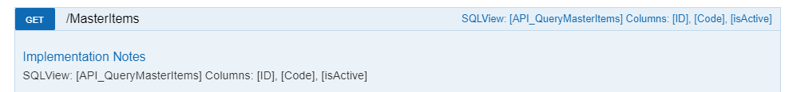

### Grids

Our system empowers users to customize numerous grids according to their preferences and requirements.
Determine whether a grid is configurable by right-clicking on it and selecting the Show Grid Definition option from the context menu.


In addition to displaying the JSON definition, the dialog provides visibility into both the API operation and the SQL syntax linked with the data source.
Modify the JSON layout directly within this dialog interface for seamless customization.


The Datagrid **table** is responsible to store the grid information.
When a grid is customized, its name will be prefixed with Custom and the column **isCustomGrid** will be set accordingly.
The column **isApplicationGrid** serves as an indicator that the grid is integrated into the WebDesktop and forms an integral part of the application. These grids are preconfigured and we do not configure the SQL view (empty).
Conversely, when **isApplicationGrid** is set to false, it signifies that the grid is designated as an **Enquiry** grid, allowing for further customization.


----

### Application Grid Columns

Any data grid used by the WebDesktop (**isApplicationGrid** = `true`) will have a minium set of columns needed to allow the application to function correctly.
These typically include the primary key fields such as Document.Number, MasterItem.Code, etc.
To verify the necessary columns, access the **API operation**.


If you navigate to the API operation documentation, you can observe that we document the SQL view name and the essential columns required for its proper functionality.




In the example provided above, ID, Code, and isActive are explicitly designated as required columns.

----
### Page Size
`Take note page size is available only for enquiry grids, this feuture is not supported for application grids.`

Set the PageSize on the database table Datagrid.PageSize.

----

### Grid Definition

```json
{
        "headerName": "Column_Name",
        "field": "SQLView_ColumnName",
        "width": 100,
        "filter": "agTextColumnFilter",
        "cellRenderer": "dateCellRenderer",
        "hide": true,
        "cellClassRules": {
                "text-error": "x == 0"
        }
}
```

| Property       | Value                  |
|--------------|------------|
| headerName     | Name you want to display on grid |
| field          | Name of field in your SQL View|
| width          | Width of the column |
| filter         | Type of filter for the column. Options : agTextColumnFilter, agDateColumnFilter, agNumberColumnFilter   |
| cellRenderer   | How do render the cell value. Options : "dateCellRenderer"     |
| hide           | Hide the column. true / false                   |
| cellClassRules | Condition styling, "text-error": "x == 0" . Options : **more below** |


### Cell Formatting

Cell customization is done at the column level via the grid definition using the property cellClassRules. 
You can define rules which can be applied to include certain CSS classes. These rules are provided as a JavaScript map where the keys are the class names and the values are expressions that if evaluated to true, the class gets used. 

Example Document status
```json
{
        // other column related properties...
        "cellClassRules": {
                "bg-warning": "x == 'ONHOLD'",
                "bg-error": "x == 'CANCELLED'",
                "bg-success": "x == 'COMPLETE'"
        }
}
```

### Row Formatting
`Version 6 ~`

You can define rules which can be applied to include certain CSS classes (CSS class defined in Styling Guidelines below). 
These rules are provided as a map where the keys are CSS class names and the values are expression string that if evaluated to true, the class gets used. 

!!! note 
	Set on the Database.RowStyleRules

Example changing background color 
```json
{
    "bg-error text-bold": "data.Qty == 0", // combine classes separating by space
    "bg-success": "data.NonStock == 1",
    "bg-primary": "data.Qty > 0"
}
```

### Styling Guidelines
`Version 6 ~`

!!! note 
	In order to keep a professional and consistent look to the application please use the below styling regarding colors.


This guide covers the available CSS classes for styling rows and cells. The following sections describe how to use each class for text formatting, background colors, borders, and alignment.

- Text Styles: Format text with colors, bold, italic, and text alignment.
- Background Styles: Set background colors for rows, cells, or sections based on states like success, warning, or error.
- Borders: Add or modify borders around elements to highlight specific areas.
- Padding and Alignment: Adjust spacing and alignment for better layout control.

| CSS Class             | Description                                                                 | Cell Format Example (`cellClassRules`)                         | Row Format Example (`rowClassRules`)                            |
|-----------------------|-----------------------------------------------------------------------------|----------------------------------------------------------------|----------------------------------------------------------------|
| text-bold             | **Applies bold font weight.**                                               | `"cellClassRules": { "text-bold": "x === 'COMPLETE'" } `        | `{ "text-bold": "data.Status === 'COMPLETE'" }`                |
| text-italic           | *Applies italic font style.*                                                | `"cellClassRules": { "text-italic": "x === 'ENTERED'" }`       | `{ "text-italic": "data.Status === 'ENTERED'" }`               |
| text-primary          | <span style="color: #00A6CE;">Sets text color to blue (#00A6CE).</span>     | `"cellClassRules": { "text-primary": "x === 'ONHOLD'" }`       | `{ "text-primary": "data.Status === 'ONHOLD'" }`               |
| bg-primary            | <span style="background-color: #00A6CE;">Sets background color to blue (#00A6CE).</span> | `"cellClassRules": { "bg-primary": "x === 'COMPLETE'" }`      | `{ "bg-primary": "data.Status === 'COMPLETE'" }`               |
| text-primary-dark     | <span style="color: #008CBA;">Sets text color to darker blue (#008CBA).</span> | `"cellClassRules": { "text-primary-dark": "x === 'COMPLETE'" }` | `{ "text-primary-dark": "data.Status === 'COMPLETE'" }`        |
| bg-primary-dark       | <span style="background-color: #008CBA;">Sets background color to darker blue (#008CBA).</span> | `"cellClassRules": { "bg-primary-dark": "x === 'ONHOLD'" }`  | `{ "bg-primary-dark": "data.Status === 'ONHOLD'" }`            |
| text-success          | <span style="color: #51AA6C;">Sets text color to green (#51AA6C).</span>    | `"cellClassRules": { "text-success": "x === 'COMPLETE'" }`     | `{ "text-success": "data.Status === 'COMPLETE'" }`             |
| bg-success            | <span style="background-color: #51AA6C;">Sets background color to green (#51AA6C).</span> | `"cellClassRules": { "bg-success": "x === 'COMPLETE'" }`     | `{ "bg-success": "data.Status === 'COMPLETE'" }`               |
| text-success-light    | <span style="color: #4F9E63;">Sets text color to darker green (#4F9E63).</span> | `"cellClassRules": { "text-success-light": "x === 'ENTERED'" }` | `{ "text-success-light": "data.Status === 'ENTERED'" }`        |
| bg-success-light      | <span style="background-color: #B0D7B8;">Sets background color to pastel green (#B0D7B8).</span> | `"cellClassRules": { "bg-success-light": "x === 'ENTERED'" }` | `{ "bg-success-light": "data.Status === 'ENTERED'" }`          |
| text-error            | <span style="color: #F24C3D;">Sets text color to red (#F24C3D).</span>      | `"cellClassRules": { "text-error": "x == 0" }`                | `{ "text-error": "data.Qty == 0" }`                            |
| bg-error              | <span style="background-color: #F24C3D;">Sets background color to red (#F24C3D).</span> | `"cellClassRules": { "bg-error": "x == 0" }`                 | `{ "bg-error": "data.Qty == 0" }`                              |
| text-warning          | <span style="color: #FFA500;">Sets text color to orange (#FFA500).</span>   | `"cellClassRules": { "text-warning": "x === 'ONHOLD'" }`       | `{ "text-warning": "data.Status === 'ONHOLD'" }`               |
| bg-warning            | <span style="background-color: #FFA500;">Sets background color to orange (#FFA500).</span> | `"cellClassRules": { "bg-warning": "x === 'ONHOLD'" }`       | `{ "bg-warning": "data.Status === 'ONHOLD'" }`                 |
| text-info             | <span style="color: #17A2B8;">Sets text color to light blue/cyan (#17A2B8).</span> | `"cellClassRules": { "text-info": "x === 'ENTERED'" }`      | `{ "text-info": "data.Status === 'ENTERED'" }`                 |
| bg-info               | <span style="background-color: #17A2B8;">Sets background color to light blue/cyan (#17A2B8).</span> | `"cellClassRules": { "bg-info": "x === 'ENTERED'" }`      | `{ "bg-info": "data.Status === 'ENTERED'" }`                   |
| text-secondary        | <span style="color: #6C757D;">Sets text color to grey/neutral (#6C757D).</span> | `"cellClassRules": { "text-secondary": "x === 'COMPLETE'" }` | `{ "text-secondary": "data.Status === 'COMPLETE'" }`           |
| bg-secondary          | <span style="background-color: #6C757D;">Sets background color to grey/neutral (#6C757D).</span> | `"cellClassRules": { "bg-secondary": "x === 'COMPLETE'" }`  | `{ "bg-secondary": "data.Status === 'COMPLETE'" }`             |
| text-secondary-light  | <span style="color: #AEB6BF;">Sets text color to lighter neutral (#AEB6BF).</span> | `"cellClassRules": { "text-secondary-light": "x === 'ENTERED'" }` | `{ "text-secondary-light": "data.Status === 'ENTERED'" }`    |
| bg-secondary-light    | <span style="background-color: #AEB6BF;">Sets background color to lighter neutral (#AEB6BF).</span> | `"cellClassRules": { "bg-secondary-light": "x === 'ENTERED'" }` | `{ "bg-secondary-light": "data.Status === 'ENTERED'" }`    |
| text-dark             | <span style="color: #343A40;">Sets text color to dark grey (#343A40).</span> | `"cellClassRules": { "text-dark": "x === 'COMPLETE'" }`      | `{ "text-dark": "data.Status === 'COMPLETE'" }`                |
| bg-dark               | <span style="background-color: #343A40;">Sets background color to dark grey (#343A40).</span> | `"cellClassRules": { "bg-dark": "x === 'ONHOLD'" }`         | `{ "bg-dark": "data.Status === 'ONHOLD'" }`                    |
| text-light            | <span style="color: #F8F9FA;">Sets text color to light grey (#F8F9FA).</span> | `"cellClassRules": { "text-light": "x === 'ENTERED'" }`     | `{ "text-light": "data.Status === 'ENTERED'" }`                |
| bg-light              | <span style="background-color: #F8F9FA;">Sets background color to light grey (#F8F9FA).</span> | `"cellClassRules": { "bg-light": "x === 'ENTERED'" }`      | `{ "bg-light": "data.Status === 'ENTERED'" }`                  |
| text-center           | Centers text alignment.                                                     | `"cellClassRules": { "text-center": "x === 'ONHOLD'" }`      | `{ "text-center": "data.Status === 'ONHOLD'" }`                |
| text-left             | Aligns text to the left.                                                    | `"cellClassRules": { "text-left": "x === 'COMPLETE'" }`      | `{ "text-left": "data.Status === 'COMPLETE'" }`                |
| text-right            | Aligns text to the right.                                                   | `"cellClassRules": { "text-right": "x === 'ENTERED'" }`      | `{ "text-right": "data.Status === 'ENTERED'" }`                |
| padding-small         | Adds small padding (4px) inside the element.                                | `"cellClassRules": { "padding-small": "x === 'COMPLETE'" }`  | `{ "padding-small": "data.Status === 'COMPLETE'" }`            |
| padding-medium        | Adds medium padding (8px) inside the element.                               | `"cellClassRules": { "padding-medium": "x === 'ENTERED'" }`  | `{ "padding-medium": "data.Status === 'ENTERED'" }`            |
| padding-large         | Adds large padding (16px) inside the element.                               | `"cellClassRules": { "padding-large": "x === 'ONHOLD'" }`    | `{ "padding-large": "data.Status === 'ONHOLD'" }`              |
| border                | Adds a default grey border (1px solid #ddd).                                | `"cellClassRules": { "border": "x === false" }`              | `{ "border": "data.isActive === false" }`                      |
| border-primary        | Adds a blue border (1px solid #00A6CE).                                     | `"cellClassRules": { "border-primary": "x === 'ONHOLD'" }`   | `{ "border-primary": "data.Status === 'ONHOLD'" }`             |
| border-error          | Adds a red border (1px solid #F24C3D).                                      | `"cellClassRules": { "border-error": "x == 0" }`             | `{ "border-error": "data.Qty == 0" }`                          |
| border-success        | Adds a green border (1px solid #51AA6C).                                    | `"cellClassRules": { "border-success": "x === 'COMPLETE'" }` | `{ "border-success": "data.Status === 'COMPLETE'" }`           |
| border-warning        | Adds an orange border (1px solid #FFA500).                                  | `"cellClassRules": { "border-warning": "x === 'ONHOLD'" }`   | `{ "border-warning": "data.Status === 'ONHOLD'" }`             |
| border-dark           | Adds a dark grey border (1px solid #343A40).                                | `"cellClassRules": { "border-dark": "x === 'COMPLETE'" }`    | `{ "border-dark": "data.Status === 'COMPLETE'" }`              |


Example: apply when ActionQty = 0, bg-error will display red background
``` json
{ 
        "bg-error": "data.ActionQty == 0"
}
```

Example: apply when Complete = 1, text-success will display green text
``` json
{ 
        "text-success": "data.Complete == 1"
}
```
Example: apply when Complete = 1, text-success will display green text
``` json
{ 
        "text-success": "data.Complete == 1"
}
```

