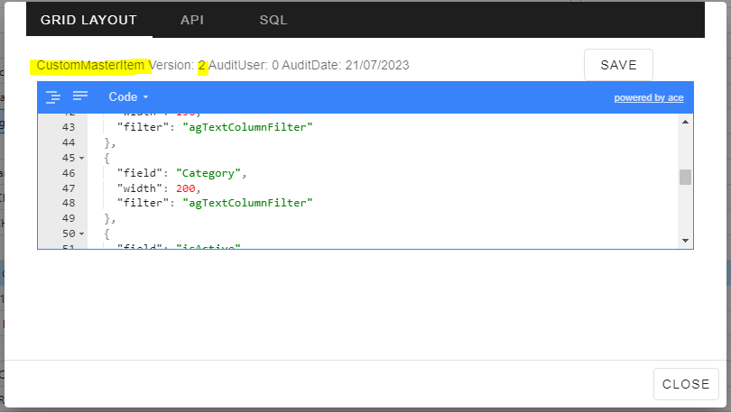

# WebDesktop


The Granite WebDesktop is constructed on a thick client architecture, where the software application operates primarily on the user's device (like a computer or mobile device) and conducts a substantial amount of processing locally. This approach minimizes reliance on server processing and data retrieval for enhanced efficiency.

The central functionality of the system revolves around data **maintenance** and **enquiry**. This relies on various Granite APIs to efficiently perform these tasks.

---
## Setup

### Requirements

- [IIS](../iis/getting-started.md)
- Sufficient permissions for folder and file access and IIS application creation

## Customization


### Grids

Our system empowers users to customize numerous grids according to their preferences and requirements.
Determine whether a grid is configurable by right-clicking on it and selecting the Show Grid Definition option from the context menu.


In addition to displaying the JSON definition, the dialog provides visibility into both the API operation and the SQL syntax linked with the data source.
Modify the JSON layout directly within this dialog interface for seamless customization.



The Datagrid **table** is responsible to store the grid information.
When a grid is customized, its name will be prefixed with Custom and the column **isCustomGrid** will be set accordingly.
The column **isApplicationGrid** serves as an indicator that the grid is integrated into the WebDesktop and forms an integral part of the application. These grids are preconfigured and we do not configure the SQL view (empty).
Conversely, when **isApplicationGrid** is set to false, it signifies that the grid is designated as an **Enquiry** grid, allowing for further customization.


----

### Grid Properties

```json
{
        "headerName": "Column_Name",
        "field": "SQLView_ColumnName",
        "width": 100,
        "filter": "agTextColumnFilter",
        "cellRenderer": "dateCellRenderer",
        "hide": true,
        "cellClassRules": {
                "cellAlert": "x == 0"
        }
}
```

| Property       | Value                  |
|--------------|------------|
| headerName     | Name you want to display on grid |
| field          | Name of field in your SQL View|
| width          | Width of the column |
| filter         | Type of filter for the column. Options : agTextColumnFilter, agDateColumnFilter, agNumberColumnFilter   |
| cellRenderer   | How do render the cell value. Options : "dateCellRenderer"     |
| hide           | Hide the column. true / false                   |
| cellClassRules | Condition styling, "cellAlert": "x == 0" . Options : cellBold, cellAlert, cellAttention |


### Grid Data Columns


The WebDesktop mandates a **minimum** set of columns to be present in both the SQL data and grid.
These typically include the primary key fields such as Document.Number, MasterItem.Code, etc.
To verify the necessary columns, access the **API operation**.


If you navigate to the API operation documentation, you can observe that we document the SQL view name and the essential columns required for its proper functionality.


In the example provided above, ID, Code, and isActive are explicitly designated as required columns.

___
